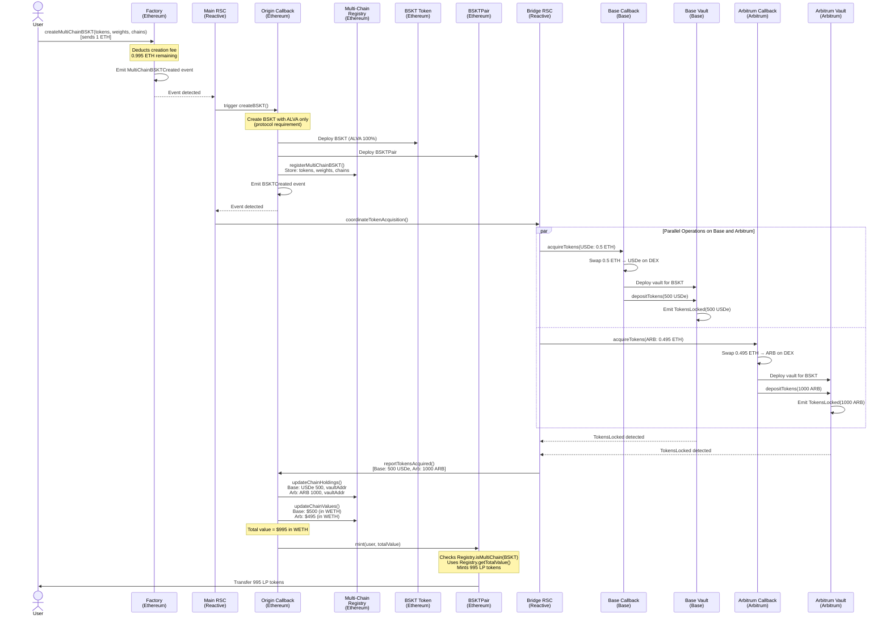
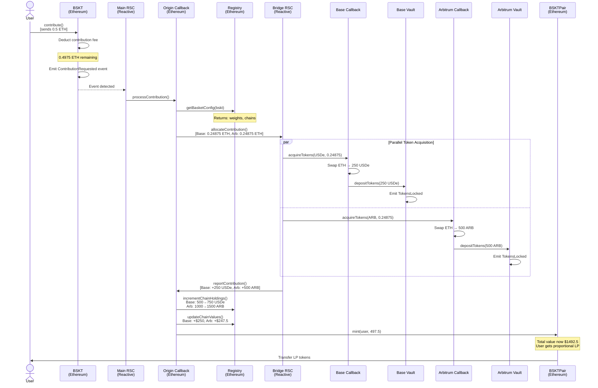
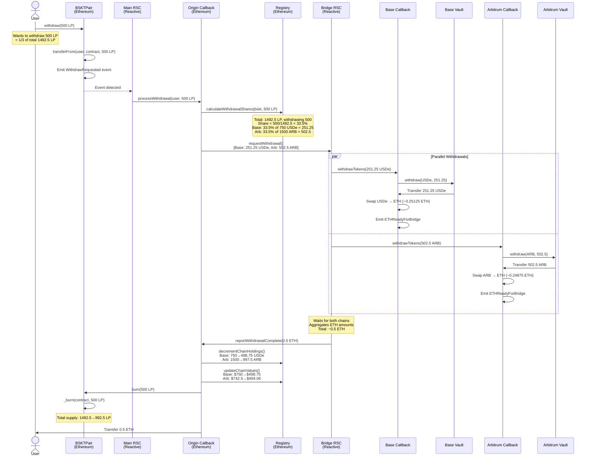
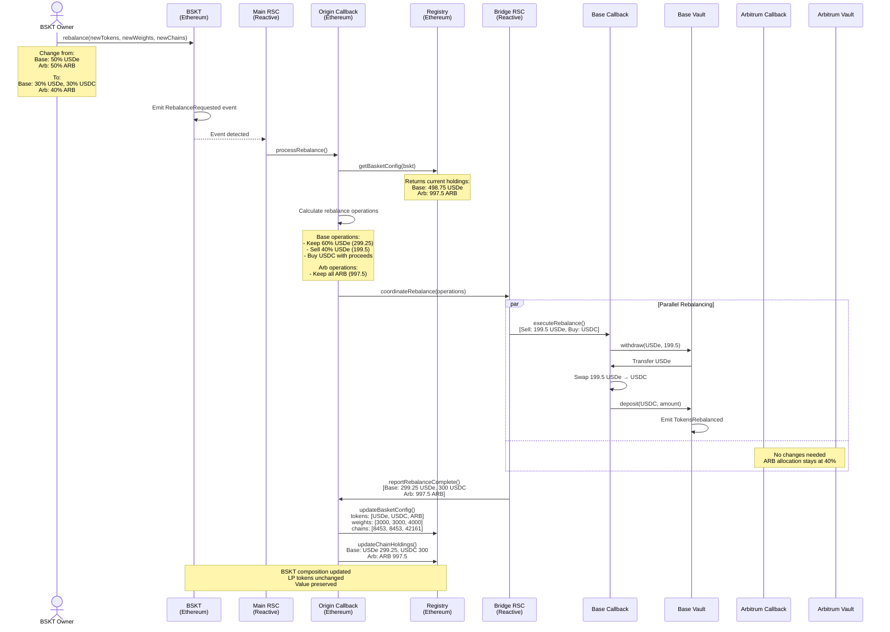

# Approach 1: Vault-Only System (No Receipt Tokens)

## Overview

### What We're Trying to Achieve

Enable Alvara Protocol users to create single multi-chain BSKT tokens that hold assets across Ethereum, Base, and Arbitrum, while maintaining the existing user experience where users only interact with Ethereum.

**Key Goals:**
1. **Single BSKT Token on Ethereum** - Users hold one ERC721 representing their entire multi-chain portfolio
2. **Single LP Token Pool** - One set of LP tokens on Ethereum representing proportional ownership across all chains
3. **No New Token Deployments** - Zero cost solution that eliminates the need for receipt/helper tokens
4. **Transparent Cross-Chain** - Users contribute ETH on Ethereum, system handles all cross-chain coordination
5. **Unified Value Tracking** - LP tokens correctly represent total value across all chains

**The Challenge:**
Traditional Alvara BSKTs work because BSKTPair holds actual tokens and can calculate their value. With multi-chain baskets, tokens are locked in vaults on Base and Arbitrum - the BSKTPair on Ethereum doesn't hold them. How do we calculate LP token value?

**The Solution:**
Use a Multi-Chain Registry contract on Ethereum as the source of truth for all cross-chain holdings. BSKTPair is modified to check if a BSKT is multi-chain, and if so, queries the registry instead of checking token balances. Reactive Network keeps the registry synchronized with actual vault holdings.

---

## Architecture

### System Components

**Ethereum (Origin Chain):**
- **Factory** - Extended with `createMultiChainBSKT()` function
- **BSKT Token** - Standard ERC721, holds only ALVA token (required by protocol)
- **Modified BSKTPair** - Overrides value calculation to use registry for multi-chain baskets
- **Multi-Chain Registry** - Stores basket configurations, vault addresses, and token balances per chain
- **Origin Callback** - Orchestrates multi-chain operations, updates registry, **holds ETH before bridging**

**Reactive Network:**
- **Main RSC** - Event-driven coordinator, no state storage
- **Bridge RSC** - Parallel operation handler, **initiates ETH bridging to destination chains**

**Base & Arbitrum (Destination Chains):**
- **Destination Callback** - **Receives bridged ETH**, acquires tokens via local DEX, manages vault interactions
- **Token Vault** - Per-basket secure storage, emits lock/unlock events

### ETH Flow Architecture

**Critical Understanding: Where Does Liquidity Come From?**

1. **User sends ETH to Factory on Ethereum** (e.g., 1 ETH)
2. **Factory transfers ETH to Origin Callback** (after fee: 0.995 ETH)
3. **Origin Callback holds ETH**, waiting for Reactive coordination
4. **Bridge RSC initiates native bridges:**
   - Uses Base's official bridge to send 0.4975 ETH from Origin Callback → BaseCallback
   - Uses Arbitrum's official bridge to send 0.4975 ETH from Origin Callback → ArbitrumCallback
   - These are standard cross-chain ETH transfers (~10-20 min)
5. **Destination Callbacks receive ETH on their respective chains:**
   - BaseCallback now has 0.4975 ETH **on Base network**
   - ArbitrumCallback now has 0.4975 ETH **on Arbitrum network**
6. **Destination Callbacks swap on local DEXs:**
   - BaseCallback swaps ETH for USDe on **Base's Uniswap** (using Base's liquidity pools)
   - ArbitrumCallback swaps ETH for ARB on **Arbitrum's Uniswap** (using Arbitrum's liquidity pools)
7. **No need to maintain our own liquidity** - we use existing DEX ecosystems on each chain

**Key Point:** We don't need liquidity pools. We use:
- Native bridges (Base bridge, Arbitrum bridge) for ETH transfers
- Existing DEXs (Uniswap on Base, Uniswap on Arbitrum) for swaps
- Existing liquidity providers on those chains

---

## Creation Flow

### Sequence Diagram



### Step-by-Step Flow

#### Step 1: User Initiates Creation
**Function Called:** `Factory.createMultiChainBSKT(tokens, weights, chains, minAmountsOut)`

```solidity
function createMultiChainBSKT(
    string calldata _name,
    address[] calldata _tokens,      // [USDe, ARB]
    uint256[] calldata _weights,     // [5000, 5000] = 50% each
    uint256[] calldata _chains,      // [8453, 42161] = Base, Arbitrum
    uint256[] calldata _minAmountsOut
) external payable
```

**What Happens:**
- User sends 1 ETH to create a BSKT with 50% USDe (on Base) and 50% ARB (on Arbitrum)
- Factory validates: tokens.length == weights.length == chains.length
- Factory validates: weights sum to 10000 (100%)
- Factory deducts 0.5% creation fee (0.005 ETH) → 0.995 ETH remains
- Factory emits `MultiChainBSKTCreated` event with all parameters

**Event Emitted:**
```solidity
event MultiChainBSKTCreated(
    address indexed creator,
    string name,
    address[] tokens,
    uint256[] weights,
    uint256[] chains,
    uint256 ethAmount,      // 0.995 ETH
    bytes32 requestId
);
```

#### Step 2: Reactive Network Detects Event
**Main RSC Logic:**

The Main RSC subscribes to `MultiChainBSKTCreated` events from the Factory contract. When detected:

```javascript
// Main RSC pseudocode
react(event MultiChainBSKTCreated) {
    // Extract parameters
    creator = event.creator
    tokens = event.tokens
    weights = event.weights
    chains = event.chains
    ethAmount = event.ethAmount
    
    // Trigger origin callback to create BSKT structure
    await OriginCallback.createBSKT(
        creator,
        tokens,
        weights,
        chains,
        ethAmount,
        event.requestId
    )
}
```

**What Happens:**
- RSC is stateless - it just transforms events into actions
- Calls `OriginCallback.createBSKT()` on Ethereum
- Passes all creation parameters through

#### Step 3: Origin Callback Creates BSKT Structure
**Function Called:** `OriginCallback.createBSKT()`

**What Happens:**

1. **Deploy BSKT Token (ERC721):**
   - Creates BSKT with only ALVA token (protocol requirement)
   - ALVA weight is 100% (cross-chain tokens don't appear in BSKT directly)
   - User receives NFT with tokenId 0

2. **Deploy BSKTPair:**
   - Creates liquidity pool contract
   - Initializes with ALVA token reference

3. **Register in Multi-Chain Registry:**
   ```solidity
   Registry.registerMultiChainBSKT(
       bsktAddress,
       tokens,      // [USDe, ARB]
       weights,     // [5000, 5000]
       chains,      // [8453, 42161]
       creator
   );
   ```
   - Stores: This BSKT is multi-chain
   - Stores: Token composition across chains
   - Stores: Weights for LP calculation

4. **Emit BSKTCreated Event:**
   ```solidity
   event BSKTCreated(
       address indexed bsktAddress,
       address indexed pairAddress,
       address[] tokens,
       uint256[] chains,
       uint256 ethAmount,
       bytes32 requestId
   );
   ```

**Registry State After This Step:**
```solidity
// In Multi-Chain Registry
baskets[bsktAddress] = {
    isMultiChain: true,
    tokens: [USDe, ARB],
    weights: [5000, 5000],
    chains: [8453, 42161],
    // Holdings empty - will be filled after token acquisition
}
```

#### Step 4: Reactive Network Bridges ETH & Coordinates Token Acquisition
**Main RSC detects BSKTCreated → triggers Bridge RSC**

**Bridge RSC Logic:**

```javascript
// Bridge RSC coordinates parallel operations
react(event BSKTCreated) {
    bskt = event.bsktAddress
    tokens = event.tokens
    chains = event.chains
    ethAmount = event.ethAmount  // 0.995 ETH held in Origin Callback
    
    // Calculate ETH allocation per chain based on weights
    // For 0.995 ETH with 50/50 split:
    baseAllocation = 0.995 * 0.50 = 0.4975 ETH
    arbAllocation = 0.995 * 0.50 = 0.4975 ETH
    
    // Step 1: Bridge ETH from Ethereum to destination chains
    await Promise.all([
        bridgeETH(1, 8453, baseAllocation, BaseCallback),      // Ethereum → Base
        bridgeETH(1, 42161, arbAllocation, ArbitrumCallback)   // Ethereum → Arbitrum
    ])
    
    // Step 2: Once ETH arrives, trigger token acquisition on destination chains
    await Promise.all([
        BaseCallback.acquireTokens(bskt, USDe, 0.4975),
        ArbitrumCallback.acquireTokens(bskt, ARB, 0.4975)
    ])
}
```

**What Happens:**

1. **Origin Callback Holds ETH:**
   - After Factory deducts fee, 0.995 ETH sits in Origin Callback contract
   - This ETH needs to be moved to Base and Arbitrum

2. **Bridge RSC Initiates Bridges:**
   - Uses native bridges (e.g., Base's official bridge, Arbitrum's bridge)
   - Or uses cross-chain messaging protocols (Axelar, LayerZero, etc.)
   - Sends 0.4975 ETH to BaseCallback contract on Base
   - Sends 0.4975 ETH to ArbitrumCallback contract on Arbitrum
   - These are standard cross-chain transfers (takes ~10-20 minutes)

3. **Destination Callbacks Receive ETH:**
   - BaseCallback on Base receives 0.4975 ETH
   - ArbitrumCallback on Arbitrum receives 0.4975 ETH
   - Now they have liquidity to swap on local DEXs

4. **Bridge RSC Waits for Confirmations:**
   - Detects ETH arrival events on destination chains
   - Only then triggers token acquisition
   - Ensures atomicity: no tokens bought without ETH present

#### Step 5: Destination Callbacks Acquire Tokens

**On Base - Function Called:** `BaseCallback.acquireTokens(bskt, token, ethAmount)`

**Prerequisites:**
- BaseCallback has received 0.4975 ETH via bridge from Ethereum
- ETH is now on Base chain, ready to use on Base's DEXs (Uniswap, Aerodrome, etc.)

**What Happens:**

1. **Swap ETH for Token on Local DEX:**
   ```solidity
   // BaseCallback now has ETH on Base
   // Use Base's Uniswap/DEX to swap ETH → USDe
   uint256 usdReceived = swapExactETHForTokens(
       0.4975 ether,
       [WETH, USDe],
       minAmountOut
   );
   // Receives ~500 USDe (depending on Base DEX price)
   ```
   
   **Where's the Liquidity?**
   - Base has its own Uniswap V2/V3 deployment with USDe/WETH pools
   - These pools are maintained by Base ecosystem liquidity providers
   - We're swapping on Base's local DEX, not Ethereum's DEX
   - No need to maintain our own liquidity - we use existing DEX liquidity
       minAmountOut
   );
   // Receives ~500 USDe (depending on price)
   ```

2. **Deploy Vault (if first time for this BSKT):**
   ```solidity
   if (vaults[bskt] == address(0)) {
       vaults[bskt] = new TokenVault(bskt, owner);
   }
   ```

3. **Deposit Tokens to Vault:**
   ```solidity
   USDe.approve(vault, 500e18);
   TokenVault(vault).depositTokens(USDe, 500e18);
   ```

4. **Vault Emits TokensLocked:**
   ```solidity
   event TokensLocked(
       address indexed bskt,
       address indexed token,
       uint256 amount,      // 500e18
       uint256 valueInWETH  // Calculated via oracle
   );
   ```

**On Arbitrum - Same Process:**
- Swap 0.4975 ETH → ~1000 ARB
- Deploy vault
- Lock 1000 ARB
- Emit TokensLocked event

**Why Vaults?**
- Security: Tokens isolated per BSKT, can't be mixed
- Auditability: Clear on-chain proof of holdings
- Composability: Vaults can be queried, verified by anyone
- Safety: Only callback contract can withdraw (with proper authorization)

#### Step 6: Bridge RSC Aggregates Results

**Bridge RSC Logic:**

```javascript
// Wait for both TokensLocked events
let baseEvent, arbEvent;

subscribe(BaseVault.TokensLocked) {
    if (event.bskt == targetBSKT) {
        baseEvent = event;
        checkComplete();
    }
}

subscribe(ArbitrumVault.TokensLocked) {
    if (event.bskt == targetBSKT) {
        arbEvent = event;
        checkComplete();
    }
}

function checkComplete() {
    if (baseEvent && arbEvent) {
        // Both chains completed
        await OriginCallback.reportTokensAcquired(
            bskt,
            [
                {chain: 8453, token: USDe, amount: 500e18, valueWETH: 500e18},
                {chain: 42161, token: ARB, amount: 1000e18, valueWETH: 495e18}
            ]
        );
    }
}
```

**What Happens:**
- RSC collects events from both chains
- Extracts: actual token amounts received, WETH values
- Calls back to Ethereum with complete data
- This ensures atomicity: LP tokens minted only after ALL chains succeed

#### Step 7: Origin Callback Updates Registry

**Function Called:** `OriginCallback.reportTokensAcquired(holdings)`

**What Happens:**

1. **Update Per-Chain Holdings:**
   ```solidity
   for (uint i = 0; i < holdings.length; i++) {
       Registry.updateChainHoldings(
           bskt,
           holdings[i].chain,
           holdings[i].token,
           holdings[i].amount,
           holdings[i].vaultAddress
       );
   }
   ```

2. **Update Per-Chain Values:**
   ```solidity
   Registry.updateChainValues(
       bskt,
       [8453, 42161],
       [500e18, 495e18]  // Values in WETH
   );
   ```

**Registry State After This Step:**
```solidity
baskets[bskt] = {
    isMultiChain: true,
    
    chainHoldings: {
        8453: {  // Base
            USDe: {
                amount: 500e18,
                vault: 0xBaseVault...
            }
        },
        42161: {  // Arbitrum
            ARB: {
                amount: 1000e18,
                vault: 0xArbVault...
            }
        }
    },
    
    chainValues: {
        8453: 500e18,   // $500 in WETH
        42161: 495e18   // $495 in WETH
    }
}
```

#### Step 8: BSKTPair Mints LP Tokens

**Function Called:** `BSKTPair.mint(user, totalValue)`

**Modified BSKTPair Logic:**

```solidity
function mint(address to) external returns (uint256 liquidity) {
    // Check if this is a multi-chain BSKT
    bool isMultiChain = Registry.isMultiChain(address(bskt));
    
    uint256 totalValue;
    
    if (isMultiChain) {
        // Use registry to calculate total value
        totalValue = Registry.getTotalValue(address(bskt));
        // Returns: 500e18 + 495e18 = 995e18 WETH
    } else {
        // Standard Alvara logic: check token balances
        totalValue = calculateValueFromBalances();
    }
    
    // Mint LP tokens proportional to value
    if (totalSupply() == 0) {
        liquidity = totalValue;  // First minter gets 1:1
    } else {
        liquidity = (totalValue * totalSupply()) / currentTotalValue;
    }
    
    _mint(to, liquidity);
}
```

**What Happens:**
- BSKTPair detects this BSKT is multi-chain (via registry)
- Queries registry for total value: 500 + 495 = 995 WETH
- Mints 995 LP tokens (assuming first mint, 1:1 ratio)
- User receives LP tokens representing ownership of multi-chain portfolio

**User's Final Holdings:**
- 1 BSKT NFT (tokenId 0) - ownership of the basket configuration
- 995 BSKTPair LP tokens - proportional share of:
  - 500 USDe locked on Base
  - 1000 ARB locked on Arbitrum

---

## Contribution Flow

### Sequence Diagram



### Step-by-Step Flow

#### Step 1: User Contributes ETH
**Function Called:** `BSKT.contribute(minAmountsOut)`

```solidity
function contribute(uint256[] calldata minAmountsOut) external payable {
    uint256 fee = (msg.value * contributionFee) / 10000;
    uint256 amountAfterFee = msg.value - fee;
    
    // Transfer fee to collector
    payable(feeCollector).transfer(fee);
    
    emit ContributionRequested(
        msg.sender,
        amountAfterFee,
        minAmountsOut,
        block.timestamp
    );
}
```

**What Happens:**
- User sends 0.5 ETH
- BSKT deducts 0.5% fee (0.0025 ETH)
- 0.4975 ETH remains for investment
- Event emitted with contribution amount

#### Step 2: Origin Callback Processes Contribution
**Main RSC detects event → triggers OriginCallback**

**Function Called:** `OriginCallback.processContribution(bskt, amount, user)`

**What Happens:**

1. **Fetch Basket Configuration:**
   ```solidity
   BasketConfig memory config = Registry.getBasketConfig(bskt);
   // Returns: tokens, weights, chains
   ```

2. **Calculate Per-Chain Allocation:**
   ```solidity
   // For 50/50 split of 0.4975 ETH:
   allocations = [
       {chain: 8453, amount: 0.24875 ETH},  // Base
       {chain: 42161, amount: 0.24875 ETH}  // Arbitrum
   ];
   ```

3. **Trigger Bridge RSC:**
   Emits event that Bridge RSC subscribes to with allocation details

#### Step 3: Bridge RSC Coordinates Parallel Acquisition

**Bridge RSC Logic:**

```javascript
react(event ContributionAllocated) {
    const allocations = event.allocations;
    
    // Step 1: Bridge ETH from Ethereum to destination chains
    await Promise.all(
        allocations.map(async (alloc) => {
            // Bridge ETH from Origin Callback to Destination Callback
            await bridgeETH(1, alloc.chain, alloc.amount, callbacks[alloc.chain]);
        })
    );
    
    // Step 2: Once ETH arrives, trigger token acquisition
    await Promise.all(
        allocations.map(async (alloc) => {
            if (alloc.chain === 8453) {
                await BaseCallback.acquireTokens(
                    event.bskt,
                    event.token,
                    alloc.amount
                );
            } else if (alloc.chain === 42161) {
                await ArbitrumCallback.acquireTokens(
                    event.bskt,
                    event.token,
                    alloc.amount
                );
            }
        })
    );
}
```

**What Happens:**
- Origin Callback holds the contribution ETH (0.4975 ETH)
- Bridge RSC bridges ETH to destination chains (0.24875 ETH each)
- Waits for ETH arrival confirmations
- Then triggers token acquisition on local DEXs

#### Step 4: Destination Callbacks Acquire Additional Tokens

**On Base:**
- Swap 0.24875 ETH → ~250 USDe
- Get vault address from storage (already exists)
- Deposit to vault: `vault.depositTokens(USDe, 250e18)`
- Vault emits: `TokensLocked(bskt, USDe, 250e18, 250e18)`

**On Arbitrum:**
- Swap 0.24875 ETH → ~500 ARB  
- Deposit to vault: `vault.depositTokens(ARB, 500e18)`
- Vault emits: `TokensLocked(bskt, ARB, 500e18, 247.5e18)`

#### Step 5: Registry Updated with New Holdings

**Function Called:** `OriginCallback.reportContribution(newHoldings)`

**What Happens:**

1. **Increment Token Holdings:**
   ```solidity
   Registry.incrementChainHoldings(
       bskt,
       8453,    // Base
       USDe,
       250e18   // Add to existing 500e18
   );
   // New total: 750 USDe on Base
   
   Registry.incrementChainHoldings(
       bskt,
       42161,   // Arbitrum
       ARB,
       500e18   // Add to existing 1000e18
   );
   // New total: 1500 ARB on Arbitrum
   ```

2. **Update Chain Values:**
   ```solidity
   Registry.updateChainValues(
       bskt,
       [8453, 42161],
       [750e18, 742.5e18]  // New totals in WETH
   );
   ```

**Registry State After Contribution:**
```solidity
baskets[bskt].chainHoldings = {
    8453: {USDe: {amount: 750e18}},
    42161: {ARB: {amount: 1500e18}}
}

baskets[bskt].chainValues = {
    8453: 750e18,    // $750
    42161: 742.5e18  // $742.50
}
// Total value: $1492.50
```

#### Step 6: BSKTPair Mints Additional LP Tokens

**Function Called:** `BSKTPair.mint(user, additionalValue)`

**What Happens:**

```solidity
// Get current state
uint256 currentTotalValue = Registry.getTotalValue(bskt);
// Returns: 1492.5e18

uint256 previousTotalValue = 995e18;  // Before contribution
uint256 additionalValue = 497.5e18;

uint256 currentSupply = totalSupply();  // 995 LP tokens

// Calculate new LP tokens to mint
uint256 newLP = (additionalValue * currentSupply) / previousTotalValue;
// newLP = (497.5 * 995) / 995 = 497.5 LP tokens

_mint(user, newLP);
```

**User Receives:**
- 497.5 new LP tokens
- These represent their proportional share of the additional $497.50 in value
- Total supply now: 995 + 497.5 = 1492.5 LP tokens
- Total value: $1492.50
- Each LP token still worth ~$1

---

## Withdrawal Flow

### Sequence Diagram



### Step-by-Step Flow

#### Step 1: User Initiates Withdrawal
**Function Called:** `BSKTPair.withdraw(lpAmount)`

```solidity
function withdraw(uint256 lpAmount) external {
    require(balanceOf(msg.sender) >= lpAmount, "Insufficient LP");
    
    // Transfer LP tokens to contract (held pending cross-chain ops)
    transferFrom(msg.sender, address(this), lpAmount);
    
    emit WithdrawRequested(
        msg.sender,
        lpAmount,
        block.timestamp
    );
}
```

**What Happens:**
- User wants to withdraw 500 LP tokens (1/3 of their holdings)
- LP tokens transferred to BSKTPair contract
- Held there until cross-chain withdrawal completes
- Event emitted to trigger Reactive workflow

#### Step 2: Origin Callback Calculates Withdrawal Shares

**Main RSC detects event → triggers OriginCallback**

**Function Called:** `OriginCallback.processWithdrawal(user, bskt, lpAmount)`

**What Happens:**

1. **Query Registry for Current Holdings:**
   ```solidity
   BasketConfig memory config = Registry.getBasketConfig(bskt);
   
   // Current state:
   // Total LP: 1492.5
   // Base: 750 USDe
   // Arb: 1500 ARB
   ```

2. **Calculate Proportional Share:**
   ```solidity
   uint256 totalSupply = BSKTPair(pair).totalSupply();  // 1492.5
   uint256 sharePercentage = (lpAmount * 1e18) / totalSupply;
   // = (500 * 1e18) / 1492.5e18 = 0.335 = 33.5%
   ```

3. **Calculate Token Amounts per Chain:**
   ```solidity
   WithdrawalAllocation[] memory allocations;
   
   // Base chain
   allocations[0] = {
       chain: 8453,
       token: USDe,
       amount: (750e18 * sharePercentage) / 1e18,
       // = 750 * 0.335 = 251.25 USDe
   };
   
   // Arbitrum chain
   allocations[1] = {
       chain: 42161,
       token: ARB,
       amount: (1500e18 * sharePercentage) / 1e18,
       // = 1500 * 0.335 = 502.5 ARB
   };
   ```

4. **Emit Withdrawal Request:**
   ```solidity
   emit WithdrawalAllocated(
       user,
       bskt,
       allocations,
       lpAmount
   );
   ```

#### Step 3: Bridge RSC Coordinates Parallel Withdrawals

**Bridge RSC Logic:**

```javascript
react(event WithdrawalAllocated) {
    const allocations = event.allocations;
    const user = event.user;
    
    // Trigger parallel withdrawals
    const results = await Promise.all(
        allocations.map(async (alloc) => {
            if (alloc.chain === 8453) {
                return await BaseCallback.withdrawAndConvert(
                    event.bskt,
                    alloc.token,
                    alloc.amount,
                    user
                );
            } else if (alloc.chain === 42161) {
                return await ArbitrumCallback.withdrawAndConvert(
                    event.bskt,
                    alloc.token,
                    alloc.amount,
                    user
                );
            }
        })
    );
    
    // Aggregate ETH amounts
    const totalETH = results.reduce((sum, r) => sum + r.ethAmount, 0);
}
```

#### Step 4: Destination Callbacks Process Withdrawals

**On Base - Function Called:** `BaseCallback.withdrawAndConvert(bskt, token, amount, user)`

**What Happens:**

1. **Withdraw from Vault:**
   ```solidity
   address vault = vaults[bskt];
   TokenVault(vault).withdraw(USDe, 251.25e18);
   // Vault transfers 251.25 USDe to callback contract
   ```

2. **Swap Token to ETH:**
   ```solidity
   USDe.approve(router, 251.25e18);
   uint256 ethReceived = swapExactTokensForETH(
       251.25e18,
       [USDe, WETH],
       address(this)
   );
   // Receives ~0.25125 ETH
   ```

3. **Prepare for Bridge:**
   ```solidity
   emit ETHReadyForBridge(
       bskt,
       user,
       ethReceived,  // 0.25125 ETH
       8453          // chainId
   );
   ```

**On Arbitrum - Same Process:**
- Withdraw 502.5 ARB from vault
- Swap ARB → ETH (~0.24875 ETH)
- Emit ETHReadyForBridge event

**Vault State After Withdrawals:**
```solidity
// Base vault
vaultBalances[bskt][USDe] = 750e18 - 251.25e18 = 498.75e18

// Arbitrum vault
vaultBalances[bskt][ARB] = 1500e18 - 502.5e18 = 997.5e18
```

#### Step 5: Bridge RSC Aggregates and Bridges ETH

**Bridge RSC Logic:**

```javascript
let baseETH = 0;
let arbETH = 0;

subscribe(BaseCallback.ETHReadyForBridge) {
    if (event.bskt === targetBSKT && event.user === targetUser) {
        baseETH = event.amount;  // 0.25125 ETH
        checkComplete();
    }
}

subscribe(ArbitrumCallback.ETHReadyForBridge) {
    if (event.bskt === targetBSKT && event.user === targetUser) {
        arbETH = event.amount;  // 0.24875 ETH
        checkComplete();
    }
}

function checkComplete() {
    if (baseETH > 0 && arbETH > 0) {
        const totalETH = baseETH + arbETH;  // 0.5 ETH
        
        // Trigger bridges to send ETH to Ethereum
        await Promise.all([
            bridgeETH(8453, targetUser, baseETH),
            bridgeETH(42161, targetUser, arbETH)
        ]);
        
        // Report to origin callback
        await OriginCallback.reportWithdrawalComplete(
            targetBSKT,
            targetUser,
            totalETH
        );
    }
}
```

**What Happens:**
- RSC waits for ETH ready events from both chains
- Initiates bridge transactions to send ETH to user on Ethereum
- Reports total amount to Origin Callback for registry update

#### Step 6: Origin Callback Updates Registry and Burns LP

**Function Called:** `OriginCallback.reportWithdrawalComplete(bskt, user, totalETH)`

**What Happens:**

1. **Decrement Chain Holdings:**
   ```solidity
   Registry.decrementChainHoldings(
       bskt,
       8453,
       USDe,
       251.25e18
   );
   // Base: 750 → 498.75 USDe
   
   Registry.decrementChainHoldings(
       bskt,
       42161,
       ARB,
       502.5e18
   );
   // Arb: 1500 → 997.5 ARB
   ```

2. **Update Chain Values:**
   ```solidity
   uint256[] memory newValues = calculateChainValues(bskt);
   Registry.updateChainValues(
       bskt,
       [8453, 42161],
       [498.75e18, 494.06e18]  // New values in WETH
   );
   // Total: 992.81 WETH (down from 1492.5)
   ```

3. **Burn LP Tokens:**
   ```solidity
   BSKTPair(pair).burn(lpAmount);
   // Burns 500 LP from contract
   // New total supply: 1492.5 - 500 = 992.5 LP
   ```

4. **Transfer ETH to User:**
   ```solidity
   payable(user).transfer(totalETH);
   // User receives 0.5 ETH
   ```

**Final State:**
- User received: 0.5 ETH
- LP burned: 500 tokens
- Remaining LP supply: 992.5 tokens
- Remaining value: $992.81 (Base $498.75 + Arb $494.06)
- LP value maintained: ~$1 per LP token

---

## Rebalancing Flow

### Sequence Diagram



### Step-by-Step Flow

#### Step 1: Owner Initiates Rebalance
**Function Called:** `BSKT.rebalance(newTokens, newWeights, newChains)`

```solidity
function rebalance(
    address[] calldata newTokens,    // [USDe, USDC, ARB]
    uint256[] calldata newWeights,   // [3000, 3000, 4000] = 30%, 30%, 40%
    uint256[] calldata newChains     // [8453, 8453, 42161]
) external onlyOwner {
    require(newWeights.sum() == 10000, "Must sum to 100%");
    
    emit RebalanceRequested(
        address(this),
        newTokens,
        newWeights,
        newChains,
        block.timestamp
    );
}
```

**What Happens:**
- Only BSKT owner (NFT holder) can rebalance
- New composition: 30% USDe (Base), 30% USDC (Base), 40% ARB (Arbitrum)
- System will sell 40% of USDe holdings, buy USDC
- ARB holdings remain unchanged (still 40%)

#### Step 2: Origin Callback Calculates Rebalance Operations

**Main RSC detects event → triggers OriginCallback**

**Function Called:** `OriginCallback.processRebalance(bskt, newTokens, newWeights, newChains)`

**What Happens:**

1. **Fetch Current Holdings:**
   ```solidity
   BasketConfig memory currentConfig = Registry.getBasketConfig(bskt);
   
   // Current state:
   // Base: 498.75 USDe (worth $498.75)
   // Arb: 997.5 ARB (worth $494.06)
   // Total value: $992.81
   ```

2. **Calculate Target Holdings:**
   ```solidity
   uint256 totalValue = Registry.getTotalValue(bskt);  // $992.81
   
   TargetHolding[] memory targets = [
       {
           chain: 8453,
           token: USDe,
           targetValue: totalValue * 3000 / 10000,  // 30% = $297.84
           currentValue: 498.75e18,
           action: REDUCE  // Need to sell some USDe
       },
       {
           chain: 8453,
           token: USDC,
           targetValue: totalValue * 3000 / 10000,  // 30% = $297.84
           currentValue: 0,
           action: BUY  // Need to acquire USDC
       },
       {
           chain: 42161,
           token: ARB,
           targetValue: totalValue * 4000 / 10000,  // 40% = $397.12
           currentValue: 494.06e18,
           action: KEEP  // Close enough, minimal adjustment
       }
   ];
   ```

3. **Generate Rebalance Instructions:**
   ```solidity
   RebalanceOp[] memory operations;
   
   // Base chain operations
   operations[0] = {
       chain: 8453,
       sellToken: USDe,
       sellAmount: 199.5e18,     // Reduce from 498.75 to ~299.25
       buyToken: USDC,
       minBuyAmount: 297e18      // Buy ~$297.84 of USDC
   };
   
   // Arbitrum - no operation needed
   // Current ARB value ($494) close to target ($397)
   // Could sell ~20% but owner may accept variance
   ```

4. **Emit for Reactive Coordination:**
   ```solidity
   emit RebalanceAllocated(
       bskt,
       operations,
       targets
   );
   ```

#### Step 3: Bridge RSC Coordinates Rebalancing

**Bridge RSC Logic:**

```javascript
react(event RebalanceAllocated) {
    const operations = event.operations;
    
    // Execute operations per chain
    await Promise.all(
        operations.map(async (op) => {
            if (op.chain === 8453) {
                await BaseCallback.executeRebalance(
                    event.bskt,
                    op.sellToken,
                    op.sellAmount,
                    op.buyToken,
                    op.minBuyAmount
                );
            } else if (op.chain === 42161) {
                // No operation for Arb in this example
            }
        })
    );
}
```

#### Step 4: Destination Callback Executes Rebalance

**On Base - Function Called:** `BaseCallback.executeRebalance(bskt, sellToken, sellAmount, buyToken, minBuyAmount)`

**What Happens:**

1. **Withdraw Tokens to Sell:**
   ```solidity
   address vault = vaults[bskt];
   TokenVault(vault).withdraw(USDe, 199.5e18);
   // Vault transfers 199.5 USDe to callback
   ```

2. **Swap on DEX:**
   ```solidity
   USDe.approve(router, 199.5e18);
   uint256 usdcReceived = swapExactTokensForTokens(
       199.5e18,
       [USDe, USDC],
       address(this),
       minBuyAmount
   );
   // Receives ~300 USDC
   ```

3. **Deposit New Tokens:**
   ```solidity
   USDC.approve(vault, usdcReceived);
   TokenVault(vault).depositTokens(USDC, usdcReceived);
   ```

4. **Emit Completion:**
   ```solidity
   emit TokensRebalanced(
       bskt,
       [USDe, USDC],               // Tokens affected
       [299.25e18, 300e18],        // New amounts
       [297.84e18, 300e18]         // Values in WETH
   );
   ```

**Vault State After Rebalance:**
```solidity
// Base vault now holds TWO tokens for this BSKT
vaultBalances[bskt][USDe] = 299.25e18   // Reduced from 498.75
vaultBalances[bskt][USDC] = 300e18      // Newly acquired

// Arbitrum vault unchanged
vaultBalances[bskt][ARB] = 997.5e18
```

#### Step 5: Registry Updated with New Configuration

**Bridge RSC reports completion → triggers OriginCallback**

**Function Called:** `OriginCallback.reportRebalanceComplete(bskt, newHoldings)`

**What Happens:**

1. **Update Basket Configuration:**
   ```solidity
   Registry.updateBasketConfig(
       bskt,
       [USDe, USDC, ARB],           // New token list
       [3000, 3000, 4000],          // New weights
       [8453, 8453, 42161]          // Chain assignments
   );
   ```

2. **Update Chain Holdings:**
   ```solidity
   // Clear old holdings, set new ones
   Registry.setChainHoldings(bskt, 8453, [
       {token: USDe, amount: 299.25e18},
       {token: USDC, amount: 300e18}
   ]);
   
   Registry.setChainHoldings(bskt, 42161, [
       {token: ARB, amount: 997.5e18}
   ]);
   ```

3. **Update Chain Values:**
   ```solidity
   Registry.updateChainValues(
       bskt,
       [8453, 42161],
       [597.84e18, 494.06e18]  // Base now has 2 tokens' value
   );
   ```

4. **Emit Event:**
   ```solidity
   emit BSKTRebalanced(
       bskt,
       [USDe, ARB],                 // Old tokens
       [USDe, USDC, ARB],           // New tokens
       [5000, 5000],                // Old weights
       [3000, 3000, 4000]           // New weights
   );
   ```

**Final Registry State:**
```solidity
baskets[bskt] = {
    isMultiChain: true,
    tokens: [USDe, USDC, ARB],
    weights: [3000, 3000, 4000],
    chains: [8453, 8453, 42161],
    
    chainHoldings: {
        8453: {
            USDe: {amount: 299.25e18, vault: 0x...},
            USDC: {amount: 300e18, vault: 0x...}
        },
        42161: {
            ARB: {amount: 997.5e18, vault: 0x...}
        }
    },
    
    chainValues: {
        8453: 597.84e18,   // USDe + USDC
        42161: 494.06e18   // ARB
    }
}
```

**Important Notes:**
- **LP tokens are NOT affected** - total supply remains 992.5
- **Total value preserved** - still ~$992 (minus DEX fees)
- **LP value maintained** - each LP still represents ~$1 of multi-chain assets
- **User holdings unchanged** - only the underlying composition changed

---

## Key Contracts & Functions

### Multi-Chain Registry (Ethereum)

**Purpose:** Single source of truth for all multi-chain BSKT configurations and holdings

**Key Functions:**

```solidity
// Register a new multi-chain BSKT
function registerMultiChainBSKT(
    address bskt,
    address[] calldata tokens,
    uint256[] calldata weights,
    uint256[] calldata chains,
    address owner
) external onlyCallback

// Update token holdings on a specific chain
function updateChainHoldings(
    address bskt,
    uint256 chainId,
    address token,
    uint256 amount,
    address vault
) external onlyCallback

// Update total value for a chain (in WETH)
function updateChainValues(
    address bskt,
    uint256[] calldata chainIds,
    uint256[] calldata values
) external onlyCallback

// Get total value across all chains
function getTotalValue(address bskt) external view returns (uint256)

// Check if BSKT is multi-chain
function isMultiChain(address bskt) external view returns (bool)

// Get basket configuration
function getBasketConfig(address bskt) external view returns (
    address[] memory tokens,
    uint256[] memory weights,
    uint256[] memory chains
)
```

**Storage Structure:**

```solidity
struct BasketConfig {
    bool isMultiChain;
    address[] tokens;
    uint256[] weights;
    uint256[] chains;
    mapping(uint256 => ChainHoldings) chainHoldings;
    mapping(uint256 => uint256) chainValues;  // In WETH
}

struct ChainHoldings {
    mapping(address => TokenHolding) holdings;
}

struct TokenHolding {
    uint256 amount;
    address vault;
}

mapping(address => BasketConfig) public baskets;
```

### Modified BSKTPair (Ethereum)

**Purpose:** Calculate LP token values using registry for multi-chain baskets

**Key Modifications:**

```solidity
// Override mint to use registry for value calculation
function mint(address to) external override returns (uint256 liquidity) {
    bool isMultiChain = Registry.isMultiChain(address(bskt));
    
    uint256 totalValue;
    if (isMultiChain) {
        // Query registry for total value across all chains
        totalValue = Registry.getTotalValue(address(bskt));
    } else {
        // Standard Alvara logic: sum token balances
        totalValue = calculateValueFromBalances();
    }
    
    // Rest of standard minting logic
    if (totalSupply() == 0) {
        liquidity = totalValue;
    } else {
        liquidity = (totalValue * totalSupply()) / getCurrentTotalValue();
    }
    
    _mint(to, liquidity);
}

// Override value calculation
function getTotalValue() public view override returns (uint256) {
    bool isMultiChain = Registry.isMultiChain(address(bskt));
    
    if (isMultiChain) {
        return Registry.getTotalValue(address(bskt));
    } else {
        return calculateValueFromBalances();
    }
}
```

### Origin Callback (Ethereum)

**Purpose:** Orchestrate multi-chain operations, update registry

**Key Functions:**

```solidity
// Create BSKT structure (called by Reactive)
function createBSKT(
    address creator,
    address[] calldata tokens,
    uint256[] calldata weights,
    uint256[] calldata chains,
    uint256 ethAmount,
    bytes32 requestId
) external onlyReactive

// Report tokens acquired on destination chains
function reportTokensAcquired(
    address bskt,
    ChainHolding[] calldata holdings
) external onlyReactive

// Process contribution
function processContribution(
    address bskt,
    address user,
    uint256 ethAmount
) external onlyReactive

// Process withdrawal
function processWithdrawal(
    address bskt,
    address user,
    uint256 lpAmount
) external onlyReactive

// Process rebalance
function processRebalance(
    address bskt,
    address[] calldata newTokens,
    uint256[] calldata newWeights,
    uint256[] calldata newChains
) external onlyReactive
```

### Token Vault (Base/Arbitrum)

**Purpose:** Secure per-BSKT token storage on destination chains

**Key Functions:**

```solidity
// Deposit tokens (only callback can call)
function depositTokens(
    address token,
    uint256 amount
) external onlyCallback

// Withdraw tokens (only callback can call)
function withdraw(
    address token,
    uint256 amount
) external onlyCallback returns (uint256)

// Get balance for specific token
function getBalance(address token) external view returns (uint256)
```

**Events:**

```solidity
event TokensLocked(
    address indexed bskt,
    address indexed token,
    uint256 amount,
    uint256 valueInWETH
);

event TokensUnlocked(
    address indexed bskt,
    address indexed token,
    uint256 amount
);
```

### Destination Callback (Base/Arbitrum)

**Purpose:** Execute token acquisition, swaps, and vault management

**Key Functions:**

```solidity
// Acquire tokens from ETH (called by Reactive)
function acquireTokens(
    address bskt,
    address token,
    uint256 ethAmount
) external onlyReactive

// Withdraw and convert to ETH
function withdrawAndConvert(
    address bskt,
    address token,
    uint256 amount,
    address user
) external onlyReactive

// Execute rebalance operations
function executeRebalance(
    address bskt,
    address sellToken,
    uint256 sellAmount,
    address buyToken,
    uint256 minBuyAmount
) external onlyReactive
```

---

## Security Considerations

### Registry Integrity

**Risk:** Registry becomes out of sync with actual vault holdings

**Mitigation:**
- Only Origin Callback can update registry (access control)
- All updates triggered by verified Reactive events
- Periodic reconciliation: compare registry vs vault balances
- Emergency pause if discrepancy detected

### Vault Security

**Risk:** Unauthorized token withdrawals from vaults

**Mitigation:**
- Only Destination Callback can call vault functions
- Callback verifies Reactive signature on all operations
- Each BSKT has isolated vault (no token mixing)
- Vault implements transfer locks during rebalancing

### Value Oracle Accuracy

**Risk:** Incorrect WETH valuations in registry lead to wrong LP minting

**Mitigation:**
- Use Chainlink oracles for token price feeds
- Sanity checks: value changes >10% require multi-sig approval
- Destination callbacks report actual swap amounts (not estimates)
- Registry stores both token amounts AND WETH values for verification

### Cross-Chain Message Replay

**Risk:** Reactive messages processed multiple times

**Mitigation:**
- Each operation has unique requestId (keccak256 hash)
- Callbacks store processed requestIds in mapping
- Duplicate requestId causes revert
- Nonce-based sequencing for same-user operations

### LP Token Value Manipulation

**Risk:** Flash loan attack to manipulate registry before LP mint

**Mitigation:**
- Registry updates atomic with vault locks (same Reactive workflow)
- BSKTPair checks block.timestamp of last registry update
- Require minimum time delta (e.g., 5 minutes) between update and mint
- Large mints (>1% of supply) have additional time delay

---

## Advantages of Vault-Only Approach

1. **Zero Deployment Cost** - No receipt tokens means no deployment fees
2. **Truly Unlimited Tokens** - Support any ERC20 without pre-deployment
3. **Simple Value Tracking** - Single registry query for total value
4. **Gas Efficient** - No token minting/burning operations
5. **Fewer Contracts** - Less complexity, easier auditing
6. **Direct Proof** - Vault balances are direct on-chain proof of holdings

## Disadvantages of Vault-Only Approach

1. **BSKTPair Modifications Required** - Must override mint/burn/value logic
2. **Registry Dependency** - Single point of failure for value calculations
3. **Less Composable** - LP tokens don't represent actual underlying tokens
4. **Breaks Token Holder Model** - BSKT doesn't hold cross-chain tokens directly
5. **Oracle Dependency** - Requires accurate price feeds for WETH conversions
6. **Complexity in Edge Cases** - Handling failed cross-chain operations is complex

---

## Comparison with Standard Alvara

| Aspect | Standard Alvara | Multi-Chain (Vault-Only) |
|--------|----------------|--------------------------|
| Token Holdings | BSKTPair holds all tokens | Vaults hold tokens, Registry tracks |
| Value Calculation | Sum of token balances | Registry.getTotalValue() |
| LP Minting | Based on deposited tokens | Based on cross-chain value |
| Composability | High (tokens in pair) | Lower (tokens in vaults) |
| Deployment Cost | Token deployments | Vault deployments |
| Cross-Chain | Single chain only | Multiple chains |
| User Experience | Immediate | Delayed (cross-chain) |
