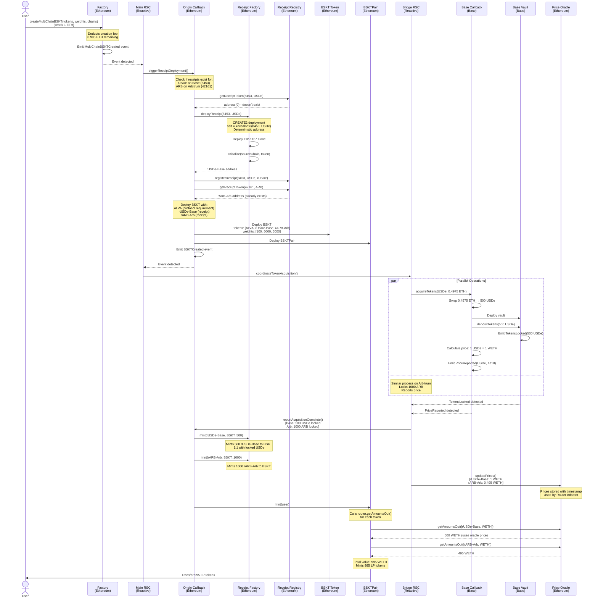
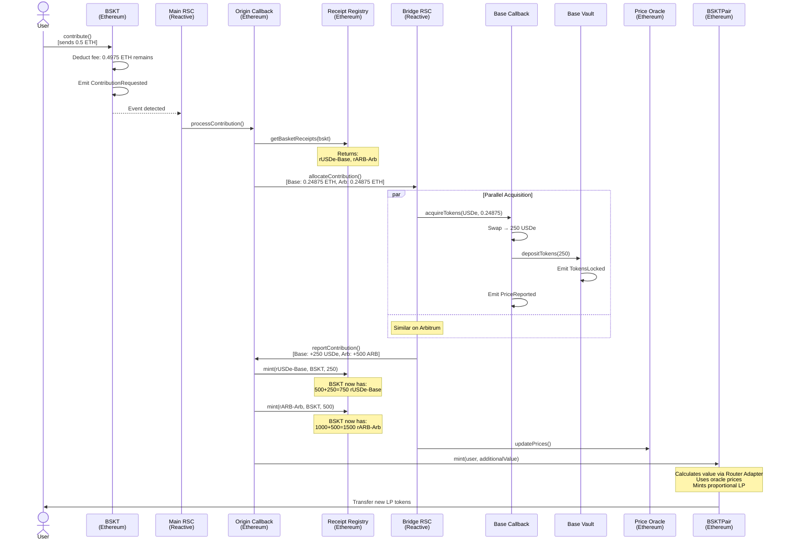
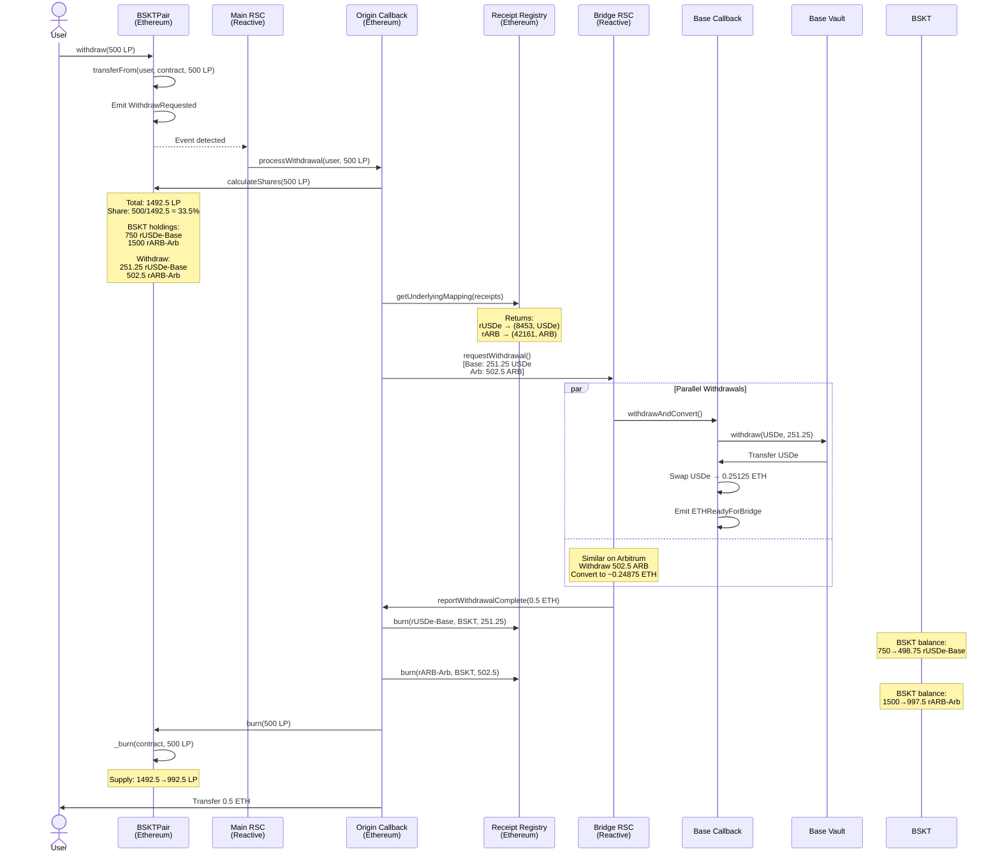
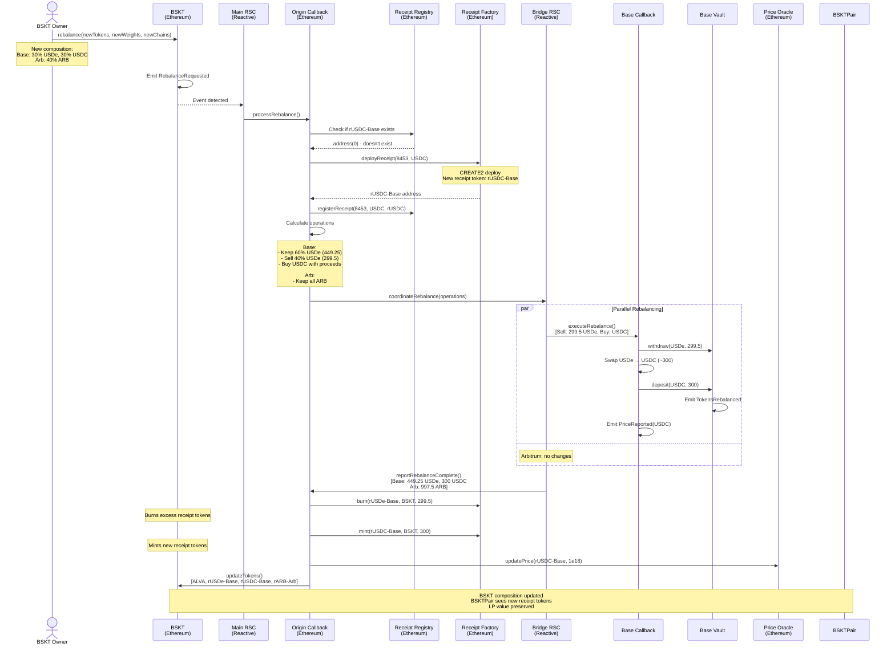

# Approach 2: Automated Receipt Token Deployment

## Overview

### What We're Trying to Achieve

Enable Alvara Protocol users to create single multi-chain BSKT tokens that hold assets across Ethereum, Base, and Arbitrum, while maintaining BSKTPair compatibility by using receipt tokens to represent cross-chain assets.

**Key Goals:**
1. **Maintain Standard BSKTPair Logic** - No modifications to core value calculation
2. **ERC20 Abstraction** - Receipt tokens act as normal ERC20s in the BSKT
3. **Automated Deployment** - System deploys receipt tokens on-demand via CREATE2
4. **1:1 Backing** - Each receipt token backed by actual asset locked in vault
5. **Price Oracle Integration** - Accurate valuation through dedicated oracle system

**The Challenge:**
Alvara's BSKTPair calculates value by checking token balances it holds and querying Uniswap for prices. When assets are on Base/Arbitrum, the BSKTPair on Ethereum doesn't hold them. We need a way to represent these cross-chain assets as ERC20 tokens that BSKTPair can see and value.

**The Solution:**
Create minimal ERC20 "receipt tokens" on Ethereum that represent locked assets on destination chains. When 500 USDe is locked on Base, mint 500 "rUSDe-Base" tokens on Ethereum. The BSKT holds these receipt tokens. A specialized router adapter intercepts price queries and uses a cross-chain price oracle instead of Uniswap for receipt tokens. Receipt tokens are deployed automatically using CREATE2 (deterministic addresses) and reused across all BSKTs.

---

## Architecture

### System Components

**Ethereum (Origin Chain):**
- **Factory** - Extended with `createMultiChainBSKT()` function
- **BSKT Token** - Standard ERC721, holds ALVA + receipt tokens
- **Receipt Token (EIP-1167 Clone)** - Minimal ERC20 representing locked cross-chain assets
- **Receipt Token Factory** - Deploys receipt tokens via CREATE2
- **Receipt Registry** - Maps chainId → underlyingToken → receiptToken
- **Price Oracle** - Stores receipt token prices in WETH
- **Router Adapter** - Intercepts getAmountsOut(), uses oracle for receipts
- **Standard BSKTPair** - Unchanged, works with receipt tokens as normal ERC20s
- **Origin Callback** - Deploys receipts, mints/burns based on vault events

**Reactive Network:**
- **Main RSC** - Event-driven coordinator
- **Bridge RSC** - Parallel operation handler

**Base & Arbitrum (Destination Chains):**
- **Destination Callback** - Acquires tokens, reports prices
- **Token Vault** - Per-basket secure storage

---

## Creation Flow

### Sequence Diagram



### Step-by-Step Flow

#### Step 1: User Initiates Creation
**Function Called:** `Factory.createMultiChainBSKT(tokens, weights, chains)`

```solidity
function createMultiChainBSKT(
    string calldata _name,
    address[] calldata _tokens,      // [USDe, ARB]
    uint256[] calldata _weights,     // [5000, 5000]
    uint256[] calldata _chains,      // [8453, 42161]
    uint256[] calldata _minAmountsOut
) external payable
```

**What Happens:**
- User sends 1 ETH for 50% USDe (Base), 50% ARB (Arbitrum) basket
- Factory validates parameters
- Deducts 0.5% creation fee → 0.995 ETH remains
- Emits `MultiChainBSKTCreated` event

**Event Emitted:**
```solidity
event MultiChainBSKTCreated(
    address indexed creator,
    string name,
    address[] tokens,      // [USDe, ARB]
    uint256[] weights,     // [5000, 5000]
    uint256[] chains,      // [8453, 42161]
    uint256 ethAmount,     // 0.995 ETH
    bytes32 requestId
);
```

#### Step 2: Reactive Network Detects & Triggers Receipt Deployment
**Main RSC Logic:**

```javascript
react(event MultiChainBSKTCreated) {
    // Trigger receipt deployment BEFORE anything else
    await OriginCallback.triggerReceiptDeployment(
        event.tokens,
        event.chains,
        event.requestId
    )
}
```

**What Happens:**
- RSC detects creation event
- Calls Origin Callback to handle receipt token deployment
- This happens BEFORE BSKT creation to ensure receipts exist

#### Step 3: Origin Callback Deploys Receipt Tokens
**Function Called:** `OriginCallback.triggerReceiptDeployment(tokens, chains, requestId)`

**What Happens - For Each Token:**

1. **Check if Receipt Already Exists:**
   ```solidity
   // For USDe on Base (chainId 8453)
   address existingReceipt = ReceiptRegistry.getReceiptToken(8453, USDe);
   
   if (existingReceipt == address(0)) {
       // Need to deploy new receipt
   } else {
       // Receipt exists, reuse it
       receiptAddresses.push(existingReceipt);
   }
   ```

2. **Deploy Receipt via CREATE2 (if needed):**
   ```solidity
   address receiptToken = ReceiptFactory.deployReceipt(
       8453,     // sourceChainId
       USDe,     // underlyingToken
       "rUSDe-Base",  // name
       "rUSDe-Base",  // symbol
       18        // decimals (matches USDe)
   );
   ```

3. **How CREATE2 Works:**
   ```solidity
   // Inside ReceiptFactory.deployReceipt()
   
   // Generate deterministic salt
   bytes32 salt = keccak256(abi.encodePacked(sourceChainId, underlyingToken));
   // salt = keccak256(8453, 0xUSDe...)
   
   // Deploy minimal clone (EIP-1167)
   address receipt = Clones.cloneDeterministic(
       receiptImplementation,  // Master copy address
       salt
   );
   
   // Initialize the clone
   IReceiptToken(receipt).initialize(
       sourceChainId,
       underlyingToken,
       name,
       symbol,
       decimals,
       address(this)  // minter = factory
   );
   
   return receipt;
   ```

4. **Register in Receipt Registry:**
   ```solidity
   ReceiptRegistry.registerReceipt(
       8453,           // chainId
       USDe,           // underlyingToken
       receiptToken,   // receipt address
       "rUSDe-Base"    // identifier
   );
   ```

**Receipt Token Structure:**
```solidity
contract ReceiptToken is ERC20Upgradeable {
    uint256 public immutable sourceChainId;   // 8453 (Base)
    address public immutable underlyingToken; // USDe address on Base
    address public minter;                     // Only Origin Callback
    
    function initialize(
        uint256 _sourceChainId,
        address _underlyingToken,
        string memory _name,
        string memory _symbol,
        uint8 _decimals,
        address _minter
    ) external initializer {
        __ERC20_init(_name, _symbol);
        // Set immutable values in storage
        sourceChainId = _sourceChainId;
        underlyingToken = _underlyingToken;
        minter = _minter;
        decimals = _decimals;
    }
    
    // Only minter can mint/burn
    function mint(address to, uint256 amount) external onlyMinter {
        _mint(to, amount);
    }
    
    function burn(address from, uint256 amount) external onlyMinter {
        _burn(from, amount);
    }
}
```

**Cost Analysis:**
- First time (deploy): ~100k gas for clone + 60k gas for initialize = **160k gas** (~$0.80 at 5 gwei)
- Reuse (existing): **0 gas** for deployment, just use existing address

**After This Step:**
```solidity
// Receipt Registry state
receipts[8453][USDe] = 0xReceiptAddr1;  // rUSDe-Base (newly deployed)
receipts[42161][ARB] = 0xReceiptAddr2;  // rARB-Arb (already existed)
```

#### Step 4: Origin Callback Creates BSKT with Receipt Tokens
**Function Called:** `OriginCallback.createBSKT()` (after receipts deployed)

**What Happens:**

1. **Prepare Token Arrays:**
   ```solidity
   address[] memory bsktTokens = new address[](3);
   bsktTokens[0] = ALVA;           // Protocol requirement
   bsktTokens[1] = receiptUSDe;    // rUSDe-Base
   bsktTokens[2] = receiptARB;     // rARB-Arb
   
   uint256[] memory bsktWeights = new uint256[](3);
   bsktWeights[0] = 100;           // ALVA gets minimal weight
   bsktWeights[1] = 5000;          // 50% rUSDe-Base
   bsktWeights[2] = 5000;          // 50% rARB-Arb
   ```

2. **Deploy BSKT Token:**
   ```solidity
   BSKT bskt = new BSKT(
       name,
       symbol,
       creator,
       bsktTokens,    // [ALVA, rUSDe-Base, rARB-Arb]
       bsktWeights,   // [100, 5000, 5000]
       tokenURI
   );
   ```

3. **Deploy BSKTPair:**
   ```solidity
   BSKTPair pair = new BSKTPair(
       bsktTokens,
       factory,
       name
   );
   ```

4. **Link Receipt Tokens to BSKT:**
   ```solidity
   ReceiptRegistry.registerBasketReceipts(
       address(bskt),
       [receiptUSDe, receiptARB],
       [8453, 42161],
       [USDe, ARB]
   );
   ```

**Key Point:** 
BSKT now holds ALVA + receipt tokens. BSKTPair sees these as normal ERC20s. The magic happens when BSKTPair queries prices - Router Adapter intercepts and uses oracle for receipts.

#### Step 5: Reactive Network Coordinates Token Acquisition
**Main RSC detects BSKTCreated → triggers Bridge RSC**

**Bridge RSC Logic:**

```javascript
react(event BSKTCreated) {
    const allocations = [
        {chain: 8453, token: USDe, ethAmount: 0.4975},
        {chain: 42161, token: ARB, ethAmount: 0.4975}
    ];
    
    await Promise.all(
        allocations.map(async (alloc) => {
            await callbacks[alloc.chain].acquireTokens(
                event.bskt,
                alloc.token,
                alloc.ethAmount
            );
        })
    );
}
```

#### Step 6: Destination Callbacks Acquire Tokens & Report Prices

**On Base - Function Called:** `BaseCallback.acquireTokens(bskt, token, ethAmount)`

**What Happens:**

1. **Swap ETH for Token:**
   ```solidity
   uint256 usdcReceived = swapExactETHForTokens(
       0.4975 ether,
       [WETH, USDe],
       address(this),
       minAmountOut
   );
   // Receives 500 USDe
   ```

2. **Deploy Vault & Lock Tokens:**
   ```solidity
   if (vaults[bskt] == address(0)) {
       vaults[bskt] = new TokenVault(bskt, owner);
   }
   
   USDe.approve(vault, 500e18);
   TokenVault(vault).depositTokens(USDe, 500e18);
   ```

3. **Calculate Price in WETH:**
   ```solidity
   // Query DEX for current price
   address[] memory path = new address[](2);
   path[0] = USDe;
   path[1] = WETH;
   
   uint256[] memory amounts = router.getAmountsOut(1e18, path);
   uint256 priceInWETH = amounts[1];  // 1 USDe = 1 WETH
   ```

4. **Emit Events:**
   ```solidity
   emit TokensLocked(
       bskt,
       USDe,
       500e18,           // amount
       500e18            // valueInWETH = amount * priceInWETH
   );
   
   emit PriceReported(
       bskt,
       8453,             // chainId
       USDe,             // underlying token
       priceInWETH,      // 1 USDe = 1 WETH
       block.timestamp
   );
   ```

**On Arbitrum - Same Process:**
- Swap 0.4975 ETH → 1000 ARB
- Lock in vault
- Calculate price: 1 ARB = 0.495 WETH
- Emit TokensLocked & PriceReported

**Why Report Prices?**
The Price Oracle on Ethereum needs to know how much each receipt token is worth. Destination callbacks have access to local DEXs and can get accurate prices. These prices are reported back and stored in the oracle for Router Adapter to use.

#### Step 7: Bridge RSC Aggregates & Updates Oracle

**Bridge RSC Logic:**

```javascript
let baseLocked, basePrice;
let arbLocked, arbPrice;

subscribe(BaseVault.TokensLocked) {
    if (event.bskt === targetBSKT) {
        baseLocked = event;
        checkComplete();
    }
}

subscribe(BaseCallback.PriceReported) {
    if (event.bskt === targetBSKT) {
        basePrice = event;
        checkComplete();
    }
}

// Similar for Arbitrum...

function checkComplete() {
    if (baseLocked && basePrice && arbLocked && arbPrice) {
        // All data collected
        await OriginCallback.reportAcquisitionComplete(
            targetBSKT,
            [
                {
                    chain: 8453,
                    token: USDe,
                    amount: baseLocked.amount,
                    priceInWETH: basePrice.price
                },
                {
                    chain: 42161,
                    token: ARB,
                    amount: arbLocked.amount,
                    priceInWETH: arbPrice.price
                }
            ]
        );
    }
}
```

**What Happens:**
- RSC waits for BOTH locks and prices from each chain
- Aggregates complete acquisition data
- Calls Origin Callback with amounts and prices
- Ensures atomic operation: all or nothing

#### Step 8: Origin Callback Mints Receipt Tokens

**Function Called:** `OriginCallback.reportAcquisitionComplete(bskt, acquisitions)`

**What Happens:**

1. **Mint Receipt Tokens to BSKT:**
   ```solidity
   for (uint i = 0; i < acquisitions.length; i++) {
       address receiptToken = ReceiptRegistry.getReceiptToken(
           acquisitions[i].chain,
           acquisitions[i].token
       );
       
       // Mint receipt tokens 1:1 with locked amount
       ReceiptToken(receiptToken).mint(
           bskt,                      // to BSKT contract
           acquisitions[i].amount     // 500 for USDe, 1000 for ARB
       );
   }
   ```
   
   After this:
   - BSKT holds 500 rUSDe-Base tokens
   - BSKT holds 1000 rARB-Arb tokens

2. **Update Price Oracle:**
   ```solidity
   for (uint i = 0; i < acquisitions.length; i++) {
       address receiptToken = ReceiptRegistry.getReceiptToken(
           acquisitions[i].chain,
           acquisitions[i].token
       );
       
       Oracle.updatePrice(
           receiptToken,              // rUSDe-Base
           acquisitions[i].priceInWETH,  // 1 WETH
           block.timestamp
       );
   }
   ```

**Oracle State After Update:**
```solidity
prices[rUSDe-Base] = {
    priceInWETH: 1e18,           // 1:1 with WETH
    lastUpdated: block.timestamp
}

prices[rARB-Arb] = {
    priceInWETH: 0.495e18,       // 1 ARB = 0.495 WETH
    lastUpdated: block.timestamp
}
```

#### Step 9: BSKTPair Mints LP Tokens Using Router Adapter

**Function Called:** `BSKTPair.mint(user)`

**What Happens:**

1. **BSKTPair Queries Value (Standard Logic):**
   ```solidity
   // For each token in BSKT
   uint256 totalValue;
   
   for (uint i = 0; i < tokens.length; i++) {
       uint256 balance = IERC20(tokens[i]).balanceOf(bsktPair);
       // rUSDe-Base: 500
       // rARB-Arb: 1000
       
       address[] memory path = new address[](2);
       path[0] = tokens[i];     // rUSDe-Base
       path[1] = WETH;
       
       // Call router.getAmountsOut()
       uint256[] memory amounts = router.getAmountsOut(balance, path);
       totalValue += amounts[1];
   }
   ```

2. **Router Adapter Intercepts Call:**
   ```solidity
   // Inside RouterAdapter.getAmountsOut()
   function getAmountsOut(
       uint256 amountIn,
       address[] memory path
   ) external view returns (uint256[] memory) {
       address tokenIn = path[0];
       address tokenOut = path[1];
       
       // Check if tokenIn is a receipt token
       bool isReceipt = ReceiptRegistry.isReceiptToken(tokenIn);
       
       if (isReceipt && tokenOut == WETH) {
           // Use oracle price instead of Uniswap
           uint256 priceInWETH = Oracle.getPrice(tokenIn);
           
           uint256[] memory amounts = new uint256[](2);
           amounts[0] = amountIn;
           amounts[1] = (amountIn * priceInWETH) / 1e18;
           
           return amounts;
       } else {
           // Normal token, use actual Uniswap
           return IUniswapRouter(realRouter).getAmountsOut(amountIn, path);
       }
   }
   ```

3. **Value Calculation:**
   ```solidity
   // rUSDe-Base
   balance = 500e18
   priceInWETH = 1e18
   value = (500e18 * 1e18) / 1e18 = 500e18 WETH
   
   // rARB-Arb
   balance = 1000e18
   priceInWETH = 0.495e18
   value = (1000e18 * 0.495e18) / 1e18 = 495e18 WETH
   
   // Total
   totalValue = 500 + 495 = 995 WETH
   ```

4. **Mint LP Tokens:**
   ```solidity
   if (totalSupply() == 0) {
       liquidity = totalValue;  // First mint: 1:1
   } else {
       liquidity = (totalValue * totalSupply()) / currentValue;
   }
   
   _mint(user, 995e18);  // 995 LP tokens
   ```

**User's Final Holdings:**
- 1 BSKT NFT (tokenId 0)
- 995 BSKTPair LP tokens
- BSKTPair sees BSKT holding:
  - 500 rUSDe-Base (worth 500 WETH via oracle)
  - 1000 rARB-Arb (worth 495 WETH via oracle)

**Behind the Scenes:**
- Base vault holds 500 actual USDe
- Arbitrum vault holds 1000 actual ARB
- Receipt tokens are 1:1 backed

---

## Contribution Flow

### Sequence Diagram



### Step-by-Step Flow

#### Step 1: User Contributes ETH
**Function Called:** `BSKT.contribute()`

```solidity
function contribute() external payable {
    uint256 fee = (msg.value * contributionFee) / 10000;
    uint256 amountAfterFee = msg.value - fee;
    
    payable(feeCollector).transfer(fee);
    
    emit ContributionRequested(
        msg.sender,
        amountAfterFee,  // 0.4975 ETH
        block.timestamp
    );
}
```

**What Happens:**
- User sends 0.5 ETH
- 0.5% fee deducted (0.0025 ETH)
- 0.4975 ETH available for investment
- Event triggers Reactive workflow

#### Step 2: Origin Callback Allocates Contribution

**Main RSC detects event → triggers OriginCallback**

**Function Called:** `OriginCallback.processContribution(bskt, amount, user)`

**What Happens:**

1. **Get Basket Receipt Configuration:**
   ```solidity
   (
       address[] memory receipts,
       uint256[] memory weights,
       uint256[] memory chains
   ) = ReceiptRegistry.getBasketReceipts(bskt);
   
   // Returns:
   // receipts: [rUSDe-Base, rARB-Arb]
   // weights: [5000, 5000]
   // chains: [8453, 42161]
   ```

2. **Calculate Per-Chain Allocation:**
   ```solidity
   allocations = [
       {chain: 8453, ethAmount: 0.4975 * 0.50 = 0.24875 ETH},
       {chain: 42161, ethAmount: 0.4975 * 0.50 = 0.24875 ETH}
   ];
   ```

3. **Trigger Bridge RSC:**
   Emit ContributionAllocated event with allocation details

#### Step 3: Destination Callbacks Acquire Additional Tokens

**On Base:**
- Swap 0.24875 ETH → ~250 USDe
- Deposit to existing vault (already created during initial creation)
- Emit TokensLocked(bskt, USDe, 250e18, 250e18)
- Emit PriceReported(bskt, 8453, USDe, 1e18, timestamp)

**On Arbitrum:**
- Swap 0.24875 ETH → ~500 ARB
- Deposit to vault
- Emit TokensLocked(bskt, ARB, 500e18, 247.5e18)
- Emit PriceReported(bskt, 42161, ARB, 0.495e18, timestamp)

**Vault State After:**
```solidity
// Base vault
vaultBalances[bskt][USDe] = 500e18 + 250e18 = 750e18

// Arbitrum vault
vaultBalances[bskt][ARB] = 1000e18 + 500e18 = 1500e18
```

#### Step 4: Origin Callback Mints Additional Receipt Tokens

**Bridge RSC aggregates → triggers OriginCallback**

**Function Called:** `OriginCallback.reportContribution(bskt, newAmounts)`

**What Happens:**

1. **Mint Additional Receipt Tokens:**
   ```solidity
   // For Base
   address rUSDe = ReceiptRegistry.getReceiptToken(8453, USDe);
   ReceiptToken(rUSDe).mint(
       bskt,      // to BSKT
       250e18     // additional amount
   );
   
   // For Arbitrum
   address rARB = ReceiptRegistry.getReceiptToken(42161, ARB);
   ReceiptToken(rARB).mint(
       bskt,      // to BSKT
       500e18     // additional amount
   );
   ```

2. **Update Oracle Prices:**
   ```solidity
   Oracle.updatePrice(rUSDe, 1e18, block.timestamp);
   Oracle.updatePrice(rARB, 0.495e18, block.timestamp);
   ```

**BSKT Holdings After:**
```solidity
// BSKT now holds:
IERC20(rUSDe).balanceOf(bskt) = 500e18 + 250e18 = 750e18
IERC20(rARB).balanceOf(bskt) = 1000e18 + 500e18 = 1500e18
```

#### Step 5: BSKTPair Mints Additional LP Tokens

**Function Called:** `BSKTPair.mint(user)`

**What Happens:**

```solidity
// Get current total value
uint256 previousValue = 995e18;  // Before contribution
uint256 currentValue = calculateTotalValue();

// For rUSDe-Base:
uint256 balance = IERC20(rUSDe).balanceOf(bsktPair);  // 750
uint256[] memory amounts = router.getAmountsOut(balance, [rUSDe, WETH]);
// Router Adapter returns: 750 * 1 = 750 WETH

// For rARB-Arb:
balance = IERC20(rARB).balanceOf(bsktPair);  // 1500
amounts = router.getAmountsOut(balance, [rARB, WETH]);
// Router Adapter returns: 1500 * 0.495 = 742.5 WETH

// Total value
currentValue = 750 + 742.5 = 1492.5 WETH
additionalValue = 1492.5 - 995 = 497.5 WETH

// Calculate LP to mint
uint256 currentSupply = totalSupply();  // 995
uint256 newLP = (additionalValue * currentSupply) / previousValue;
// = (497.5 * 995) / 995 = 497.5 LP

_mint(user, 497.5e18);
```

**User Receives:**
- 497.5 new LP tokens
- Total supply now: 1492.5 LP
- Each LP worth ~$1

---

## Withdrawal Flow

### Sequence Diagram



### Step-by-Step Flow

#### Step 1: User Initiates Withdrawal
**Function Called:** `BSKTPair.withdraw(lpAmount)`

```solidity
function withdraw(uint256 lpAmount) external {
    require(balanceOf(msg.sender) >= lpAmount);
    
    transferFrom(msg.sender, address(this), lpAmount);
    
    emit WithdrawRequested(
        msg.sender,
        lpAmount,      // 500 LP
        block.timestamp
    );
}
```

**What Happens:**
- User transfers 500 LP to BSKTPair contract
- LP held pending cross-chain operations
- Event triggers Reactive workflow

#### Step 2: Origin Callback Calculates Receipt Token Amounts

**Main RSC detects event → triggers OriginCallback**

**Function Called:** `OriginCallback.processWithdrawal(user, bskt, lpAmount)`

**What Happens:**

1. **Get Current State:**
   ```solidity
   uint256 totalSupply = BSKTPair(pair).totalSupply();  // 1492.5 LP
   
   (
       address[] memory receipts,
       uint256[] memory weights
   ) = ReceiptRegistry.getBasketReceipts(bskt);
   
   // receipts: [rUSDe-Base, rARB-Arb]
   ```

2. **Calculate Proportional Share:**
   ```solidity
   uint256 sharePercentage = (lpAmount * 1e18) / totalSupply;
   // = (500 * 1e18) / 1492.5e18 = 0.335e18 (33.5%)
   ```

3. **Calculate Receipt Token Amounts to Burn:**
   ```solidity
   WithdrawalAllocation[] memory allocations;
   
   for (uint i = 0; i < receipts.length; i++) {
       uint256 receiptBalance = IERC20(receipts[i]).balanceOf(bskt);
       uint256 amountToWithdraw = (receiptBalance * sharePercentage) / 1e18;
       
       // rUSDe-Base: 750 * 0.335 = 251.25
       // rARB-Arb: 1500 * 0.335 = 502.5
       
       allocations[i] = {
           receiptToken: receipts[i],
           amount: amountToWithdraw
       };
   }
   ```

4. **Map Receipt Tokens to Underlying:**
   ```solidity
   for (uint i = 0; i < allocations.length; i++) {
       (uint256 chainId, address underlying) = ReceiptRegistry.getUnderlying(
           allocations[i].receiptToken
       );
       
       allocations[i].chainId = chainId;
       allocations[i].underlyingToken = underlying;
   }
   
   // Results:
   // [0]: rUSDe-Base → chainId: 8453, token: USDe, amount: 251.25
   // [1]: rARB-Arb → chainId: 42161, token: ARB, amount: 502.5
   ```

5. **Trigger Reactive Workflow:**
   ```solidity
   emit WithdrawalAllocated(
       user,
       bskt,
       allocations,
       lpAmount
   );
   ```

#### Step 3: Bridge RSC Coordinates Parallel Withdrawals

**Bridge RSC Logic:**

```javascript
react(event WithdrawalAllocated) {
    const allocations = event.allocations;
    
    const results = await Promise.all(
        allocations.map(async (alloc) => {
            return await callbacks[alloc.chainId].withdrawAndConvert(
                event.bskt,
                alloc.underlyingToken,
                alloc.amount,
                event.user
            );
        })
    );
    
    const totalETH = results.reduce((sum, r) => sum + r.ethAmount, 0);
}
```

#### Step 4: Destination Callbacks Process Withdrawals

**On Base - Function Called:** `BaseCallback.withdrawAndConvert(bskt, token, amount, user)`

**What Happens:**

1. **Withdraw from Vault:**
   ```solidity
   address vault = vaults[bskt];
   TokenVault(vault).withdraw(USDe, 251.25e18);
   // Vault sends 251.25 USDe to callback
   ```

2. **Swap to ETH:**
   ```solidity
   USDe.approve(router, 251.25e18);
   uint256 ethReceived = swapExactTokensForETH(
       251.25e18,
       [USDe, WETH],
       address(this)
   );
   // Receives ~0.25125 ETH
   ```

3. **Prepare for Bridge:**
   ```solidity
   emit ETHReadyForBridge(
       bskt,
       user,
       ethReceived,  // 0.25125 ETH
       8453
   );
   ```

**On Arbitrum - Same Process:**
- Withdraw 502.5 ARB
- Swap to ~0.24875 ETH
- Emit ETHReadyForBridge

**Vault State After:**
```solidity
// Base vault
vaultBalances[bskt][USDe] = 750e18 - 251.25e18 = 498.75e18

// Arbitrum vault
vaultBalances[bskt][ARB] = 1500e18 - 502.5e18 = 997.5e18
```

#### Step 5: Origin Callback Burns Receipt Tokens & LP

**Bridge RSC aggregates → triggers OriginCallback**

**Function Called:** `OriginCallback.reportWithdrawalComplete(bskt, user, totalETH, withdrawnAmounts)`

**What Happens:**

1. **Burn Receipt Tokens from BSKT:**
   ```solidity
   for (uint i = 0; i < withdrawnAmounts.length; i++) {
       ReceiptToken(withdrawnAmounts[i].receipt).burn(
           bskt,                       // from BSKT
           withdrawnAmounts[i].amount  // 251.25 rUSDe, 502.5 rARB
       );
   }
   ```

2. **BSKT Receipt Balance After Burn:**
   ```solidity
   IERC20(rUSDe).balanceOf(bskt) = 750e18 - 251.25e18 = 498.75e18
   IERC20(rARB).balanceOf(bskt) = 1500e18 - 502.5e18 = 997.5e18
   ```

3. **Burn LP Tokens:**
   ```solidity
   BSKTPair(pair).burn(lpAmount);
   // Burns 500 LP from BSKTPair contract
   // New supply: 1492.5 - 500 = 992.5 LP
   ```

4. **Transfer ETH to User:**
   ```solidity
   payable(user).transfer(totalETH);
   // User receives 0.5 ETH
   ```

**Final State:**
- User received: 0.5 ETH
- Receipt tokens burned: 251.25 rUSDe-Base, 502.5 rARB-Arb
- LP burned: 500 tokens
- Remaining supply: 992.5 LP
- Remaining value: $992.81

---

## Rebalancing Flow

### Sequence Diagram



### Step-by-Step Flow

#### Step 1: Owner Initiates Rebalance
**Function Called:** `BSKT.rebalance(newTokens, newWeights, newChains)`

```solidity
function rebalance(
    address[] calldata newTokens,    // [USDe, USDC, ARB]
    uint256[] calldata newWeights,   // [3000, 3000, 4000]
    uint256[] calldata newChains     // [8453, 8453, 42161]
) external onlyOwner {
    emit RebalanceRequested(
        address(this),
        newTokens,
        newWeights,
        newChains,
        block.timestamp
    );
}
```

**What Happens:**
- Owner wants: 30% USDe (Base), 30% USDC (Base), 40% ARB (Arb)
- Current: 50% USDe (Base), 50% ARB (Arb)
- Need to: reduce USDe, add USDC, keep ARB

#### Step 2: Origin Callback Deploys New Receipt Token (if needed)

**Main RSC detects event → triggers OriginCallback**

**Function Called:** `OriginCallback.processRebalance(bskt, newTokens, newWeights, newChains)`

**What Happens:**

1. **Check for New Tokens:**
   ```solidity
   for (uint i = 0; i < newTokens.length; i++) {
       address receipt = ReceiptRegistry.getReceiptToken(
           newChains[i],
           newTokens[i]
       );
       
       if (receipt == address(0)) {
           // Need to deploy new receipt
           if (newTokens[i] == USDC && newChains[i] == 8453) {
               receipt = ReceiptFactory.deployReceipt(
                   8453,
                   USDC,
                   "rUSDC-Base",
                   "rUSDC-Base",
                   6  // USDC has 6 decimals
               );
               
               ReceiptRegistry.registerReceipt(8453, USDC, receipt);
           }
       }
       
       newReceipts[i] = receipt;
   }
   ```

2. **Calculate Current Holdings:**
   ```solidity
   // BSKT currently holds:
   uint256 rUSDBalance = IERC20(rUSDe).balanceOf(bskt);  // 748.75
   uint256 rARBBalance = IERC20(rARB).balanceOf(bskt);   // 997.5
   
   // Underlying vaults hold:
   // Base: 748.75 USDe
   // Arb: 997.5 ARB
   
   // Total value: $746.19 (USDe) + $494.06 (ARB) = $1240.25
   ```

3. **Calculate Target Holdings:**
   ```solidity
   uint256 totalValue = calculateTotalValue(bskt);  // $1240.25
   
   // Targets:
   // USDe: 30% = $372.075 → need 372.075 USDe
   // USDC: 30% = $372.075 → need 372.075 USDC
   // ARB: 40% = $496.10 → need ~1002 ARB
   
   // Current:
   // USDe: 748.75 → REDUCE to 372.075 (sell 376.675)
   // USDC: 0 → BUY 372.075
   // ARB: 997.5 → KEEP (close to target)
   ```

4. **Generate Rebalance Operations:**
   ```solidity
   RebalanceOp[] memory operations;
   
   operations[0] = {
       chain: 8453,
       sellToken: USDe,
       sellAmount: 376.675e18,
       buyToken: USDC,
       minBuyAmount: 370e6  // USDC has 6 decimals
   };
   
   // No operation for Arbitrum (ARB stays)
   ```

#### Step 3: Destination Callback Executes Rebalance

**Bridge RSC triggers BaseCallback**

**Function Called:** `BaseCallback.executeRebalance(bskt, sellToken, sellAmount, buyToken, minBuyAmount)`

**What Happens:**

1. **Withdraw USDe to Sell:**
   ```solidity
   TokenVault(vault).withdraw(USDe, 376.675e18);
   // Vault transfers to callback
   ```

2. **Swap on DEX:**
   ```solidity
   USDe.approve(router, 376.675e18);
   uint256 usdcReceived = swapExactTokensForTokens(
       376.675e18,
       [USDe, USDC],
       address(this)
   );
   // Receives ~372.075 USDC (6 decimals)
   ```

3. **Deposit New Token:**
   ```solidity
   USDC.approve(vault, usdcReceived);
   TokenVault(vault).depositTokens(USDC, usdcReceived);
   ```

4. **Report Price & Completion:**
   ```solidity
   uint256 usdcPrice = getPrice(USDC, WETH);  // 1 USDC = 1 WETH
   
   emit TokensRebalanced(
       bskt,
       [USDe, USDC],
       [372.075e18, 372.075e6],  // Note: different decimals
       [372.075e18, 372.075e18]  // Values in WETH
   );
   
   emit PriceReported(
       bskt,
       8453,
       USDC,
       1e18,  // 1 USDC = 1 WETH
       block.timestamp
   );
   ```

**Vault State After:**
```solidity
// Base vault now holds TWO tokens
vaultBalances[bskt][USDe] = 372.075e18
vaultBalances[bskt][USDC] = 372.075e6

// Arbitrum vault unchanged
vaultBalances[bskt][ARB] = 997.5e18
```

#### Step 4: Origin Callback Updates Receipt Tokens

**Bridge RSC reports completion → triggers OriginCallback**

**Function Called:** `OriginCallback.reportRebalanceComplete(bskt, newHoldings)`

**What Happens:**

1. **Burn Excess Receipt Tokens:**
   ```solidity
   // rUSDe-Base: reduce from 748.75 to 372.075
   uint256 amountToBurn = 748.75e18 - 372.075e18 = 376.675e18;
   
   ReceiptToken(rUSDe).burn(
       bskt,
       amountToBurn
   );
   ```

2. **Mint New Receipt Tokens:**
   ```solidity
   // rUSDC-Base: mint 372.075 (scaled to 18 decimals internally)
   ReceiptToken(rUSDC).mint(
       bskt,
       372.075e18  // Receipt uses 18 decimals regardless
   );
   ```

3. **Update Oracle:**
   ```solidity
   Oracle.updatePrice(rUSDC, 1e18, block.timestamp);
   Oracle.updatePrice(rUSDe, 1e18, block.timestamp);  // Refresh
   Oracle.updatePrice(rARB, 0.495e18, block.timestamp);  // Refresh
   ```

4. **Update BSKT Token Composition:**
   ```solidity
   BSKT(bskt).updateTokens(
       [ALVA, rUSDe, rUSDC, rARB],
       [100, 3000, 3000, 4000]
   );
   ```

**BSKT Holdings After Rebalance:**
```solidity
IERC20(ALVA).balanceOf(bskt) = minimal amount
IERC20(rUSDe).balanceOf(bskt) = 372.075e18
IERC20(rUSDC).balanceOf(bskt) = 372.075e18  // New!
IERC20(rARB).balanceOf(bskt) = 997.5e18
```

#### Step 5: BSKTPair Automatically Recognizes New Composition

**No Function Call Needed - BSKTPair queries BSKT for current holdings**

**What Happens:**

Next time someone contributes/withdraws, BSKTPair will:

```solidity
// Query BSKT for current token list
address[] memory tokens = BSKT(bskt).getTokens();
// Returns: [ALVA, rUSDe-Base, rUSDC-Base, rARB-Arb]

// Calculate value for each
for (uint i = 0; i < tokens.length; i++) {
    uint256 balance = IERC20(tokens[i]).balanceOf(bsktPair);
    
    // Router Adapter intercepts for receipt tokens
    uint256[] memory amounts = router.getAmountsOut(
        balance,
        [tokens[i], WETH]
    );
    
    totalValue += amounts[1];
}

// rUSDe-Base: 372.075 * 1 = 372.075 WETH
// rUSDC-Base: 372.075 * 1 = 372.075 WETH
// rARB-Arb: 997.5 * 0.495 = 493.76 WETH
// Total: $1237.91 (small loss due to DEX fees)
```

**Important:**
- LP tokens unchanged (still 992.5 supply)
- LP value slightly decreased due to swap fees (~$1.24 per LP)
- Users don't need to do anything
- Next contribution will use new composition automatically

---

## Key Contracts & Functions

### Receipt Token (EIP-1167 Clone)

**Purpose:** Minimal ERC20 representing locked cross-chain assets

**Storage:**
```solidity
contract ReceiptToken is ERC20Upgradeable {
    uint256 public immutable sourceChainId;
    address public immutable underlyingToken;
    address public minter;  // Only this address can mint/burn
    uint8 private _decimals;
    
    // Inherited from ERC20: name, symbol, balances, allowances
}
```

**Key Functions:**
```solidity
function initialize(
    uint256 _sourceChainId,
    address _underlyingToken,
    string memory _name,
    string memory _symbol,
    uint8 __decimals,
    address _minter
) external initializer

function mint(address to, uint256 amount) external onlyMinter

function burn(address from, uint256 amount) external onlyMinter

function decimals() public view override returns (uint8)
```

### Receipt Factory (Ethereum)

**Purpose:** Deploy receipt tokens via CREATE2

**Key Functions:**

```solidity
// Deploy new receipt token
function deployReceipt(
    uint256 sourceChainId,
    address underlyingToken,
    string calldata name,
    string calldata symbol,
    uint8 decimals
) external onlyCallback returns (address)

// Calculate deterministic address
function computeReceiptAddress(
    uint256 sourceChainId,
    address underlyingToken
) public view returns (address)

// Internal CREATE2 deployment
function _deployClone(bytes32 salt) internal returns (address)
```

**Implementation:**
```solidity
function deployReceipt(...) external returns (address) {
    // Generate deterministic salt
    bytes32 salt = keccak256(
        abi.encodePacked(sourceChainId, underlyingToken)
    );
    
    // Check if already deployed
    address predicted = Clones.predictDeterministicAddress(
        receiptImplementation,
        salt
    );
    
    if (predicted.code.length > 0) {
        return predicted;  // Already deployed
    }
    
    // Deploy EIP-1167 minimal proxy
    address receipt = Clones.cloneDeterministic(
        receiptImplementation,
        salt
    );
    
    // Initialize
    IReceiptToken(receipt).initialize(
        sourceChainId,
        underlyingToken,
        name,
        symbol,
        decimals,
        msg.sender  // minter
    );
    
    return receipt;
}
```

### Receipt Registry (Ethereum)

**Purpose:** Map receipt tokens to underlying assets and BSKTs

**Storage:**
```solidity
// chainId => underlyingToken => receiptToken
mapping(uint256 => mapping(address => address)) public receipts;

// receiptToken => (chainId, underlyingToken)
mapping(address => UnderlyingInfo) public underlying;

// bskt => receipt tokens used
mapping(address => address[]) public basketReceipts;
```

**Key Functions:**
```solidity
// Register new receipt token
function registerReceipt(
    uint256 chainId,
    address underlyingToken,
    address receiptToken,
    string calldata identifier
) external onlyCallback

// Get receipt token for underlying
function getReceiptToken(
    uint256 chainId,
    address underlyingToken
) external view returns (address)

// Get underlying info for receipt
function getUnderlying(address receiptToken) 
    external view returns (uint256 chainId, address underlying)

// Register receipts used by a basket
function registerBasketReceipts(
    address bskt,
    address[] calldata receiptTokens,
    uint256[] calldata chainIds,
    address[] calldata underlyingTokens
) external onlyCallback

// Check if token is a receipt
function isReceiptToken(address token) external view returns (bool)
```

### Price Oracle (Ethereum)

**Purpose:** Store receipt token prices for Router Adapter

**Storage:**
```solidity
struct PriceData {
    uint256 priceInWETH;  // Price in WETH (18 decimals)
    uint256 lastUpdated;   // Timestamp
    bool isActive;
}

mapping(address => PriceData) public prices;  // receiptToken => price
```

**Key Functions:**
```solidity
// Update price (called by Origin Callback)
function updatePrice(
    address receiptToken,
    uint256 priceInWETH,
    uint256 timestamp
) external onlyCallback

// Get current price
function getPrice(address receiptToken) 
    external view returns (uint256)

// Check if price is stale
function isPriceStale(address receiptToken) 
    external view returns (bool)

// Batch update prices
function updatePrices(
    address[] calldata receiptTokens,
    uint256[] calldata pricesInWETH,
    uint256 timestamp
) external onlyCallback
```

**Staleness Check:**
```solidity
uint256 public constant MAX_PRICE_AGE = 1 hours;

function isPriceStale(address receiptToken) external view returns (bool) {
    PriceData memory data = prices[receiptToken];
    return (block.timestamp - data.lastUpdated) > MAX_PRICE_AGE;
}
```

### Router Adapter (Ethereum)

**Purpose:** Intercept price queries and use oracle for receipt tokens

**Key Function:**

```solidity
function getAmountsOut(
    uint256 amountIn,
    address[] memory path
) external view returns (uint256[] memory)

// Implementation
function getAmountsOut(
    uint256 amountIn,
    address[] memory path
) external view returns (uint256[] memory amounts) {
    require(path.length >= 2, "Invalid path");
    
    address tokenIn = path[0];
    address tokenOut = path[path.length - 1];
    
    amounts = new uint256[](path.length);
    amounts[0] = amountIn;
    
    // Check if tokenIn is a receipt token
    bool isReceipt = ReceiptRegistry.isReceiptToken(tokenIn);
    
    if (isReceipt && tokenOut == WETH) {
        // Use oracle for receipt token pricing
        uint256 priceInWETH = Oracle.getPrice(tokenIn);
        
        // Check staleness
        require(!Oracle.isPriceStale(tokenIn), "Price stale");
        
        // Calculate output
        amounts[path.length - 1] = (amountIn * priceInWETH) / 1e18;
    } else {
        // Use actual Uniswap router
        return IUniswapRouter(realRouter).getAmountsOut(amountIn, path);
    }
    
    return amounts;
}
```

**Why This Works:**
BSKTPair calls `router.getAmountsOut()` to value tokens. Router Adapter sits between BSKTPair and actual Uniswap router. When it sees a receipt token, it uses the oracle price. When it sees a normal token, it delegates to Uniswap.

### Origin Callback (Ethereum)

**Purpose:** Deploy receipts, mint/burn, coordinate multi-chain operations

**Key Functions:**

```solidity
// Trigger receipt deployment before BSKT creation
function triggerReceiptDeployment(
    address[] calldata tokens,
    uint256[] calldata chains,
    bytes32 requestId
) external onlyReactive

// Create BSKT with receipt tokens
function createBSKT(
    address creator,
    address[] calldata tokens,
    uint256[] calldata weights,
    uint256[] calldata chains,
    uint256 ethAmount,
    bytes32 requestId
) external onlyReactive

// Mint receipt tokens after tokens locked
function reportAcquisitionComplete(
    address bskt,
    ChainHolding[] calldata holdings
) external onlyReactive

// Process contribution: mint more receipts
function processContribution(
    address bskt,
    address user,
    uint256 ethAmount
) external onlyReactive

// Process withdrawal: burn receipts
function processWithdrawal(
    address bskt,
    address user,
    uint256 lpAmount
) external onlyReactive

// Process rebalance: deploy new receipts, burn/mint as needed
function processRebalance(
    address bskt,
    address[] calldata newTokens,
    uint256[] calldata newWeights,
    uint256[] calldata newChains
) external onlyReactive
```

---

## Security Considerations

### Receipt Token Security

**Risk:** Unlimited minting of receipt tokens

**Mitigation:**
- Only Origin Callback can mint/burn (enforced by `onlyMinter` modifier)
- Origin Callback only mints after verifying TokensLocked events from vaults
- 1:1 backing enforced: mint amount = locked amount
- Immutable sourceChainId and underlyingToken prevent confusion

### Oracle Manipulation

**Risk:** Stale or manipulated prices lead to incorrect LP minting

**Mitigation:**
- Prices updated every time tokens locked/unlocked (frequent)
- Staleness check: prices older than 1 hour rejected
- Prices sourced from destination chain DEXs (harder to manipulate)
- Sanity checks: price changes >10% require delay
- Multi-sig can pause oracle in emergency

### CREATE2 Address Collision

**Risk:** Malicious actor pre-deploys receipt with same salt

**Mitigation:**
- Receipt Factory checks if address already has code
- If exists, verifies it's a valid receipt with correct parameters
- Rejects if parameters don't match expected
- Only Origin Callback can register in Receipt Registry

### Receipt Token Reuse Attack

**Risk:** One BSKT's receipts used in another BSKT maliciously

**Mitigation:**
- Receipt tokens are permissionless (this is intentional)
- BSKTPair values receipts via oracle (not user-controlled)
- Receipt Registry tracks which receipts each BSKT uses
- Worst case: user loses gas creating redundant position

### Cross-Chain Message Replay

**Risk:** Mint events processed multiple times

**Mitigation:**
- Each operation has unique requestId
- Origin Callback stores processed requestIds
- Duplicate requestId causes revert
- Nonce-based sequencing for same-user operations

### LP Token Value Manipulation

**Risk:** Flash loan to manipulate oracle before LP mint

**Mitigation:**
- Oracle updates and LP mints happen atomically (same Reactive workflow)
- Oracle prices come from destination chains (can't flash loan cross-chain)
- Router Adapter checks price staleness (<1 hour old)
- Large mints (>1% supply) have time delay

---

## Advantages of Receipt Token Approach

1. **BSKTPair Compatible** - Minimal changes to core logic
2. **Standard ERC20 Abstraction** - Receipt tokens work like normal tokens
3. **Reusable Receipts** - Deploy once, use across all BSKTs (60-90% reuse rate)
4. **1:1 Backing** - Clear relationship: 1 receipt = 1 locked asset
5. **Composability** - Receipt tokens can be used elsewhere (if needed)
6. **Maintains Token Holder Model** - BSKT holds tokens (receipts), BSKTPair values them

## Disadvantages of Receipt Token Approach

1. **Deployment Cost** - ~$0.80 per new receipt token (but reusable)
2. **Oracle Dependency** - Requires accurate, up-to-date price feeds
3. **Additional Complexity** - More contracts, more moving parts
4. **Gas Overhead** - ~50k gas per mint/burn operation
5. **Token Proliferation** - Permanent receipt for each cross-chain token
6. **Not True ERC-7621** - Receipts are abstractions, not actual multi-chain tokens

---

## Comparison with Standard Alvara

| Aspect | Standard Alvara | Multi-Chain (Receipt Tokens) |
|--------|----------------|------------------------------|
| Token Holdings | BSKTPair holds actual tokens | BSKTPair sees receipt tokens |
| Value Calculation | Uniswap price queries | Router Adapter → Oracle |
| BSKTPair Changes | None | Minimal (use adapter) |
| Deployment Cost | Token deployments | Receipt deployments ($0.80 ea) |
| Token Reusability | N/A | High (60-90% reuse) |
| Composability | High | High (receipts are ERC20s) |
| Cross-Chain | Single chain | Multiple chains |
| User Experience | Immediate | Delayed (cross-chain) |
| Backing | Tokens in pair | Tokens in vaults, 1:1 receipts |
