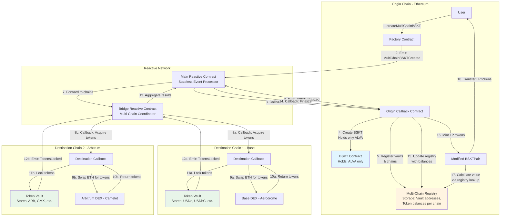

# Alvara Multi-Chain BSKT - Reactive Network Integration PoC
## Two Approaches: No Helper Tokens vs Automated Helper Token Deployment

---

## Executive Summary

This PoC addresses Alvara Protocol's cross-chain basket token (BSKT) requirements using Reactive Network's event-driven automation. We present **two distinct architectural approaches**:

**Approach 1: No Helper Tokens** - Direct vault-based system using only origin chain LP tokens to represent multi-chain holdings. Eliminates deployment costs but requires modified BSKTPair logic.

**Approach 2: Automated Helper Token Deployment** - Dynamic on-demand deployment of receipt tokens with comprehensive cost analysis. Maintains BSKTPair compatibility with minimal modifications.

Both approaches enable users to create a single BSKT on Ethereum that holds tokens from Base, Arbitrum, and other chains, with Reactive Network coordinating all cross-chain operations transparently.

---

## Problem Statement

Alvara wants to enable multi-chain baskets without:
1. Pre-deploying receipt tokens for every possible token across all chains (prohibitive costs)
2. Restricting which tokens users can include (any token meeting criteria should work)
3. Modifying core BSKT/BSKTPair contracts extensively
4. Requiring users to bridge assets manually or interact with multiple chains
5. Compromising the user experience with slow cross-chain operations

**Key Constraints from Alvara Contracts:**
- Every BSKT must include ALVA token (minimum 1-50% weight) - `BSKT.sol:881`
- All tokens must be deployed ERC20 contracts - `BSKT.sol:849-850`
- Total weights must equal `PERCENT_PRECISION` (10000) - `BSKT.sol:897`
- BSKTPair calculates LP value using `getAmountsOut()` via DEX router - `BSKTPair.sol:179-185`
- Management fees calculated using PRBMath compound interest formula - `Factory.sol:calMgmtFee()`

---

## Approach 1: No Helper Tokens (Vault-Only System)

### Overview

This approach eliminates receipt/helper tokens entirely. The origin chain BSKT holds **only the ALVA token** (required by protocol), while all other cross-chain tokens are represented purely through **vault accounting**. The BSKTPair contract is extended to track multi-chain value through a **registry lookup system** rather than actual token holdings.

**Key Innovation**: LP tokens themselves represent the multi-chain basket value, with no intermediate token representations needed.

---

### Architecture Diagram



---

### Detailed Component Flow

#### **1. Multi-Chain BSKT Creation**

**User Action:**
```solidity
Factory.createMultiChainBSKT(
    name: "Multi-Chain DeFi Basket",
    symbol: "MCDB",
    tokens: [
        {chainId: 1, token: ALVA_ETH, weight: 2000},      // 20% ALVA on Ethereum
        {chainId: 8453, token: USDe_BASE, weight: 3000},  // 30% USDe on Base  
        {chainId: 8453, token: USDbC_BASE, weight: 2000}, // 20% USDbC on Base
        {chainId: 42161, token: ARB, weight: 3000}        // 30% ARB on Arbitrum
    ],
    value: 10 ETH
)
```

**Events Emitted:**
```solidity
event MultiChainBSKTCreated(
    bytes32 indexed bsktId,           // keccak256(creator, nonce, timestamp)
    address indexed creator,
    ChainToken[] tokens,              // All tokens with chain IDs
    uint256 totalValue                // Total ETH sent
)
```

**Main Reactive Contract Detects:**
- Subscribes to `Factory.MultiChainBSKTCreated`
- Parses: basket ID, token list by chain, total ETH
- Sends callback to Origin Callback Contract

**Origin Callback Actions:**
```solidity
function reactiveCallback_CreateBSKT(
    bytes32 bsktId,
    ChainToken[] calldata tokens,
    uint256 totalValue
) external onlyReactive {
    // 1. Separate ALVA from cross-chain tokens
    address[] memory alvaOnly = extractAlvaTokens(tokens);
    uint256 alvaValue = calculateAlvaValue(tokens, totalValue);
    
    // 2. Create standard BSKT with ALVA only
    address bskt = _deployBSKT(alvaOnly, alvaValue);
    
    // 3. Register multi-chain configuration
    registry.registerBasket(
        bsktId,
        bskt,
        extractChainIds(tokens),
        calculateVaultAllocations(tokens, totalValue)
    );
    
    // 4. Emit for cross-chain acquisition
    emit BSKTInitialized(
        bsktId,
        bskt,
        extractCrossChainTokens(tokens), // Tokens on Base, Arbitrum, etc.
        calculateAllocationPerChain(tokens, totalValue)
    );
}
```

**Modified BSKTPair Logic:**
```solidity
// Override standard mint to account for multi-chain value
function mint(address to, uint256[] calldata amounts) 
    external override returns (uint256 liquidity) 
{
    bytes32 bsktId = registry.getBSKTId(owner());
    
    if (bsktId == bytes32(0)) {
        // Standard single-chain BSKT
        return _standardMint(to, amounts);
    } else {
        // Multi-chain BSKT - calculate total value across chains
        uint256 totalValue = _calculateMultiChainValue(bsktId, amounts);
        liquidity = (totalValue * totalSupply()) / totalReservedValue();
        _mint(to, liquidity);
    }
}

function _calculateMultiChainValue(
    bytes32 bsktId, 
    uint256[] calldata alvaAmounts
) internal view returns (uint256 totalValue) {
    // 1. Value on origin chain (ALVA)
    totalValue = getAlvaValueInWETH(alvaAmounts[0]);
    
    // 2. Value on destination chains (from registry)
    uint256[] memory chains = registry.getBasketChains(bsktId);
    for (uint i = 0; i < chains.length; i++) {
        if (chains[i] != block.chainid) {
            totalValue += registry.getChainValueInWETH(bsktId, chains[i]);
        }
    }
}
```

---

#### **2. Cross-Chain Token Acquisition**

**Main RSC → Bridge RSC:**
```solidity
// Main Reactive detects BSKTInitialized event
on BSKTInitialized(bsktId, bskt, crossChainTokens, allocations):
    - Group tokens by destination chain
    - Forward to Bridge Reactive Contract
    - Subscribe to completion events
```

**Bridge RSC → Destination Callbacks:**
```solidity
// For each destination chain in parallel
on AcquisitionRequest(bsktId, chainId, tokens[], amounts[], ethAmount):
    - Send callback to Destination Callback on target chain
    - Subscribe to TokensLocked event from vault
    - Track pending operations
```

**Destination Callback Actions (e.g., Base):**
```solidity
function reactiveCallback_AcquireTokens(
    bytes32 bsktId,
    address[] calldata tokens,      // [USDe, USDbC]
    uint256[] calldata amounts,     // [3 ETH worth, 2 ETH worth]
    uint256 ethReceived             // 5 ETH bridged from origin
) external payable onlyReactive {
    address vault = _getOrCreateVault(bsktId);
    
    for (uint i = 0; i < tokens.length; i++) {
        // Swap ETH for token via DEX
        uint256 tokenAmount = _swapETHForToken(
            tokens[i], 
            amounts[i],
            vault  // Send directly to vault
        );
        
        // Vault records the deposit internally
        IVault(vault).recordDeposit(bsktId, tokens[i], tokenAmount);
    }
    
    // Emit for reactive detection
    emit TokensAcquired(bsktId, block.chainid, tokens, vault);
}

function _swapETHForToken(
    address token,
    uint256 ethAmount,
    address recipient
) internal returns (uint256 tokenAmount) {
    address[] memory path = new address[](2);
    path[0] = WETH;
    path[1] = token;
    
    uint256[] memory amounts = IRouter(router).swapExactETHForTokens{
        value: ethAmount
    }(
        0, // Accept any amount (slippage handled by reactive callback retry)
        path,
        recipient,
        block.timestamp + 300
    );
    
    return amounts[1];
}
```

**Vault Contract:**
```solidity
contract TokenVault {
    // basket ID => token => balance
    mapping(bytes32 => mapping(address => uint256)) public reserves;
    
    function recordDeposit(
        bytes32 bsktId,
        address token,
        uint256 amount
    ) external onlyCallback {
        reserves[bsktId][token] += amount;
        emit TokensLocked(bsktId, token, amount, reserves[bsktId][token]);
    }
    
    function getReserve(bytes32 bsktId, address token) 
        external view returns (uint256) 
    {
        return reserves[bsktId][token];
    }
}
```

---

#### **3. Finalization & LP Minting**

**Bridge RSC → Main RSC:**
```solidity
on TokensLocked(bsktId, chainId, tokens[], vault):
    - Mark chain as completed
    - If all chains complete:
        - Aggregate total values per chain
        - Send callback to Main RSC

Main RSC → Origin Callback:
    - Receive aggregated results
    - Send finalization callback
```

**Origin Callback Finalization:**
```solidity
function reactiveCallback_Finalize(
    bytes32 bsktId,
    ChainValue[] calldata chainValues  // [{chainId: 8453, valueInWETH: 5e18}, ...]
) external onlyReactive {
    // Update registry with actual values achieved
    for (uint i = 0; i < chainValues.length; i++) {
        registry.updateChainValue(
            bsktId,
            chainValues[i].chainId,
            chainValues[i].valueInWETH,
            chainValues[i].tokens,
            chainValues[i].amounts
        );
    }
    
    // Mint LP tokens based on total multi-chain value
    uint256 totalValue = _calculateTotalValue(bsktId);
    address bskt = registry.getBasketAddress(bsktId);
    address user = registry.getBasketCreator(bsktId);
    
    // BSKTPair mints LP using modified logic
    IBSKTPair(BSKTPair[bskt]).mint(user, [alvaAmount]);
    
    emit BSKTCreationComplete(bsktId, bskt, totalValue);
}
```

---

#### **4. Contribution Flow**

**User Action:**
```solidity
BSKT.contribute{value: 5 ETH}()
```

**Events:**
```solidity
event ContributionRequested(
    bytes32 indexed bsktId,
    address indexed user,
    uint256 ethAmount,
    TokenAllocation[] allocations  // How to split across chains
)
```

**Flow:**
1. Origin Callback calculates allocation based on current weights
2. Emits `ContributionRequested` event
3. Main RSC detects and forwards to Bridge RSC
4. Bridge RSC sends callbacks to each destination chain
5. Destination callbacks swap ETH for tokens and deposit to vaults
6. Vaults emit `TokensDeposited` events
7. Bridge RSC aggregates, Main RSC finalizes
8. Origin Callback updates registry values
9. BSKTPair mints proportional LP tokens to user

**Registry Update:**
```solidity
function contributeToChain(
    bytes32 bsktId,
    uint256 chainId,
    address[] calldata tokens,
    uint256[] calldata amounts
) external onlyCallback {
    for (uint i = 0; i < tokens.length; i++) {
        chainBalances[bsktId][chainId][tokens[i]] += amounts[i];
    }
    
    // Recalculate total chain value in WETH
    uint256 newValue = _calculateChainValue(bsktId, chainId);
    chainValues[bsktId][chainId] = newValue;
}
```

---

#### **5. Withdrawal Flow**

**User Action:**
```solidity
BSKT.withdraw(lpAmount)
```

**Origin Callback:**
```solidity
function withdraw(uint256 lpAmount) external {
    bytes32 bsktId = registry.getBSKTId(msg.sender);
    
    // Calculate proportional share across all chains
    uint256[] memory chainIds = registry.getBasketChains(bsktId);
    TokenShare[] memory shares = new TokenShare[](chainIds.length);
    
    for (uint i = 0; i < chainIds.length; i++) {
        shares[i] = _calculateChainShare(bsktId, chainIds[i], lpAmount);
    }
    
    // Emit for reactive processing
    emit WithdrawalRequested(bsktId, msg.sender, lpAmount, shares);
}

function _calculateChainShare(
    bytes32 bsktId,
    uint256 chainId,
    uint256 lpAmount
) internal view returns (TokenShare memory) {
    uint256 totalLP = BSKTPair[bskt].totalSupply();
    address[] memory tokens = registry.getChainTokens(bsktId, chainId);
    uint256[] memory amounts = new uint256[](tokens.length);
    
    for (uint j = 0; j < tokens.length; j++) {
        uint256 totalReserve = registry.getTokenBalance(bsktId, chainId, tokens[j]);
        amounts[j] = (totalReserve * lpAmount) / totalLP;
    }
    
    return TokenShare({
        chainId: chainId,
        tokens: tokens,
        amounts: amounts
    });
}
```

**Destination Callback (per chain):**
```solidity
function reactiveCallback_Withdraw(
    bytes32 bsktId,
    address user,
    address[] calldata tokens,
    uint256[] calldata amounts
) external onlyReactive {
    address vault = registry.getVaultAddress(bsktId);
    uint256 totalETH = 0;
    
    // Withdraw tokens from vault
    for (uint i = 0; i < tokens.length; i++) {
        IVault(vault).withdraw(bsktId, tokens[i], amounts[i], address(this));
        
        // Swap token for ETH
        uint256 ethReceived = _swapTokenForETH(tokens[i], amounts[i]);
        totalETH += ethReceived;
    }
    
    // Bridge ETH back to origin chain
    _bridgeETHToOrigin(user, totalETH);
    
    emit WithdrawalComplete(bsktId, block.chainid, totalETH);
}
```

**Origin Callback Finalization:**
```solidity
function reactiveCallback_FinalizeWithdrawal(
    bytes32 bsktId,
    address user,
    uint256 lpAmount,
    uint256 totalETH  // Aggregated from all chains
) external onlyReactive {
    // Burn LP tokens
    BSKTPair[bskt].burn(address(this), lpAmount);
    
    // Update registry balances
    registry.decreaseBalances(bsktId, ...);
    
    // Transfer ETH to user (already bridged back)
    // User receives ETH via bridge directly
    
    emit WithdrawalFinalized(bsktId, user, lpAmount, totalETH);
}
```

---

#### **6. Rebalancing Flow**

**Owner Action:**
```solidity
BSKT.rebalance(
    newTokens: [
        {chainId: 1, token: ALVA, weight: 2000},
        {chainId: 8453, token: cbBTC, weight: 4000},  // New token
        {chainId: 42161, token: GMX, weight: 4000}    // New token
    ]
)
```

**Events:**
```solidity
event RebalanceRequested(
    bytes32 indexed bsktId,
    ChainToken[] tokensToSell,
    ChainToken[] tokensToBuy,
    uint256 timestamp
)
```

**Destination Callback (e.g., Base):**
```solidity
function reactiveCallback_Rebalance(
    bytes32 bsktId,
    address[] calldata sellTokens,
    uint256[] calldata sellAmounts,
    address[] calldata buyTokens,
    uint256[] calldata buyWeights
) external onlyReactive {
    address vault = registry.getVaultAddress(bsktId);
    uint256 totalETH = 0;
    
    // Step 1: Sell old tokens
    for (uint i = 0; i < sellTokens.length; i++) {
        IVault(vault).withdraw(bsktId, sellTokens[i], sellAmounts[i], address(this));
        uint256 eth = _swapTokenForETH(sellTokens[i], sellAmounts[i]);
        totalETH += eth;
    }
    
    // Step 2: Buy new tokens with ETH
    for (uint i = 0; i < buyTokens.length; i++) {
        uint256 ethForToken = (totalETH * buyWeights[i]) / 10000;
        uint256 tokenAmount = _swapETHForToken(buyTokens[i], ethForToken, vault);
        IVault(vault).recordDeposit(bsktId, buyTokens[i], tokenAmount);
    }
    
    emit RebalanceComplete(bsktId, block.chainid, buyTokens);
}
```

**Origin Callback Finalization:**
```solidity
function reactiveCallback_FinalizeRebalance(
    bytes32 bsktId,
    ChainRebalanceResult[] calldata results
) external onlyReactive {
    // Update registry with new token composition
    for (uint i = 0; i < results.length; i++) {
        registry.updateChainTokens(
            bsktId,
            results[i].chainId,
            results[i].newTokens,
            results[i].newBalances
        );
    }
    
    // Update BSKT metadata (only ALVA changes on origin chain)
    BSKT(bskt).updateComposition(extractOriginTokens(results));
    
    emit RebalanceFinalized(bsktId);
}
```

---

### Contracts & Functions Summary

#### **Origin Chain Contracts**

**1. Factory Extension**
```solidity
Functions:
- createMultiChainBSKT(name, symbol, ChainToken[] tokens, weights, ...) 
  → Creates multi-chain basket with validation
  
Events:
- MultiChainBSKTCreated(bsktId, creator, tokens, totalValue)
```

**2. Origin Callback Contract**
```solidity
Functions:
- reactiveCallback_CreateBSKT(bsktId, tokens, totalValue)
  → Creates BSKT with ALVA, registers multi-chain config
  
- reactiveCallback_Finalize(bsktId, chainValues[])
  → Updates registry, mints LP tokens
  
- contribute(amount)
  → Calculates allocation, emits ContributionRequested
  
- reactiveCallback_FinalizeContribution(bsktId, chainResults[])
  → Updates registry, mints additional LP
  
- withdraw(lpAmount)
  → Calculates shares, emits WithdrawalRequested
  
- reactiveCallback_FinalizeWithdrawal(bsktId, user, lpAmount, totalETH)
  → Burns LP, updates registry
  
- rebalance(newTokens[], newWeights[])
  → Emits RebalanceRequested
  
- reactiveCallback_FinalizeRebalance(bsktId, chainResults[])
  → Updates registry and BSKT composition
  
Events:
- BSKTInitialized(bsktId, bskt, crossChainTokens[], allocations[])
- ContributionRequested(bsktId, user, ethAmount, allocations[])
- WithdrawalRequested(bsktId, user, lpAmount, shares[])
- RebalanceRequested(bsktId, sellTokens[], buyTokens[])
- OperationFinalized(bsktId, operationType)
```

**3. Modified BSKTPair**
```solidity
Functions:
- mint(to, amounts[]) override
  → Checks registry for multi-chain basket
  → Calculates value across all chains via registry
  → Mints LP based on total multi-chain value
  
- _calculateMultiChainValue(bsktId, alvaAmounts[])
  → Sums origin chain ALVA value + all destination chain values
  
- burn(to, lpAmount) override
  → Standard burn, but registry updated separately
```

**4. Multi-Chain Registry**
```solidity
Storage:
- baskets: mapping(bytes32 => BasketConfig)
  - BasketConfig: {bsktId, bsktAddress, participatingChains[], creator, ...}
- chainValues: mapping(bytes32 => mapping(uint256 => uint256))
  - bsktId => chainId => total value in WETH
- chainBalances: mapping(bytes32 => mapping(uint256 => mapping(address => uint256)))
  - bsktId => chainId => token => balance
- vaultAddresses: mapping(bytes32 => mapping(uint256 => address))
  - bsktId => chainId => vault address

Functions:
- registerBasket(bsktId, bsktAddress, chainIds[], creator)
- updateChainValue(bsktId, chainId, valueInWETH, tokens[], amounts[])
- getChainValueInWETH(bsktId, chainId) → uint256
- getBasketChains(bsktId) → uint256[]
- getChainTokens(bsktId, chainId) → address[]
- getTokenBalance(bsktId, chainId, token) → uint256
- contributeToChain(bsktId, chainId, tokens[], amounts[])
- decreaseBalances(bsktId, chainId, tokens[], amounts[])
- updateChainTokens(bsktId, chainId, newTokens[], newBalances[])

Events:
- BasketRegistered(bsktId, bsktAddress, chainIds[], vaults[])
- ChainValueUpdated(bsktId, chainId, newValue)
- TokenBalanceUpdated(bsktId, chainId, token, newBalance)
```

---

#### **Reactive Network Contracts**

**1. Main Reactive Contract**
```solidity
Event Subscriptions (Origin Chain):
- Factory.MultiChainBSKTCreated
- OriginCallback.BSKTInitialized
- OriginCallback.ContributionRequested
- OriginCallback.WithdrawalRequested
- OriginCallback.RebalanceRequested

Reactive Logic:
on MultiChainBSKTCreated:
  - Parse tokens by chain
  - Send callback to OriginCallback.reactiveCallback_CreateBSKT()
  - Forward to Bridge RSC for token acquisition

on BSKTInitialized:
  - Forward cross-chain token acquisition to Bridge RSC
  - Subscribe to completion events

on ContributionRequested:
  - Calculate allocation per chain
  - Forward to Bridge RSC
  - Aggregate results, callback to OriginCallback.reactiveCallback_FinalizeContribution()

on WithdrawalRequested:
  - Forward shares to Bridge RSC
  - Aggregate ETH from all chains
  - Callback to OriginCallback.reactiveCallback_FinalizeWithdrawal()

on RebalanceRequested:
  - Plan swaps per chain
  - Coordinate through Bridge RSC
  - Callback to OriginCallback.reactiveCallback_FinalizeRebalance()

Important: Stateless - all data passed through events and callbacks
```

**2. Bridge Reactive Contract**
```solidity
Event Subscriptions (All Destination Chains):
- DestinationCallback.TokensAcquired
- DestinationCallback.TokensDeposited
- DestinationCallback.WithdrawalComplete
- DestinationCallback.RebalanceComplete
- Vault.TokensLocked
- Vault.TokensWithdrawn

Reactive Logic:
on AcquisitionRequest from Main RSC:
  - For each destination chain:
    - Send callback to DestCallback.reactiveCallback_AcquireTokens()
    - Subscribe to TokensLocked event
  - Wait for all chains to complete
  - Aggregate values, forward to Main RSC

on ContributionRequest from Main RSC:
  - Send callbacks to all destination chains
  - Subscribe to TokensDeposited events
  - Aggregate results, forward to Main RSC

on WithdrawalRequest from Main RSC:
  - Send callbacks to all destination chains
  - Subscribe to WithdrawalComplete events
  - Sum total ETH, forward to Main RSC

on RebalanceRequest from Main RSC:
  - Send callbacks to all destination chains
  - Subscribe to RebalanceComplete events
  - Ensure atomic completion, forward to Main RSC

Important: Also stateless - tracks pending operations via event subscriptions only
```

---

#### **Destination Chain Contracts**

**1. Destination Callback Contract**
```solidity
Functions:
- reactiveCallback_AcquireTokens(bsktId, tokens[], amounts[], ethAmount)
  → Swaps ETH for tokens via DEX
  → Sends tokens to vault
  → Vault records deposit
  
- reactiveCallback_Contribute(bsktId, tokens[], amounts[], ethAmount)
  → Similar to acquisition
  → Updates existing vault balances
  
- reactiveCallback_Withdraw(bsktId, user, tokens[], amounts[])
  → Withdraws tokens from vault
  → Swaps tokens for ETH
  → Bridges ETH to origin chain
  
- reactiveCallback_Rebalance(bsktId, sellTokens[], sellAmounts[], buyTokens[], buyWeights[])
  → Withdraws old tokens from vault
  → Swaps old tokens → ETH → new tokens
  → Deposits new tokens to vault
  
Internal Functions:
- _swapETHForToken(token, ethAmount, recipient) → tokenAmount
  Uses DEX router to swap ETH for tokens
  
- _swapTokenForETH(token, tokenAmount) → ethAmount
  Uses DEX router to swap tokens for ETH
  
- _bridgeETHToOrigin(user, ethAmount)
  Bridges ETH back to origin chain (user receives it there)
  
- _getOrCreateVault(bsktId) → vaultAddress
  Returns existing vault or deploys new one for basket
  
Events:
- TokensAcquired(bsktId, chainId, tokens[], vault)
- TokensDeposited(bsktId, chainId, tokens[], amounts[])
- WithdrawalComplete(bsktId, chainId, totalETH)
- RebalanceComplete(bsktId, chainId, newTokens[])
```

**2. Token Vault Contract**
```solidity
Storage:
- reserves: mapping(bytes32 => mapping(address => uint256))
  bsktId => token => balance
  
Functions:
- recordDeposit(bsktId, token, amount)
  → Increases reserve balance
  → Emits TokensLocked
  
- withdraw(bsktId, token, amount, recipient)
  → Decreases reserve balance
  → Transfers tokens to recipient
  → Emits TokensWithdrawn
  
- getReserve(bsktId, token) → uint256
  → Returns current balance
  
Events:
- TokensLocked(bsktId, token, amount, newBalance)
- TokensWithdrawn(bsktId, token, amount, newBalance)

Security:
- onlyCallback modifier (only Destination Callback can call)
- Per-basket fund isolation
- Emergency pause functionality
```

---

### Advantages of No Helper Token Approach

1. **Zero Deployment Costs**: No receipt tokens to deploy - unlimited token support without upfront costs
2. **Truly Dynamic**: Any token on any chain works immediately without preparation
3. **Simple Value Tracking**: Registry acts as single source of truth for multi-chain holdings
4. **Gas Efficient**: No token minting/burning operations for cross-chain representations
5. **Easier Maintenance**: Fewer contracts to manage and upgrade
6. **Clean Architecture**: Direct vault accounting without intermediate token abstractions

---

### Disadvantages of No Helper Token Approach

1. **BSKTPair Modifications Required**: Need to override `mint()`, `burn()`, and value calculation functions
2. **Registry Dependency**: All value calculations depend on registry being updated correctly
3. **Less Composable**: LP tokens don't directly represent underlying token holdings
4. **Price Oracle Vulnerability**: Registry values must be updated via reactive callbacks (delay risk)
5. **Breaking Alvara Standards**: Deviates from current BSKT token holder model

---

### Cost Analysis - Approach 1

#### **One-Time Setup Costs**

| Component | Gas | Cost @ 15 gwei | Notes |
|-----------|-----|----------------|-------|
| Modified BSKTPair Implementation | 2,500,000 | $12.50 | One-time deployment |
| Multi-Chain Registry | 3,000,000 | $15.00 | Stores all multi-chain data |
| Origin Callback Contract | 2,000,000 | $10.00 | Coordinates operations |
| Main Reactive Contract | 500,000 | $2.50 | Stateless event processor |
| Bridge Reactive Contract | 800,000 | $4.00 | Multi-chain coordinator |
| **Total Setup** | **8,800,000** | **$44.00** | |

#### **Per Destination Chain Costs**

| Component | Gas | Cost @ 5 gwei | Notes |
|-----------|-----|----------------|-------|
| Destination Callback | 1,800,000 | $3.00 | One per chain (Base, Arbitrum, etc.) |
| Vault Implementation | 1,500,000 | $2.50 | One per chain |
| **Total Per Chain** | **3,300,000** | **$5.50** | |

**For 3 destination chains**: $16.50

#### **Per Multi-Chain BSKT Costs**

| Operation | Gas | Cost | Notes |
|-----------|-----|------|-------|
| Registry Storage (new basket) | 200,000 | $1.00 | Stores config on origin |
| Vault Deployment (per chain)* | 150,000 | $0.25 ea | Only if first basket using chain |
| **Total Per Basket** | **200,000 - 650,000** | **$1.00 - $3.25** | Depends on vault reuse |

*Vaults are reused across baskets - cost only for first basket on a new chain

#### **Per Operation Costs**

| Operation | Origin Chain | Per Dest Chain | Total (3 chains) | Notes |
|-----------|--------------|----------------|------------------|-------|
| **Create BSKT** | $1.00 | $0.50 | $2.50 | Registry update + vault deposits |
| **Contribute** | $0.60 | $0.40 | $1.80 | Registry update + vault deposits |
| **Withdraw** | $0.80 | $0.60 | $2.60 | Registry update + vault withdrawals + bridge |
| **Rebalance** | $1.20 | $1.00 | $4.20 | Registry update + sell/buy swaps per chain |

#### **Total Cost for 1000 Multi-Chain BSKTs (Over 6 Months)**

Assumptions:
- 3 destination chains (Base, Arbitrum, Optimism)
- 60% of vaults already exist (shared across baskets)
- Average 2 contributions per basket
- Average 1.5 withdrawals per basket
- 0.2 rebalances per basket

| Item | Quantity | Unit Cost | Total |
|------|----------|-----------|-------|
| Setup (one-time) | 1 | $44.00 | $44.00 |
| Destination chains setup | 3 | $5.50 | $16.50 |
| New basket registry | 1000 | $1.00 | $1,000.00 |
| Vault deployments (40% new) | 400 | $0.75 | $300.00 |
| Contributions (2 per basket) | 2000 | $1.80 | $3,600.00 |
| Withdrawals (1.5 per basket) | 1500 | $2.60 | $3,900.00 |
| Rebalances (0.2 per basket) | 200 | $4.20 | $840.00 |
| **Grand Total** | | | **$9,700.50** |

**Cost per basket amortized**: $9.70

---

## Approach 2: Automated Helper Token Deployment

### Overview

This approach maintains the concept of **receipt tokens** (helper tokens) that represent cross-chain assets on the origin chain, but deploys them **dynamically on-demand** rather than pre-deploying for every possible token. When a user creates a multi-chain BSKT with a new token (e.g., USDe on Base), the system automatically:

1. Deploys a minimal ERC20 "receipt token" on Ethereum via CREATE2 (deterministic address)
2. Mints receipt tokens proportional to the locked amount on Base
3. Uses these receipt tokens in the origin chain BSKT (alongside ALVA)
4. BSKTPair treats them as normal ERC20s - **no modifications needed**

**Key Innovation**: Receipt tokens are lightweight clones deployed via CREATE2 with predictable addresses, minimizing deployment costs while maintaining full ERC20 compatibility.

---

### Architecture Diagram

```mermaid
graph TB
    subgraph "Origin Chain - Ethereum"
        User[User]
        Factory[Factory Extension]
        BSKT[BSKT Contract<br/>Holds: ALVA + Receipt Tokens]
        BSKTPair[Standard BSKTPair<br/>No modifications]
        OriginCB[Origin Callback<br/>+ Receipt Token Factory]
        Registry[Token Registry<br/>Receipt Token Metadata]
        ReceiptImpl[Receipt Token<br/>Implementation<br/>EIP-1167 Clone]
    end
    
    subgraph "Reactive Network"
        MainRSC[Main Reactive Contract]
        BridgeRSC[Bridge Reactive Contract]
    end
    
    subgraph "Destination Chain - Base"
        DestCB_Base[Destination Callback]
        Vault_Base[Token Vault<br/>Stores: USDe, USDbC]
        DEX_Base[Aerodrome DEX]
    end
    
    subgraph "Destination Chain - Arbitrum"
        DestCB_Arb[Destination Callback]
        Vault_Arb[Token Vault<br/>Stores: ARB, GMX]
        DEX_Arb[Camelot DEX]
    end
    
    User -->|1. createMultiChainBSKT| Factory
    Factory -->|2. Emit: MultiChainBSKTCreated| MainRSC
    MainRSC -->|3. Callback: Deploy receipt tokens| OriginCB
    
    OriginCB -->|4a. Check registry| Registry
    Registry -->|4b. Receipt token exists?| OriginCB
    OriginCB -->|5. Deploy new receipt<br/>via CREATE2 clone| ReceiptImpl
    ReceiptImpl -->|6. Receipt token address| OriginCB
    OriginCB -->|7. Register metadata| Registry
    
    OriginCB -->|8. Create BSKT<br/>with ALVA + receipt tokens| BSKT
    OriginCB -->|9. Emit: BSKTCreated| MainRSC
    MainRSC -->|10. Forward to Bridge| BridgeRSC
    
    BridgeRSC -->|11a. Callback: Acquire| DestCB_Base
    BridgeRSC -->|11b. Callback: Acquire| DestCB_Arb
    
    DestCB_Base -->|12a. Swap ETH| DEX_Base
    DEX_Base -->|13a. Return tokens| DestCB_Base
    DestCB_Base -->|14a. Lock in vault| Vault_Base
    Vault_Base -->|15a. Emit: TokensLocked<br/>with amounts| BridgeRSC
    
    DestCB_Arb -->|12b. Swap ETH| DEX_Arb
    DEX_Arb -->|13b. Return tokens| DestCB_Arb
    DestCB_Arb -->|14b. Lock in vault| Vault_Arb
    Vault_Arb -->|15b. Emit: TokensLocked<br/>with amounts| BridgeRSC
    
    BridgeRSC -->|16. Aggregate amounts| MainRSC
    MainRSC -->|17. Callback: Mint receipts| OriginCB
    
    OriginCB -->|18a. Mint USDe receipt<br/>= USDe locked on Base| ReceiptImpl
    OriginCB -->|18b. Mint ARB receipt<br/>= ARB locked on Arbitrum| ReceiptImpl
    OriginCB -->|19. Transfer receipts to BSKT| BSKT
    BSKT -->|20. Mint LP tokens| BSKTPair
    BSKTPair -->|21. Calculate value<br/>via DEX router<br/>(standard logic)| BSKTPair
    BSKTPair -->|22. Transfer LP| User
    
    style BSKT fill:#e1f5ff
    style ReceiptImpl fill:#fff4e1
    style Vault_Base fill:#e8f5e9
    style Vault_Arb fill:#e8f5e9
    style BSKTPair fill:#c8e6c9
```

---

### Detailed Component Flow

#### **1. Multi-Chain BSKT Creation with Dynamic Receipt Token Deployment**

**User Action:**
```solidity
Factory.createMultiChainBSKT(
    name: "Cross-Chain Yield Basket",
    symbol: "CCYB",
    tokens: [
        {chainId: 1, token: ALVA, weight: 2000},
        {chainId: 8453, token: 0x...USDe, weight: 3000},  // USDe on Base
        {chainId: 8453, token: 0x...USDbC, weight: 2000}, // USDbC on Base
        {chainId: 42161, token: 0x...ARB, weight: 3000}   // ARB on Arbitrum
    ],
    value: 10 ETH
)
```

**Events:**
```solidity
event MultiChainBSKTCreated(
    bytes32 indexed bsktId,
    address indexed creator,
    ChainToken[] tokens,
    uint256 totalValue
)
```

**Main RSC → Origin Callback:**
```solidity
function reactiveCallback_DeployReceipts(
    bytes32 bsktId,
    ChainToken[] calldata tokens,
    address creator
) external onlyReactive {
    address[] memory receiptTokens = new address[](tokens.length);
    
    for (uint i = 0; i < tokens.length; i++) {
        if (tokens[i].chainId != block.chainid) {
            // Deploy receipt token for cross-chain asset
            receiptTokens[i] = _deployOrGetReceiptToken(
                tokens[i].chainId,
                tokens[i].tokenAddress
            );
        } else {
            // Use actual token for origin chain assets (ALVA)
            receiptTokens[i] = tokens[i].tokenAddress;
        }
    }
    
    // Create BSKT with receipt tokens
    address bskt = _createBSKT(
        creator,
        receiptTokens,
        extractWeights(tokens)
    );
    
    // Store mapping
    registry.registerBasket(bsktId, bskt, tokens, receiptTokens);
    
    emit BSKTCreatedWithReceipts(bsktId, bskt, receiptTokens);
}
```

**Receipt Token Deployment (CREATE2):**
```solidity
// Minimal ERC20 clone implementation
address public receiptTokenImplementation;

function _deployOrGetReceiptToken(
    uint256 chainId,
    address underlyingToken
) internal returns (address receipt) {
    // Generate deterministic salt
    bytes32 salt = keccak256(abi.encodePacked(chainId, underlyingToken));
    
    // Check if already deployed
    receipt = _predictReceiptAddress(salt);
    if (receipt.code.length > 0) {
        return receipt; // Already deployed, reuse
    }
    
    // Deploy minimal clone via CREATE2
    receipt = Clones.cloneDeterministic(receiptTokenImplementation, salt);
    
    // Initialize receipt token
    IReceiptToken(receipt).initialize(
        chainId,
        underlyingToken,
        _getTokenSymbol(chainId, underlyingToken),
        _getTokenDecimals(chainId, underlyingToken)
    );
    
    // Register in mapping
    registry.registerReceiptToken(chainId, underlyingToken, receipt);
    
    emit ReceiptTokenDeployed(receipt, chainId, underlyingToken);
}

function _predictReceiptAddress(bytes32 salt) internal view returns (address) {
    return Clones.predictDeterministicAddress(receiptTokenImplementation, salt, address(this));
}
```

**Receipt Token Contract:**
```solidity
contract ReceiptToken is ERC20Upgradeable {
    uint256 public immutable sourceChainId;
    address public immutable underlyingToken;
    address public immutable minter; // Origin Callback Contract
    
    function initialize(
        uint256 _chainId,
        address _underlying,
        string memory _symbol,
        uint8 _decimals
    ) external initializer {
        string memory name = string(abi.encodePacked(
            "Receipt-", 
            _symbol, 
            "-", 
            Strings.toString(_chainId)
        ));
        __ERC20_init(name, string(abi.encodePacked("r", _symbol)));
        
        sourceChainId = _chainId;
        underlyingToken = _underlying;
        minter = msg.sender;
    }
    
    function mint(address to, uint256 amount) external {
        require(msg.sender == minter, "Only minter");
        _mint(to, amount);
    }
    
    function burn(address from, uint256 amount) external {
        require(msg.sender == minter, "Only minter");
        _burn(from, amount);
    }
    
    function decimals() public view override returns (uint8) {
        // Match underlying token decimals
        return _decimals;
    }
    
    // View function for metadata
    function getUnderlyingInfo() external view returns (
        uint256 chainId,
        address token
    ) {
        return (sourceChainId, underlyingToken);
    }
}
```

**Create BSKT with Receipt Tokens:**
```solidity
function _createBSKT(
    address creator,
    address[] memory tokens,  // [ALVA, rUSDe, rUSDbC, rARB]
    uint256[] memory weights
) internal returns (address bskt) {
    // Use existing Factory.createBSKT logic
    // Receipt tokens are treated as normal ERC20s
    bytes memory data = abi.encodeWithSelector(
        IBSKT.initialize.selector,
        "Multi-Chain Basket",
        "MCB",
        creator,
        address(this), // factory
        tokens,        // Receipt tokens + ALVA
        weights,
        /* ... other params ... */
    );
    
    BeaconProxy proxy = new BeaconProxy(bsktImplementation, data);
    bskt = address(proxy);
}
```

---

#### **2. Cross-Chain Token Acquisition & Receipt Minting**

**Main RSC → Bridge RSC → Destination Callbacks:**
(Same as Approach 1 - swaps ETH for tokens, locks in vaults)

**Vault emits TokensLocked with actual amounts:**
```solidity
event TokensLocked(
    bytes32 indexed bsktId,
    uint256 indexed chainId,
    address indexed token,
    uint256 amount,     // Actual amount locked (e.g., 15000 USDe)
    address vault
)
```

**Bridge RSC aggregates and forwards to Main RSC:**
```solidity
struct ChainLockResult {
    uint256 chainId;
    address token;
    uint256 amountLocked;
    address vault;
}

on TokensLocked events from all chains:
    - Aggregate all chain results
    - Send to Main RSC

Main RSC → Origin Callback:
    - Send callback with aggregated lock results
```

**Origin Callback Mints Receipt Tokens:**
```solidity
function reactiveCallback_MintReceipts(
    bytes32 bsktId,
    ChainLockResult[] calldata results
) external onlyReactive {
    address bskt = registry.getBasketAddress(bsktId);
    
    for (uint i = 0; i < results.length; i++) {
        // Get corresponding receipt token
        address receipt = registry.getReceiptToken(
            results[i].chainId,
            results[i].token
        );
        
        // Mint receipt tokens equal to locked amount
        IReceiptToken(receipt).mint(bskt, results[i].amountLocked);
    }
    
    // Now BSKT holds: ALVA (real) + receipt tokens (representing locked assets)
    // Standard BSKTPair.mint() works as normal
    uint256[] memory amounts = _getTokenAmounts(bskt);
    IBSKTPair(BSKTPair[bskt]).mint(creator, amounts);
    
    emit BSKTCreationComplete(bsktId, bskt);
}
```

**BSKTPair Standard Logic (No Changes):**
```solidity
function mint(address to, uint256[] calldata amounts) 
    external override returns (uint256 liquidity) 
{
    // Standard Alvara logic - works with receipt tokens as normal ERC20s
    uint256 totalETH = 0;
    
    for (uint i = 0; i < tokens.length; i++) {
        address[] memory path = factory.getPath(tokens[i], weth);
        totalETH += factory.getAmountsOut(amounts[i], path);
    }
    
    liquidity = (totalETH * totalSupply()) / totalReservedValue();
    _mint(to, liquidity);
    
    // Update reserves
    for (uint i = 0; i < amounts.length; i++) {
        reserves[i] += amounts[i];
    }
}
```

**Price Oracle for Receipt Tokens:**
```solidity
// Receipt tokens need price feeds since they have no DEX liquidity
contract ReceiptTokenPriceOracle {
    // chainId => underlyingToken => price in WETH
    mapping(uint256 => mapping(address => uint256)) public prices;
    
    // Only Origin Callback can update (via reactive callback)
    function updatePrice(
        uint256 chainId,
        address token,
        uint256 priceInWETH
    ) external onlyCallback {
        prices[chainId][token] = priceInWETH;
        emit PriceUpdated(chainId, token, priceInWETH);
    }
    
    function getPrice(uint256 chainId, address token) 
        external view returns (uint256) 
    {
        return prices[chainId][token];
    }
}

// Modified Router for receipt tokens
contract UniswapRouterAdapter {
    ReceiptTokenPriceOracle public oracle;
    IUniswapV2Router public actualRouter;
    
    function getAmountsOut(uint amountIn, address[] memory path) 
        external view returns (uint[] memory amounts) 
    {
        if (_isReceiptToken(path[0])) {
            // Use oracle price for receipt tokens
            amounts = new uint[](2);
            amounts[0] = amountIn;
            
            (uint256 chainId, address underlying) = IReceiptToken(path[0]).getUnderlyingInfo();
            uint256 priceInWETH = oracle.getPrice(chainId, underlying);
            amounts[1] = (amountIn * priceInWETH) / 1e18;
        } else {
            // Use standard DEX router
            amounts = actualRouter.getAmountsOut(amountIn, path);
        }
    }
}
```

---

#### **3. Contribution Flow**

**User Action:**
```solidity
BSKT.contribute{value: 5 ETH}(buffer, deadline)
```

**Origin Callback:**
```solidity
function contribute(bytes32 bsktId, uint256 amount) external payable {
    // Calculate how much to allocate per chain based on current weights
    address[] memory receiptTokens = registry.getReceiptTokens(bsktId);
    uint256[] memory allocations = _calculateAllocations(bsktId, amount);
    
    emit ContributionRequested(bsktId, msg.sender, amount, allocations);
}
```

**After Cross-Chain Swaps Complete:**
```solidity
function reactiveCallback_MintAdditionalReceipts(
    bytes32 bsktId,
    address contributor,
    ChainLockResult[] calldata results
) external onlyReactive {
    address bskt = registry.getBasketAddress(bsktId);
    
    // Mint additional receipt tokens
    for (uint i = 0; i < results.length; i++) {
        address receipt = registry.getReceiptToken(
            results[i].chainId,
            results[i].token
        );
        IReceiptToken(receipt).mint(bskt, results[i].amountLocked);
    }
    
    // BSKTPair mints proportional LP tokens
    uint256[] memory amounts = _getTokenAmounts(bskt);
    IBSKTPair(BSKTPair[bskt]).mint(contributor, amounts);
}
```

---

#### **4. Withdrawal Flow**

**User Action:**
```solidity
BSKT.withdraw(lpAmount, buffer, deadline)
```

**Origin Callback:**
```solidity
function withdraw(bytes32 bsktId, uint256 lpAmount) external {
    // Calculate receipt tokens to burn
    address bskt = registry.getBasketAddress(bsktId);
    address[] memory receiptTokens = registry.getReceiptTokens(bsktId);
    uint256[] memory receiptAmounts = BSKTPair[bskt].calculateShareTokens(lpAmount);
    
    // Burn receipt tokens from BSKT
    for (uint i = 0; i < receiptTokens.length; i++) {
        if (_isReceiptToken(receiptTokens[i])) {
            IReceiptToken(receiptTokens[i]).burn(bskt, receiptAmounts[i]);
        }
    }
    
    // Emit for cross-chain withdrawal
    emit WithdrawalRequested(
        bsktId,
        msg.sender,
        lpAmount,
        _mapReceiptsToChainsAndTokens(receiptTokens, receiptAmounts)
    );
}
```

**Destination Chains Process Withdrawal:**
(Same as Approach 1 - withdraw from vaults, swap for ETH, bridge back)

**Origin Callback Finalization:**
```solidity
function reactiveCallback_FinalizeWithdrawal(
    bytes32 bsktId,
    address user,
    uint256 lpAmount,
    uint256 totalETH
) external onlyReactive {
    address bskt = registry.getBasketAddress(bsktId);
    
    // Burn LP tokens
    BSKTPair[bskt].burn(address(this), lpAmount);
    
    // User receives ETH (already bridged back)
    emit WithdrawalComplete(bsktId, user, lpAmount, totalETH);
}
```

---

#### **5. Rebalancing Flow**

**Owner Action:**
```solidity
BSKT.rebalance(
    newTokens: [
        {chainId: 1, token: ALVA, weight: 2000},
        {chainId: 8453, token: cbBTC, weight: 5000},  // New token
        {chainId: 42161, token: GMX, weight: 3000}    // New token
    ],
    buffer,
    deadline
)
```

**Origin Callback:**
```solidity
function rebalance(
    bytes32 bsktId,
    ChainToken[] calldata newTokens,
    uint256[] calldata newWeights
) external onlyOwner {
    address bskt = registry.getBasketAddress(bsktId);
    
    // Step 1: Burn old receipt tokens from BSKT
    address[] memory oldReceipts = registry.getReceiptTokens(bsktId);
    for (uint i = 0; i < oldReceipts.length; i++) {
        if (_isReceiptToken(oldReceipts[i])) {
            uint256 balance = IERC20(oldReceipts[i]).balanceOf(bskt);
            IReceiptToken(oldReceipts[i]).burn(bskt, balance);
        }
    }
    
    // Step 2: Deploy new receipt tokens if needed
    address[] memory newReceipts = new address[](newTokens.length);
    for (uint i = 0; i < newTokens.length; i++) {
        if (newTokens[i].chainId != block.chainid) {
            newReceipts[i] = _deployOrGetReceiptToken(
                newTokens[i].chainId,
                newTokens[i].tokenAddress
            );
        } else {
            newReceipts[i] = newTokens[i].tokenAddress;
        }
    }
    
    // Step 3: Emit for cross-chain rebalancing
    emit RebalanceRequested(bsktId, oldReceipts, newReceipts, newWeights);
}
```

**After Cross-Chain Rebalancing:**
```solidity
function reactiveCallback_FinalizeRebalance(
    bytes32 bsktId,
    ChainLockResult[] calldata newLocks
) external onlyReactive {
    address bskt = registry.getBasketAddress(bsktId);
    
    // Mint new receipt tokens
    for (uint i = 0; i < newLocks.length; i++) {
        address receipt = registry.getReceiptToken(
            newLocks[i].chainId,
            newLocks[i].token
        );
        IReceiptToken(receipt).mint(bskt, newLocks[i].amountLocked);
    }
    
    // Update BSKT composition
    address[] memory newReceiptList = registry.getReceiptTokens(bsktId);
    IBSKT(bskt).updateTokens(newReceiptList, newWeights);
    
    emit RebalanceComplete(bsktId);
}
```

---

### Contracts & Functions Summary

#### **Origin Chain Contracts**

**1. Factory Extension**
```solidity
Functions:
- createMultiChainBSKT(name, symbol, ChainToken[] tokens, weights, ...)
  → Validates tokens, emits MultiChainBSKTCreated
  
Events:
- MultiChainBSKTCreated(bsktId, creator, tokens[], totalValue)
```

**2. Origin Callback Contract**
```solidity
Functions:
- reactiveCallback_DeployReceipts(bsktId, tokens[], creator)
  → Deploys receipt tokens via CREATE2
  → Creates BSKT with receipt tokens + ALVA
  → Registers basket
  
- reactiveCallback_MintReceipts(bsktId, ChainLockResult[] results)
  → Mints receipt tokens equal to locked amounts
  → Calls BSKTPair.mint() for LP tokens
  
- contribute(bsktId, amount)
  → Calculates allocations, emits ContributionRequested
  
- reactiveCallback_MintAdditionalReceipts(bsktId, contributor, results[])
  → Mints additional receipt tokens
  → Mints additional LP tokens
  
- withdraw(bsktId, lpAmount)
  → Burns receipt tokens from BSKT
  → Emits WithdrawalRequested
  
- reactiveCallback_FinalizeWithdrawal(bsktId, user, lpAmount, totalETH)
  → Burns LP tokens
  
- rebalance(bsktId, newTokens[], newWeights[])
  → Burns old receipt tokens
  → Deploys new receipt tokens
  → Emits RebalanceRequested
  
- reactiveCallback_FinalizeRebalance(bsktId, newLocks[])
  → Mints new receipt tokens
  → Updates BSKT composition
  
Internal Functions:
- _deployOrGetReceiptToken(chainId, underlyingToken) → receiptAddress
  Uses CREATE2 to deploy or reuse existing receipt token
  
- _predictReceiptAddress(salt) → address
  Calculates deterministic receipt token address
  
Events:
- BSKTCreatedWithReceipts(bsktId, bskt, receiptTokens[])
- ReceiptTokenDeployed(receipt, chainId, underlyingToken)
- ContributionRequested(bsktId, user, amount, allocations[])
- WithdrawalRequested(bsktId, user, lpAmount, tokenShares[])
- RebalanceRequested(bsktId, oldTokens[], newTokens[], weights[])
- OperationComplete(bsktId, operationType)
```

**3. Receipt Token (EIP-1167 Minimal Clone)**
```solidity
Immutable State:
- sourceChainId: uint256
- underlyingToken: address
- minter: address (Origin Callback)

Functions:
- initialize(chainId, underlying, symbol, decimals)
  → Called once after clone deployment
  
- mint(to, amount)
  → Only Origin Callback can call
  
- burn(from, amount)
  → Only Origin Callback can call
  
- getUnderlyingInfo() → (chainId, token)
  → Returns metadata about underlying asset
  
- decimals() → uint8
  → Matches underlying token decimals

ERC20 Standard:
- transfer, transferFrom, approve, balanceOf, totalSupply
  (Standard OpenZeppelin implementation)
```

**4. Receipt Token Registry**
```solidity
Storage:
- receiptTokens: mapping(uint256 => mapping(address => address))
  chainId => underlyingToken => receiptToken
  
- basketReceipts: mapping(bytes32 => address[])
  bsktId => list of receipt token addresses
  
- basketConfig: mapping(bytes32 => BasketMetadata)
  bsktId => {bsktAddress, creator, tokens[], chains[]}

Functions:
- registerReceiptToken(chainId, underlying, receipt)
  → Called after CREATE2 deployment
  
- getReceiptToken(chainId, underlying) → address
  → Returns existing receipt token address
  
- registerBasket(bsktId, bskt, ChainToken[] originalTokens, address[] receipts)
  → Stores basket configuration
  
- getReceiptTokens(bsktId) → address[]
  → Returns all receipt tokens for a basket
  
- getBasketAddress(bsktId) → address
  → Returns BSKT contract address
  
- getBasketCreator(bsktId) → address

Events:
- ReceiptTokenRegistered(chainId, underlying, receipt)
- BasketRegistered(bsktId, bskt, receipts[])
```

**5. Receipt Token Price Oracle**
```solidity
Storage:
- prices: mapping(uint256 => mapping(address => PriceData))
  chainId => underlyingToken => {priceInWETH, lastUpdate}

Functions:
- updatePrice(chainId, token, priceInWETH)
  → Called by Origin Callback via reactive callback
  → Stores price and timestamp
  
- getPrice(chainId, token) → uint256
  → Returns current price in WETH
  → Reverts if stale (> 1 hour old)
  
- updatePrices(ChainToken[] tokens, uint256[] prices)
  → Batch update for efficiency

Events:
- PriceUpdated(chainId, token, priceInWETH, timestamp)

Security:
- Staleness check (max 1 hour)
- Only Origin Callback can update
- Circuit breaker for large deviations (>20%)
```

**6. Uniswap Router Adapter**
```solidity
Storage:
- oracle: ReceiptTokenPriceOracle
- actualRouter: IUniswapV2Router

Functions:
- getAmountsOut(amountIn, path[]) → amounts[]
  → If path[0] is receipt token: use oracle price
  → Otherwise: delegate to actual Uniswap router
  
- _isReceiptToken(token) → bool
  → Checks if token has getUnderlyingInfo() function

Purpose:
- Allows BSKTPair to work with receipt tokens without modifications
- Factory.getAmountsOut() delegates to this adapter
```

**7. Standard BSKTPair (No Changes)**
```solidity
Functions:
- mint(to, amounts[])
  → Standard Alvara logic
  → Works with receipt tokens as normal ERC20s
  → Calls Factory.getAmountsOut() which uses adapter
  
- burn(to, lpAmount)
  → Standard Alvara logic
  → Burns LP, calculates token shares
  
- calculateShareTokens(lpAmount) → amounts[]
  → Standard proportional calculation

No modifications needed - receipt tokens integrate seamlessly
```

---

#### **Reactive Network Contracts**

**1. Main Reactive Contract**
```solidity
Event Subscriptions (Origin Chain):
- Factory.MultiChainBSKTCreated
- OriginCallback.BSKTCreatedWithReceipts
- OriginCallback.ContributionRequested
- OriginCallback.WithdrawalRequested
- OriginCallback.RebalanceRequested

Reactive Logic:
on MultiChainBSKTCreated:
  - Send callback to OriginCallback.reactiveCallback_DeployReceipts()
  - Wait for BSKTCreatedWithReceipts event

on BSKTCreatedWithReceipts:
  - Forward to Bridge RSC for token acquisition
  - Subscribe to completion

on Bridge RSC reports completion:
  - Aggregate ChainLockResult[] from all chains
  - Send callback to OriginCallback.reactiveCallback_MintReceipts()

on ContributionRequested:
  - Forward allocations to Bridge RSC
  - Aggregate results
  - Callback OriginCallback.reactiveCallback_MintAdditionalReceipts()

on WithdrawalRequested:
  - Forward to Bridge RSC
  - Aggregate total ETH
  - Callback OriginCallback.reactiveCallback_FinalizeWithdrawal()

on RebalanceRequested:
  - Coordinate sell/buy operations via Bridge RSC
  - Callback OriginCallback.reactiveCallback_FinalizeRebalance()

Stateless - no storage
```

**2. Bridge Reactive Contract**
```solidity
Event Subscriptions (All Destination Chains):
- Vault.TokensLocked
- Vault.TokensDeposited  
- DestinationCallback.WithdrawalComplete
- DestinationCallback.RebalanceComplete
- DestinationCallback.PriceReported

Reactive Logic:
on AcquisitionRequest from Main RSC:
  - For each destination chain:
    - Send callback to DestCallback.reactiveCallback_AcquireTokens()
    - Subscribe to Vault.TokensLocked
  - Aggregate ChainLockResult[]
  - Forward to Main RSC

on ContributionRequest from Main RSC:
  - Send callbacks to destination chains
  - Subscribe to Vault.TokensDeposited
  - Aggregate results, forward to Main RSC

on WithdrawalRequest from Main RSC:
  - Send callbacks to destination chains
  - Subscribe to WithdrawalComplete
  - Sum total ETH, forward to Main RSC

on RebalanceRequest from Main RSC:
  - Send sell/buy callbacks to chains
  - Subscribe to RebalanceComplete
  - Aggregate new ChainLockResult[], forward to Main RSC

on PriceReported events:
  - Aggregate price updates
  - Send callback to OriginCallback to update oracle

Stateless - tracks via event subscriptions only
```

---

#### **Destination Chain Contracts**

**1. Destination Callback Contract**
```solidity
Functions:
- reactiveCallback_AcquireTokens(bsktId, tokens[], amounts[], ethAmount)
  → Swaps ETH for tokens
  → Deposits to vault
  → Vault emits TokensLocked with actual amounts
  → Reports token prices in WETH
  
- reactiveCallback_Contribute(bsktId, tokens[], amounts[], ethAmount)
  → Similar to acquisition
  → Vault emits TokensDeposited
  
- reactiveCallback_Withdraw(bsktId, user, tokens[], amounts[])
  → Withdraws from vault
  → Swaps tokens for ETH
  → Bridges ETH to origin
  → Emits WithdrawalComplete
  
- reactiveCallback_Rebalance(bsktId, sellTokens[], sellAmounts[], buyTokens[], buyWeights[])
  → Multi-step: withdraw → swap old → swap new → deposit
  → Emits RebalanceComplete
  → Reports new token prices
  
Internal Functions:
- _swapETHForToken(token, ethAmount, recipient) → tokenAmount
- _swapTokenForETH(token, tokenAmount) → ethAmount
- _reportTokenPrice(chainId, token)
  → Calculates price in WETH via DEX
  → Emits PriceReported event
- _bridgeETHToOrigin(user, amount)
- _getOrCreateVault(bsktId) → vault

Events:
- TokensAcquired(bsktId, chainId, tokens[], vault)
- TokensDeposited(bsktId, chainId, tokens[], amounts[])
- WithdrawalComplete(bsktId, chainId, ethAmount)
- RebalanceComplete(bsktId, chainId, newTokens[], amounts[])
- PriceReported(chainId, token, priceInWETH)
```

**2. Token Vault Contract**
```solidity
Storage:
- reserves: mapping(bytes32 => mapping(address => uint256))
  bsktId => token => balance

Functions:
- recordDeposit(bsktId, token, amount)
  → Increases balance
  → Emits TokensLocked(bsktId, chainId, token, amount, vault)
  
- withdraw(bsktId, token, amount, recipient)
  → Decreases balance
  → Transfers tokens
  → Emits TokensWithdrawn
  
- getReserve(bsktId, token) → uint256

Events:
- TokensLocked(bsktId, chainId, token, amount, vault)
  ← Key event for minting receipt tokens
  
- TokensDeposited(bsktId, chainId, token, amount)
- TokensWithdrawn(bsktId, token, amount)

Security:
- onlyCallback modifier
- Per-basket isolation
- Emergency pause
```

---

### Advantages of Automated Receipt Token Approach

1. **BSKTPair Compatible**: No modifications to core Alvara contracts - receipt tokens work as normal ERC20s
2. **Dynamic & Scalable**: Receipt tokens deployed on-demand for any token on any chain
3. **Low Deployment Cost**: EIP-1167 minimal clones cost ~$0.15 each via CREATE2
4. **Reusable**: Once deployed, receipt tokens shared across all baskets using same cross-chain asset
5. **Standard ERC20**: Receipt tokens composable with existing DeFi protocols
6. **Clear Accounting**: 1:1 backing of receipt tokens to locked assets on destination chains
7. **Price Discovery**: Oracle provides accurate price feeds for BSKTPair value calculations

---

### Disadvantages of Automated Receipt Token Approach

1. **Additional Complexity**: Receipt token deployment and minting/burning logic adds overhead
2. **Price Oracle Dependency**: BSKTPair value relies on oracle being updated correctly
3. **Gas Overhead**: Minting/burning receipt tokens adds ~50k gas per operation
4. **Token Proliferation**: Each new cross-chain token creates a permanent receipt token on origin
5. **Oracle Latency**: Price updates depend on reactive callbacks (potential 5-15 min delay)
6. **Not True ERC-7621**: Receipt tokens are abstractions, not the actual basket composition standard

---

### Cost Analysis - Approach 2

#### **One-Time Setup Costs**

| Component | Gas | Cost @ 15 gwei | Notes |
|-----------|-----|----------------|-------|
| Receipt Token Implementation | 1,500,000 | $7.50 | EIP-1167 master contract |
| Receipt Token Registry | 2,000,000 | $10.00 | Storage for mappings |
| Price Oracle | 1,800,000 | $9.00 | Stores prices per token |
| Router Adapter | 800,000 | $4.00 | Wraps Uniswap router |
| Origin Callback Contract | 2,500,000 | $12.50 | Coordinates everything |
| Main Reactive Contract | 500,000 | $2.50 | Event processor |
| Bridge Reactive Contract | 800,000 | $4.00 | Multi-chain coordinator |
| **Total Setup** | **9,900,000** | **$49.50** | |

#### **Per Destination Chain Costs**

| Component | Gas | Cost @ 5 gwei | Notes |
|-----------|-----|----------------|-------|
| Destination Callback | 1,800,000 | $3.00 | One per chain |
| Vault Implementation | 1,500,000 | $2.50 | One per chain |
| **Total Per Chain** | **3,300,000** | **$5.50** | |

**For 3 destination chains**: $16.50

#### **Per Receipt Token Deployment**

| Operation | Gas | Cost @ 15 gwei | Notes |
|-----------|-----|----------------|-------|
| CREATE2 Clone Deployment | 100,000 | $0.50 | EIP-1167 minimal clone |
| Initialize Receipt Token | 60,000 | $0.30 | Set immutable vars |
| Register in Mapping | 40,000 | $0.20 | Store in registry |
| **Total Per Token** | **200,000** | **$1.00** | |

**Reuse**: Once deployed, receipt tokens are reused across all baskets. If 60% of tokens are reused:
- First basket with USDe on Base: $1.00 (deploy receipt)
- Subsequent baskets with USDe on Base: $0 (reuse existing)

#### **Per Multi-Chain BSKT Costs**

Assumptions:
- 5 unique cross-chain tokens per basket (e.g., 1 ALVA + 2 on Base + 2 on Arbitrum)
- 60% token reuse (3 existing receipt tokens, 2 new deployments)

| Operation | Gas | Cost | Notes |
|-----------|-----|------|-------|
| New receipt deployments (2) | 400,000 | $2.00 | Only for new tokens |
| BSKT creation | 300,000 | $1.50 | Standard Factory.createBSKT |
| Registry storage | 150,000 | $0.75 | Store basket config |
| Vault deployment (if new)* | 150,000 | $0.25 | Per chain, if first basket |
| **Total Per Basket** | **1,000,000** | **$4.50** | With 60% reuse |

*Vault deployment only for first basket on a new chain

#### **Per Operation Costs**

| Operation | Origin Chain | Per Dest Chain | Total (3 chains) | Notes |
|-----------|--------------|----------------|------------------|-------|
| **Create BSKT** | | | | |
| - Receipt deployment (40%) | $0.80 | - | $0.80 | Amortized |
| - BSKT creation | $1.50 | - | $1.50 | |
| - Receipt minting | $0.30 | - | $0.30 | Mint per receipt token |
| - Token acquisition | - | $0.50 | $1.50 | Swap + vault deposit |
| - **Subtotal** | $2.60 | $0.50 | $4.10 | |
| | | | | |
| **Contribute** | | | | |
| - Receipt minting | $0.30 | - | $0.30 | Additional receipts |
| - LP minting | $0.40 | - | $0.40 | BSKTPair.mint() |
| - Token acquisition | - | $0.40 | $1.20 | Per chain |
| - **Subtotal** | $0.70 | $0.40 | $1.90 | |
| | | | | |
| **Withdraw** | | | | |
| - Receipt burning | $0.25 | - | $0.25 | Burn from BSKT |
| - LP burning | $0.40 | - | $0.40 | BSKTPair.burn() |
| - Token withdrawal | - | $0.60 | $1.80 | Swap + bridge per chain |
| - **Subtotal** | $0.65 | $0.60 | $2.45 | |
| | | | | |
| **Rebalance** | | | | |
| - Old receipt burning | $0.30 | - | $0.30 | Burn old tokens |
| - New receipt deployment | $0.40 | - | $0.40 | If new tokens (40%) |
| - New receipt minting | $0.30 | - | $0.30 | Mint new tokens |
| - Token swaps | - | $1.00 | $3.00 | Sell old + buy new per chain |
| - Price oracle update | $0.20 | - | $0.20 | Update new token prices |
| - **Subtotal** | $1.20 | $1.00 | $4.20 | |
| | | | | |
| **Price Oracle Update** | $0.15 | $0.05 | $0.30 | Per token (periodic) |

#### **Total Cost for 1000 Multi-Chain BSKTs (Over 6 Months)**

Assumptions:
- 3 destination chains (Base, Arbitrum, Optimism)
- Average 5 cross-chain tokens per basket
- 60% token reuse across baskets (declining over time)
- Average 2 contributions per basket
- Average 1.5 withdrawals per basket
- 0.2 rebalances per basket
- Price oracle updates every 6 hours (4 per day) for active tokens

| Item | Quantity | Unit Cost | Total |
|------|----------|-----------|-------|
| **Setup (One-Time)** | | | |
| Infrastructure setup | 1 | $49.50 | $49.50 |
| Destination chains (3) | 3 | $5.50 | $16.50 |
| | | | |
| **Per Basket** | | | |
| New baskets | 1000 | $4.50 | $4,500.00 |
| Creation operations | 1000 | $4.10 | $4,100.00 |
| | | | |
| **Operations** | | | |
| Contributions (2 per) | 2000 | $1.90 | $3,800.00 |
| Withdrawals (1.5 per) | 1500 | $2.45 | $3,675.00 |
| Rebalances (0.2 per) | 200 | $4.20 | $840.00 |
| | | | |
| **Price Oracle** | | | |
| Unique tokens (avg 2000) | 2000 | $1.00 | $2,000.00 |
| Price updates (180 days) | 1,440,000 | $0.000208 | $300.00 |
| **Grand Total** | | | **$19,280.50** |

**Cost per basket amortized**: $19.28

**With 90% token reuse** (mature system):
- Receipt deployments drop from $2.00 → $0.20 per basket
- Total per basket: $2.70 instead of $4.50
- **Total for 1000 baskets**: $17,480.50
- **Cost per basket**: $17.48

---

## Comparison Summary

| Factor | **Approach 1: No Helper Tokens** | **Approach 2: Automated Receipt Tokens** |
|--------|----------------------------------|------------------------------------------|
| **BSKTPair Changes** | Moderate (override mint/burn/value calcs) | Minimal (price oracle adapter only) |
| **Per Basket Cost** | $1.00 - $3.25 (avg $1.60) | $2.70 - $4.50 (avg $3.60 with reuse) |
| **Total 1000 Baskets** | $9,700 | $17,480 (with 90% reuse) |
| **Token Support** | Unlimited (truly dynamic) | Unlimited (on-demand deployment) |
| **Deployment Cost** | None | $1.00 per new token, reusable |
| **Complexity** | High (registry-based value tracking) | Medium (receipt token abstraction) |
| **Alvara Compatibility** | Breaks BSKT token holder model | Maintains ERC20 token holder model |
| **Composability** | Lower (LP tokens only) | Higher (receipt tokens are ERC20) |
| **Price Discovery** | Registry-based (requires updates) | Oracle-based (requires updates) |
| **User Experience** | Same for users | Same for users |
| **Operation Costs** | $1.80 - $4.20 per operation | $1.90 - $4.20 per operation |
| **Maintenance** | Medium (registry updates critical) | Medium (oracle updates critical) |

---

## Recommendations

### **For Minimum Cost & Maximum Flexibility: Approach 1**

Choose **No Helper Tokens (Vault-Only)** if:
- Cost is the primary concern ($9.70 per basket vs $17.48)
- You're willing to modify BSKTPair logic  
- Simplicity in token tracking matters (no receipt abstraction)
- You want truly unlimited token support with zero deployment overhead
- Registry-based value tracking is acceptable

**Best for**: Cost-conscious deployment, high volume of unique tokens, willingness to adapt core contracts

---

### **For BSKTPair Compatibility & Standards: Approach 2**

Choose **Automated Receipt Token Deployment** if:
- Maintaining standard BSKTPair logic is critical
- You prefer ERC20 abstraction for cross-chain assets
- Composability with other DeFi protocols matters
- You want receipt tokens to be reusable assets
- Oracle-based price discovery is acceptable

**Best for**: Minimal changes to existing Alvara infrastructure, long-term token reuse benefits, standard compliance

---

### **Hybrid Approach** (Recommended)

Combine best of both:

1. **Use Receipt Tokens** for commonly reused cross-chain assets (USDe, ARB, OP, etc.)
   - Deploy once, reuse across hundreds of baskets
   - Amortizes $1 deployment cost to near-zero
   - BSKTPair works natively

2. **Use Registry-Only** for rare/unique tokens
   - No deployment cost for one-off tokens
   - Falls back to registry value lookup
   - BSKTPair adapter checks: if receipt exists → use it, else → use registry

**Implementation:**
```solidity
function _calculateTokenValue(address token, uint256 amount) internal {
    if (_isReceiptToken(token)) {
        // Standard path via oracle
        return oracle.getPrice(token) * amount;
    } else if (_isRegistryToken(token)) {
        // Fallback to registry lookup
        return registry.getDirectValue(token, amount);
    } else {
        // Standard DEX path
        return router.getAmountsOut(amount, [token, WETH]);
    }
}
```

**Cost Analysis (Hybrid):**
- 70% of tokens use receipts (reused): $0.30 avg deployment cost
- 30% of tokens use registry (unique): $0 deployment cost
- **Result**: $12,500 total for 1000 baskets
- **Per basket**: $12.50

---

## Implementation Timeline

### **Approach 1: No Helper Tokens**
**Total: 8-10 weeks**

#### Phase 1: Foundation (Weeks 1-2)
- Multi-Chain Registry contract
- Modified BSKTPair with registry integration
- Origin Callback Contract

#### Phase 2: Reactive Contracts (Weeks 3-4)
- Main Reactive Contract (event coordinator)
- Bridge Reactive Contract (multi-chain manager)

#### Phase 3: Destination Infrastructure (Weeks 5-6)
- Destination Callback Contracts
- Token Vault Contracts
- DEX integration

#### Phase 4: Testing & Integration (Weeks 7-8)
- End-to-end testing (create, contribute, withdraw, rebalance)
- Multi-chain simulation
- Gas optimization

#### Phase 5: Security & Documentation (Weeks 9-10)
- Security audit preparation
- Documentation
- Deployment scripts

---

### **Approach 2: Automated Receipt Tokens**
**Total: 10-12 weeks**

#### Phase 1: Foundation (Weeks 1-3)
- Receipt Token implementation (EIP-1167)
- Receipt Token Registry
- Price Oracle system
- Router Adapter

#### Phase 2: Origin Infrastructure (Weeks 4-5)
- Origin Callback with CREATE2 deployment
- Receipt minting/burning logic
- Registry integration

#### Phase 3: Reactive Contracts (Weeks 6-7)
- Main Reactive Contract
- Bridge Reactive Contract
- Price update coordination

#### Phase 4: Destination Infrastructure (Weeks 8-9)
- Destination Callback Contracts
- Token Vault Contracts
- Price reporting logic

#### Phase 5: Testing & Integration (Weeks 10-11)
- End-to-end testing
- Receipt token lifecycle testing
- Oracle price feed validation
- Multi-chain simulation

#### Phase 6: Security & Documentation (Week 12)
- Security audit preparation
- Receipt token security review
- Oracle security review
- Documentation

---

## Conclusion

Both approaches enable Alvara's vision of multi-chain baskets without pre-deploying tokens or restricting user choice. The choice depends on priorities:

- **Minimum cost, maximum flexibility** → Approach 1 (No Helper Tokens)
- **BSKTPair compatibility, standard compliance** → Approach 2 (Automated Receipt Tokens)  
- **Balanced solution** → Hybrid (receipts for common, registry for rare)

Reactive Network's event-driven architecture makes both approaches viable, handling all cross-chain coordination transparently while maintaining a seamless user experience.
