# Alvara x Reactive Network - Cross-Chain BSKT Automation PoC

## Overview

This document presents a **Proof of Concept (PoC)** for integrating Alvara Protocol's tokenized portfolio management system (BSKT) with Reactive Network to enable trustless, real-time cross-chain automation between **Base** and **Ethereum**.

### Problem Statement

Alvara wants to:
1. **Build baskets across multiple chains** to enhance liquidity and avoid market fragmentation
2. **Enable real-time event-based cross-chain transactions** using Reactive Network
3. **Maintain decentralization** without centralized relayers or bridges

### Solution Architecture

Using **Reactive Smart Contracts (RSCs)**, we create an event-driven automation layer that:
- Monitors Solidity events on the origin chain (Base)
- Executes logic in the Reactive Network
- Submits transactions to the destination chain (Ethereum)

This enables **trustless cross-chain coordination** for BSKT operations across multiple EVM chains.

---

## What is Reactive Network?

**Reactive Network** is Web3's first network for decentralized, trustless cross-chain automation. It features:

- **Reactive Smart Contracts (RSCs)**: Unlike standard EVM contracts, RSCs are triggered by Solidity events from other chains, not direct user input
- **Event-driven workflows**: Enables if-this-then-that logic across chains
- **Trustless execution**: No centralized relayers or bridge operators
- **Cross-chain automation**: `[Event on Chain A] → [RSC Logic] → [Transaction on Chain B]`

---

## Architecture Components

### 1. Origin Chain (Base)
- Existing Alvara contracts (Factory, BSKT, BSKTPair)
- Emits events for cross-chain actions
- No modifications to core functionality required

### 2. Reactive Network
- **Reactive Smart Contract (RSC)**: Subscribes to Base events
- Token address mapping (Base ↔ Ethereum)
- BSKT mirror registry
- Cross-chain coordination logic

### 3. Destination Chain (Ethereum)
- Existing Alvara contracts (Factory, BSKT, BSKTPair)
- **New Callback Contract**: Receives calls from RSC
- Executes destination-side logic
- Maintains cross-chain state synchronization

---

## Cross-Chain Automation Scenarios

### Scenario 1: Cross-Chain BSKT Creation & Mirroring
**Flow**: User creates BSKT on Base → RSC detects event → Creates mirrored BSKT on Ethereum

**Events Monitored**: `BSKTCreated(name, symbol, bskt, bsktPair, creator, amount, id, description, feeAmount)`

**RSC Actions**:
1. Extract BSKT parameters (tokens, weights, creator, id)
2. Map Base token addresses to Ethereum equivalents
3. Call Callback Contract to create mirror BSKT

**Callback Function**: `createMirrorBSKT(address originBSKT, address[] tokens, uint[] weights, address creator, string id)`

---

### Scenario 2: Cross-Chain Contribution Aggregation
**Flow**: User contributes ETH on Base → RSC aggregates → Updates liquidity metrics on Ethereum

**Events Monitored**: `ContributedToBSKT(address bskt, address indexed sender, uint256 amount, uint256 amountAfterFee)`

**RSC Actions**:
1. Extract contribution details (bskt, user, amount)
2. Lookup mirrored BSKT on Ethereum
3. Calculate proportional liquidity share
4. Sync contribution state to Ethereum

**Callback Function**: `syncContribution(address ethBSKT, address user, uint amount, uint originChain)`

**Benefits**:
- Combined TVL visibility across chains
- Unified liquidity metrics
- No fragmented markets

---

### Scenario 3: Cross-Chain Rebalancing Coordination
**Flow**: Owner rebalances BSKT on Base → RSC coordinates → Triggers rebalance on Ethereum

**Events Monitored**: `BSKTRebalanced(address indexed bskt, address[] oldtokens, uint256[] oldWeights, address[] newTokens, uint256[] newWeights)`

**RSC Actions**:
1. Extract new token composition
2. Map token addresses across chains
3. Trigger coordinated rebalance on Ethereum

**Callback Function**: `rebalanceMirrorBSKT(address ethBSKT, address[] newTokens, uint[] newWeights, bytes[] sigs)`

**Benefits**:
- Synchronized portfolio composition
- Prevents arbitrage opportunities
- Maintains basket integrity across chains

---

### Scenario 4: Cross-Chain Withdrawal Coordination
**Flow**: User withdraws from Base → RSC tracks → Updates cross-chain liquidity on Ethereum

**Events Monitored**: `WithdrawnFromBSKT(address bskt, address indexed sender, address[] tokens, uint256[] amounts, uint256 lpAmountAfterFee)`

**RSC Actions**:
1. Track withdrawal amounts
2. Update cross-chain liquidity metrics
3. Sync state to mirrored BSKT

**Callback Function**: `syncWithdrawal(address ethBSKT, address user, uint lpAmount, uint originChain)`

---

### Scenario 5: Cross-Chain Management Fee Claiming
**Flow**: Manager claims fees on Base → RSC calculates proportional → Triggers claim on Ethereum

**Events Monitored**: `FeeClaimed(address indexed bskt, address indexed manager, uint256 lpAmount, uint256 ethAmount, uint[] amounts)`

**RSC Actions**:
1. Extract fee claim details
2. Calculate proportional fees on Ethereum
3. Trigger automated fee claim

**Callback Function**: `triggerFeeClaim(address ethBSKT, address manager, uint proportionalAmount)`

---

### Scenario 6: Emergency Cross-Chain Pause
**Flow**: Admin pauses on Base → RSC detects → Immediately pauses on Ethereum

**Events Monitored**: `Paused(address account)`

**RSC Actions**:
1. Detect critical pause event
2. Verify pause authorization
3. Propagate pause to all chains

**Callback Function**: `emergencyPause(string reason, uint originChain)`

**Benefits**:
- Instant emergency response
- System-wide security coordination
- Prevents cross-chain exploits

---

### Scenario 7: Cross-Chain Token Greylist Synchronization
**Flow**: Address greylisted on Base → RSC syncs → Blocks address on Ethereum

**Events Monitored**: 
- `GreyListed(address indexed account)`
- `RemovedFromGreyList(address indexed account)`

**RSC Actions**:
1. Detect greylist update
2. Verify across all chain BSKTs
3. Propagate to all chains

**Callback Function**: `syncGreylist(address account, bool isGreylisted)`

**Benefits**:
- Unified security policy
- Prevents malicious actors from chain-hopping
- Maintains protocol integrity

---

## Complete Sequence Diagram

```mermaid
sequenceDiagram
    participant User
    participant BSKT_Base as BSKT Contract (Base)
    participant Factory_Base as Factory (Base)
    participant Reactive as Reactive Network
    participant RSC as Reactive Smart Contract
    participant Callback_ETH as Callback Contract (Ethereum)
    participant BSKT_ETH as BSKT Contract (Ethereum)
    participant Factory_ETH as Factory (Ethereum)

    Note over User,Factory_ETH: Scenario 1: Cross-Chain BSKT Creation & Initial Contribution
    
    User->>Factory_Base: createBSKT(name, tokens[], weights[], etc.)
    Factory_Base->>BSKT_Base: Deploy BSKT via BeaconProxy
    Factory_Base->>Factory_Base: Emit BSKTCreated(bskt, tokens[], weights[], creator, etc.)
    
    Factory_Base-->>Reactive: Event: BSKTCreated detected
    Reactive->>RSC: Trigger on BSKTCreated event
    RSC->>RSC: Extract: bsktAddress, tokens[], weights[], creator, id, description
    RSC->>RSC: Map Base token addresses to Ethereum equivalents
    RSC->>Callback_ETH: createMirrorBSKT(originBSKT, tokens[], weights[], creator, id)
    
    Callback_ETH->>Factory_ETH: createBSKT(name, tokens[], weights[], etc.)
    Factory_ETH->>BSKT_ETH: Deploy mirrored BSKT
    Callback_ETH->>Callback_ETH: Store mapping: baseBSKT -> ethBSKT
    Callback_ETH->>Callback_ETH: Emit MirrorBSKTCreated(baseBSKT, ethBSKT)
    
    Note over User,Factory_ETH: Scenario 2: Cross-Chain Contribution Aggregation
    
    User->>BSKT_Base: contribute{value: 1 ETH}(minAmounts[], signature, deadline)
    BSKT_Base->>BSKT_Base: Swap ETH for tokens, mint LP tokens
    BSKT_Base->>BSKT_Base: Emit ContributedToBSKT(bskt, user, amount, amountAfterFee)
    
    BSKT_Base-->>Reactive: Event: ContributedToBSKT detected
    Reactive->>RSC: Trigger on ContributedToBSKT
    RSC->>RSC: Extract: bsktAddress, user, contributionAmount
    RSC->>RSC: Lookup mirrored BSKT on Ethereum
    RSC->>RSC: Calculate proportional share for liquidity sync
    RSC->>Callback_ETH: syncContribution(ethBSKT, user, amount, originChain)
    
    Callback_ETH->>Callback_ETH: Update aggregated liquidity metrics
    Callback_ETH->>BSKT_ETH: updateCrossChainLiquidity(totalBase, totalEth)
    BSKT_ETH->>BSKT_ETH: Store cross-chain liquidity state
    Callback_ETH->>Callback_ETH: Emit ContributionSynced(baseBSKT, ethBSKT, amount)
    
    Note over User,Factory_ETH: Scenario 3: Cross-Chain Rebalancing Coordination
    
    User->>BSKT_Base: rebalance(newTokens[], newWeights[], minAmounts, sigs, deadline)
    BSKT_Base->>BSKT_Base: Sell old tokens, buy new tokens
    BSKT_Base->>BSKT_Base: Update token composition
    BSKT_Base->>BSKT_Base: Emit BSKTRebalanced(bskt, oldTokens[], oldWeights[], newTokens[], newWeights[])
    
    BSKT_Base-->>Reactive: Event: BSKTRebalanced detected
    Reactive->>RSC: Trigger on BSKTRebalanced
    RSC->>RSC: Extract: bsktAddress, newTokens[], newWeights[]
    RSC->>RSC: Map Base tokens to Ethereum equivalents
    RSC->>RSC: Lookup mirrored BSKT
    RSC->>Callback_ETH: rebalanceMirrorBSKT(ethBSKT, newTokens[], newWeights[], sigs)
    
    Callback_ETH->>Callback_ETH: Verify cross-chain rebalance authorization
    Callback_ETH->>BSKT_ETH: rebalance(newTokens[], newWeights[], minAmounts, sigs, deadline)
    BSKT_ETH->>BSKT_ETH: Execute rebalancing on Ethereum
    Callback_ETH->>Callback_ETH: Emit MirrorRebalanceCompleted(baseBSKT, ethBSKT)
    
    Note over User,Factory_ETH: Scenario 4: Cross-Chain Withdrawal Coordination
    
    User->>BSKT_Base: withdraw(liquidity)
    BSKT_Base->>BSKT_Base: Burn LP tokens, return tokens to user
    BSKT_Base->>BSKT_Base: Emit WithdrawnFromBSKT(bskt, user, tokens[], amounts[], lpAmount)
    
    BSKT_Base-->>Reactive: Event: WithdrawnFromBSKT detected
    Reactive->>RSC: Trigger on WithdrawnFromBSKT
    RSC->>RSC: Extract: bsktAddress, user, lpAmount, tokens[], amounts[]
    RSC->>RSC: Check if user has LP on mirrored BSKT
    RSC->>Callback_ETH: syncWithdrawal(ethBSKT, user, lpAmount, originChain)
    
    Callback_ETH->>Callback_ETH: Update cross-chain liquidity tracking
    Callback_ETH->>BSKT_ETH: updateCrossChainLiquidity(totalBase, totalEth)
    Callback_ETH->>Callback_ETH: Emit WithdrawalSynced(baseBSKT, ethBSKT, user, amount)
    
    Note over User,Factory_ETH: Scenario 5: Cross-Chain Management Fee Claiming
    
    User->>BSKT_Base: claimFee(amount, minAmounts, sig, deadline, false, true)
    BSKT_Base->>BSKT_Base: Calculate and distribute management fee
    BSKT_Base->>BSKT_Base: Emit FeeClaimed(bskt, manager, lpAmount, ethAmount, amounts[])
    
    BSKT_Base-->>Reactive: Event: FeeClaimed detected
    Reactive->>RSC: Trigger on FeeClaimed
    RSC->>RSC: Extract: bsktAddress, manager, lpAmount, ethAmount
    RSC->>RSC: Calculate proportional fee on mirrored BSKT
    RSC->>Callback_ETH: triggerFeeClaim(ethBSKT, manager, proportionalAmount)
    
    Callback_ETH->>Callback_ETH: Verify manager authorization
    Callback_ETH->>BSKT_ETH: claimFee(amount, minAmounts, sig, deadline, false, false)
    BSKT_ETH->>BSKT_ETH: Execute fee claim on Ethereum
    Callback_ETH->>Callback_ETH: Emit CrossChainFeeClaimCompleted(baseBSKT, ethBSKT)
    
    Note over User,Factory_ETH: Scenario 6: Emergency Cross-Chain Pause
    
    User->>Factory_Base: pause() [ADMIN_ROLE]
    Factory_Base->>Factory_Base: _pause()
    Factory_Base->>Factory_Base: Emit Paused(account)
    
    Factory_Base-->>Reactive: Event: Paused detected
    Reactive->>RSC: Trigger on Paused event
    RSC->>RSC: Extract: pausedContract, account
    RSC->>RSC: Verify critical pause scenario
    RSC->>Callback_ETH: emergencyPause(reason, originChain)
    
    Callback_ETH->>Callback_ETH: Verify pause authorization
    Callback_ETH->>Factory_ETH: pause()
    Factory_ETH->>Factory_ETH: _pause() - Block all operations
    Callback_ETH->>Callback_ETH: Emit CrossChainPauseExecuted(originChain, timestamp)
    
    Note over User,Factory_ETH: Scenario 7: Cross-Chain Token Greylist Synchronization
    
    User->>BSKT_Base: addToGreyList(maliciousAddress) [GREYLIST_MANAGER_ROLE]
    BSKT_Base->>BSKT_Base: Block address from transfers
    BSKT_Base->>BSKT_Base: Emit GreyListed(account)
    
    BSKT_Base-->>Reactive: Event: GreyListed detected
    Reactive->>RSC: Trigger on GreyListed
    RSC->>RSC: Extract: greylistedAddress
    RSC->>RSC: Verify address across all chain BSKTs
    RSC->>Callback_ETH: syncGreylist(address, isGreylisted=true)
    
    Callback_ETH->>Callback_ETH: Verify greylist sync authorization
    Callback_ETH->>BSKT_ETH: addToGreyList(address)
    BSKT_ETH->>BSKT_ETH: Block address on Ethereum chain
    Callback_ETH->>Callback_ETH: Emit GreylistSynced(address, chains[])
```



---

## Technical Implementation Requirements

### 1. Reactive Smart Contract (RSC) on Reactive Network

**Core Responsibilities**:
- Subscribe to all relevant events from Base contracts
- Maintain token address mappings between chains
- Store BSKT mirror registry (Base BSKT address → Ethereum BSKT address)
- Implement cross-chain coordination business logic
- Execute callback transactions on destination chains

**Key Data Structures**:
```solidity
// Token address mapping: Base → Ethereum
mapping(address => address) public tokenMapping;

// BSKT mirror registry
mapping(address => address) public bsktMirrors; // baseBSKT → ethBSKT

// Cross-chain liquidity tracking
mapping(address => CrossChainLiquidity) public liquidityState;

struct CrossChainLiquidity {
    uint256 totalBaseChain;
    uint256 totalEthereumChain;
    uint256 lastUpdateBlock;
}
```

**Event Subscriptions**:
```solidity
// Factory events
- BSKTCreated
- Paused
- Unpaused

// BSKT events
- ContributedToBSKT
- WithdrawnFromBSKT
- WithdrawnETHFromBSKT
- BSKTRebalanced
- FeeClaimed
- GreyListed
- RemovedFromGreyList
```

---

### 2. Callback Contract on Ethereum

**New Contract Required**: `AlvaraReactiveCallback.sol`

This contract serves as the entry point for all cross-chain operations initiated by the RSC.

**Required Functions**:

```solidity
// BSKT Lifecycle Management
function createMirrorBSKT(
    address originBSKT,
    address[] calldata tokens,
    uint256[] calldata weights,
    address creator,
    string calldata id
) external onlyRSC returns (address mirroredBSKT);

// Liquidity Synchronization
function syncContribution(
    address ethBSKT,
    address user,
    uint256 amount,
    uint256 originChain
) external onlyRSC;

function syncWithdrawal(
    address ethBSKT,
    address user,
    uint256 lpAmount,
    uint256 originChain
) external onlyRSC;

function updateCrossChainLiquidity(
    address bskt,
    uint256 totalBase,
    uint256 totalEth
) external onlyRSC;

// Portfolio Management
function rebalanceMirrorBSKT(
    address ethBSKT,
    address[] calldata newTokens,
    uint256[] calldata newWeights,
    bytes[] calldata signatures
) external onlyRSC;

// Fee Management
function triggerFeeClaim(
    address ethBSKT,
    address manager,
    uint256 proportionalAmount
) external onlyRSC;

// Emergency Controls
function emergencyPause(
    string calldata reason,
    uint256 originChain
) external onlyRSC;

function emergencyUnpause(
    string calldata reason,
    uint256 originChain
) external onlyRSC;

// Security Synchronization
function syncGreylist(
    address account,
    bool isGreylisted
) external onlyRSC;

// Administrative
function setRSCAddress(address rsc) external onlyOwner;
function setFactoryAddress(address factory) external onlyOwner;
function getBSKTMirror(address originBSKT) external view returns (address);
```

**Access Control**:
```solidity
modifier onlyRSC() {
    require(msg.sender == rscAddress, "Unauthorized: Only RSC can call");
    _;
}

modifier onlyOwner() {
    require(msg.sender == owner, "Unauthorized: Only owner can call");
    _;
}
```

**Events**:
```solidity
event MirrorBSKTCreated(address indexed originBSKT, address indexed mirroredBSKT, uint256 chainId);
event ContributionSynced(address indexed baseBSKT, address indexed ethBSKT, uint256 amount);
event WithdrawalSynced(address indexed baseBSKT, address indexed ethBSKT, address user, uint256 amount);
event MirrorRebalanceCompleted(address indexed baseBSKT, address indexed ethBSKT);
event CrossChainFeeClaimCompleted(address indexed baseBSKT, address indexed ethBSKT);
event CrossChainPauseExecuted(uint256 originChain, uint256 timestamp);
event CrossChainUnpauseExecuted(uint256 originChain, uint256 timestamp);
event GreylistSynced(address indexed account, uint256[] chains);
```

---

### 3. Minimal Changes to Existing Alvara Contracts

**Important**: No core functionality changes, only additions for cross-chain state tracking.

#### Changes to `BSKT.sol`:

```solidity
// Add state variable
uint256 public crossChainLiquidityBase;
uint256 public crossChainLiquidityEthereum;

// Add function (only callable by authorized callback contract)
function updateCrossChainLiquidity(
    uint256 totalBase,
    uint256 totalEth
) external onlyCallback {
    crossChainLiquidityBase = totalBase;
    crossChainLiquidityEthereum = totalEth;
    emit CrossChainLiquidityUpdated(totalBase, totalEth);
}

// Add view function
function getCrossChainLiquidity() external view returns (uint256, uint256) {
    return (crossChainLiquidityBase, crossChainLiquidityEthereum);
}

// Add modifier
modifier onlyCallback() {
    require(msg.sender == factory.callbackContract(), "Unauthorized");
    _;
}

// Add event
event CrossChainLiquidityUpdated(uint256 totalBase, uint256 totalEth);
```

#### Changes to `Factory.sol`:

```solidity
// Add state variable
address public callbackContract;

// Add function
function setCallbackContract(address _callback) external onlyRole(ADMIN_ROLE) {
    require(_callback != address(0), "Invalid callback address");
    callbackContract = _callback;
    emit CallbackContractUpdated(_callback);
}

// Add view function
function getCallbackContract() external view returns (address) {
    return callbackContract;
}

// Add event
event CallbackContractUpdated(address indexed newCallback);
```

---

## Token Address Mapping Strategy

To enable cross-chain operations, the RSC must maintain a mapping of equivalent tokens across Base and Ethereum.

### Mapping Structure:

```solidity
struct TokenPair {
    address baseAddress;
    address ethereumAddress;
    string symbol;
    bool isActive;
}

mapping(bytes32 => TokenPair) public tokenMappings; // keccak256(symbol) => TokenPair
```

### Example Mappings:

| Token Symbol | Base Address | Ethereum Address |
|-------------|--------------|------------------|
| WETH | 0x4200...0006 | 0xC02a...3000 |
| USDC | 0x833...D6e0 | 0xA0b8...c20 |
| ALVA | 0x... | 0x... |

### Adding New Token Mappings:

```solidity
function addTokenMapping(
    string calldata symbol,
    address baseAddress,
    address ethAddress
) external onlyOwner {
    bytes32 key = keccak256(abi.encodePacked(symbol));
    tokenMappings[key] = TokenPair({
        baseAddress: baseAddress,
        ethereumAddress: ethAddress,
        symbol: symbol,
        isActive: true
    });
    emit TokenMappingAdded(symbol, baseAddress, ethAddress);
}
```

---

## Security Considerations

### 1. Authorization & Access Control

**RSC Authorization**:
- Only the authorized RSC address can call callback functions
- Use `onlyRSC` modifier on all callback functions
- Admin can update RSC address if needed

**Multi-Sig Recommendations**:
- Set callback contract address via multi-sig
- Emergency pause should require multi-sig on critical operations
- RSC address updates should go through governance

### 2. Event Validation

**RSC Must Validate**:
- Event source contract address
- Event signature matches expected format
- Block confirmations before acting (prevent reorg attacks)
- Rate limiting on high-frequency events

**Example Validation**:
```solidity
function validateEvent(
    address sourceContract,
    uint256 blockNumber,
    bytes32 eventSignature
) internal view returns (bool) {
    require(sourceContract == trustedBSKTAddress, "Untrusted source");
    require(block.number - blockNumber >= MIN_CONFIRMATIONS, "Insufficient confirmations");
    require(eventSignature == BSKT_CREATED_SIGNATURE, "Invalid event");
    return true;
}
```

### 3. Reentrancy Protection

All callback functions must use `nonReentrant` modifier:
```solidity
import "@openzeppelin/contracts/security/ReentrancyGuard.sol";

contract AlvaraReactiveCallback is ReentrancyGuard {
    function syncContribution(...) external onlyRSC nonReentrant {
        // Implementation
    }
}
```

### 4. Chain ID Verification

Validate operations are coming from expected chains:
```solidity
uint256 public constant BASE_CHAIN_ID = 8453;
uint256 public constant ETHEREUM_CHAIN_ID = 1;

function validateChainId(uint256 originChain) internal pure {
    require(
        originChain == BASE_CHAIN_ID || originChain == ETHEREUM_CHAIN_ID,
        "Invalid origin chain"
    );
}
```

### 5. Rate Limiting

Implement rate limits to prevent spam or attacks:
```solidity
mapping(address => uint256) public lastOperationTimestamp;
uint256 public constant OPERATION_COOLDOWN = 60; // seconds

modifier rateLimited(address user) {
    require(
        block.timestamp >= lastOperationTimestamp[user] + OPERATION_COOLDOWN,
        "Rate limit exceeded"
    );
    lastOperationTimestamp[user] = block.timestamp;
    _;
}
```

---

## Gas Optimization Strategies

### 1. Batch Operations

Instead of processing each event individually, batch operations where possible:
```solidity
function syncMultipleContributions(
    address[] calldata ethBSKTs,
    address[] calldata users,
    uint256[] calldata amounts
) external onlyRSC {
    require(ethBSKTs.length == users.length, "Length mismatch");
    
    for (uint256 i = 0; i < ethBSKTs.length; i++) {
        _syncContribution(ethBSKTs[i], users[i], amounts[i]);
    }
}
```

### 2. Storage Optimization

Use packed structs to minimize storage slots:
```solidity
struct PackedLiquidityState {
    uint128 totalBase;      // Sufficient for most use cases
    uint128 totalEthereum;  // Sufficient for most use cases
    uint64 lastUpdate;      // Timestamp
}
```

### 3. Event Indexing

Properly index events for efficient querying:
```solidity
event ContributionSynced(
    address indexed baseBSKT,
    address indexed ethBSKT,
    address indexed user,
    uint256 amount,
    uint256 timestamp
);
```

---

## Testing Strategy

### 1. Unit Tests

Test individual components in isolation:
- RSC event parsing logic
- Token address mapping
- Callback function execution
- Access control mechanisms

### 2. Integration Tests

Test complete flows across components:
- BSKT creation on Base → Mirror creation on Ethereum
- Contribution on Base → Liquidity sync on Ethereum
- Rebalance coordination across chains
- Emergency pause propagation

### 3. End-to-End Tests

Simulate real-world scenarios:
- Deploy contracts on Base testnet (Sepolia) and Ethereum testnet (Sepolia)
- Execute full cross-chain workflows
- Verify state consistency across chains
- Test failure scenarios and recovery

### 4. Stress Tests

Test system limits:
- High-frequency event generation
- Maximum number of concurrent BSKTs
- Large batch operations
- Network congestion scenarios

---

## Deployment Plan

### Phase 1: Testnet Deployment (Base Sepolia + Ethereum Sepolia)

**Week 1-2: Initial Deployment**
1. Deploy Callback Contract on Ethereum Sepolia
2. Deploy RSC on Reactive Network (testnet)
3. Configure token mappings
4. Set up event subscriptions

**Week 3-4: Testing & Validation**
1. Execute Scenario 1: BSKT Creation
2. Execute Scenario 2: Contribution Aggregation
3. Execute Scenario 3: Rebalancing
4. Execute Scenarios 4-7
5. Monitor gas costs and optimize

### Phase 2: Mainnet Deployment (Base + Ethereum)

**Week 5-6: Mainnet Preparation**
1. Security audit of Callback Contract
2. Security audit of RSC
3. Multi-sig setup for admin functions
4. Governance proposal for deployment

**Week 7: Mainnet Launch**
1. Deploy Callback Contract on Ethereum mainnet
2. Deploy RSC on Reactive Network mainnet
3. Configure production token mappings
4. Enable event subscriptions
5. Monitor first cross-chain operations

### Phase 3: Post-Launch Monitoring

**Week 8+: Operations & Optimization**
1. 24/7 monitoring of cross-chain operations
2. Gas optimization based on mainnet data
3. User feedback collection
4. Feature enhancements

---

## Benefits Summary

### For Alvara Protocol

1. **Unified Liquidity**: No market fragmentation across chains
2. **Real-time Synchronization**: Event-driven automation eliminates delays
3. **Trustless Operation**: No centralized relayer or bridge operator
4. **Enhanced Security**: Emergency controls propagate instantly
5. **Better UX**: Users see combined TVL and seamless cross-chain experience

### For Reactive Network

1. **Showcase Use Case**: Demonstrates real-world DeFi automation
2. **Complex Workflow**: Multiple scenarios showing RSC capabilities
3. **High-Value Integration**: Financial protocol with significant TVL
4. **Technical Proof**: Validates event-driven cross-chain architecture

### For End Users

1. **Deeper Liquidity**: Better pricing and lower slippage
2. **Unified Portfolio View**: Single interface for multi-chain positions
3. **Faster Operations**: No manual bridging or waiting periods
4. **Enhanced Security**: Coordinated security measures across chains
5. **Lower Costs**: Optimized gas usage via batched operations

---

## Potential Challenges & Mitigations

### Challenge 1: Token Address Mapping Maintenance

**Issue**: New tokens added to BSKTs need manual mapping updates

**Mitigation**:
- Automated mapping discovery service
- Community-driven mapping registry
- Fallback to manual approval for unmapped tokens
- Clear documentation for adding new tokens

### Challenge 2: Network Congestion

**Issue**: High gas costs on Ethereum during network congestion

**Mitigation**:
- Implement batch operations to amortize gas costs
- Queue non-urgent operations for off-peak hours
- Dynamic gas pricing based on network conditions
- Consider L2 deployment (Arbitrum, Optimism)

### Challenge 3: Event Ordering & Race Conditions

**Issue**: Events may arrive out of order or simultaneously

**Mitigation**:
- Include sequence numbers in cross-chain messages
- Implement locking mechanisms for critical operations
- Use block numbers for ordering validation
- Queue system for serializing operations

### Challenge 4: Failed Cross-Chain Transactions

**Issue**: Destination chain transaction may fail after event detection

**Mitigation**:
- Implement retry logic with exponential backoff
- Manual intervention tools for stuck operations
- Comprehensive logging and monitoring
- Alerting system for failed operations

---

## Future Enhancements

### Multi-Chain Expansion

**Beyond Base + Ethereum**:
- Arbitrum
- Optimism
- Polygon
- Avalanche
- Any EVM-compatible chain

**Architecture Support**:
- RSC can subscribe to events from any EVM chain
- Token mapping registry scales to N chains
- Callback contracts deployed on each chain

### Advanced Features

1. **Cross-Chain Arbitrage Prevention**
   - Monitor price discrepancies across chains
   - Automatic rebalancing to maintain parity

2. **Liquidity Routing Optimization**
   - Direct contributions to chain with best pricing
   - Automatic cross-chain rebalancing

3. **Governance Coordination**
   - Cross-chain voting aggregation
   - Synchronized governance execution

4. **Enhanced Analytics**
   - Unified dashboard for multi-chain metrics
   - Real-time cross-chain TVL tracking
   - Historical performance analysis

---

## Conclusion

This PoC demonstrates how **Reactive Network's event-driven architecture** can solve Alvara Protocol's cross-chain coordination challenges without compromising on decentralization or security.

**Key Achievements**:
✅ Trustless cross-chain BSKT creation and management  
✅ Real-time liquidity synchronization  
✅ Coordinated rebalancing across chains  
✅ Emergency security controls  
✅ Unified user experience  
✅ No centralized relayers  

**Next Steps**:
1. Review and validate architecture with Alvara team
2. Begin RSC contract development
3. Develop Callback Contract
4. Execute testnet deployment
5. Security audits
6. Mainnet launch

---

## Contact & Resources

**Alvara Protocol**:
- Website: [alvara.xyz](https://alvara.xyz)
- Documentation: [docs.alvara.xyz](https://docs.alvara.xyz)
- GitHub: [github.com/alvara-protocol](https://github.com/alvara-protocol)

**Reactive Network**:
- Website: [reactive.network](https://reactive.network)
- Documentation: [docs.reactive.network](https://docs.reactive.network)
- GitHub: [github.com/reactive-network](https://github.com/reactive-network)

---

## Appendix: Event Signatures

### Factory Events
```solidity
event BSKTCreated(
    string name,
    string symbol,
    address bskt,
    address bsktPair,
    address indexed creator,
    uint256 amount,
    string _id,
    string description,
    uint256 feeAmount
);

event Paused(address account);
event Unpaused(address account);
```

### BSKT Events
```solidity
event ContributedToBSKT(
    address bskt,
    address indexed sender,
    uint256 amount,
    uint256 amountAfterFee
);

event WithdrawnFromBSKT(
    address bskt,
    address indexed sender,
    address[] tokens,
    uint256[] amounts,
    uint256 lpAmountAfterFee
);

event WithdrawnETHFromBSKT(
    address bskt,
    address indexed sender,
    uint256 amount
);

event BSKTRebalanced(
    address indexed bskt,
    address[] oldtokens,
    uint256[] oldWeights,
    address[] newTokens,
    uint256[] newWeights
);

event FeeClaimed(
    address indexed bskt,
    address indexed manager,
    uint256 lpAmount,
    uint256 ethAmount,
    uint[] amounts
);
```

### Alvara Token Events
```solidity
event GreyListed(address indexed account);
event RemovedFromGreyList(address indexed account);
```

---

## License

This documentation is provided for reference purposes for the Alvara x Reactive Network integration.

**Copyright © 2024 Alvara Protocol | Reactive Network**

---

*Last Updated: November 2024*
