# Alvara Multi-Chain BSKT with Reactive Network

## Overview

This proof-of-concept implements cross-chain basket token functionality for the Alvara Protocol using Reactive Network's event-driven automation. The solution enables users to create a single BSKT (basket token) on a primary chain (e.g., Ethereum) that contains tokens from multiple secondary chains (e.g., Base, Arbitrum) without asset mirroring. The primary BSKT manages the basket composition while actual token holdings are secured in vaults on their native chains. Reactive Smart Contracts (RSCs) orchestrate trustless cross-chain coordination, automatically handling token swaps, vault deposits, rebalancing, and reward distribution across all participating chains based on Solidity events emitted from the primary chain.

## Architecture Flow

```mermaid
sequenceDiagram
    participant User
    participant Factory as Factory Contract<br/>(Origin Chain)
    participant Callback as Origin Callback<br/>(Origin Chain)
    participant RSC_Main as Main Reactive<br/>Contract (Reactive)
    participant RSC_Bridge as Bridge Reactive<br/>Contract (Reactive)
    participant Dest_CB as Destination Callback<br/>(Destination Chains)
    participant Vault as Token Vaults<br/>(Destination Chains)
    participant DEX as DEX/Liquidity Pools<br/>(Destination Chains)

    Note over User,DEX: 1. Multi-Chain BSKT Creation Flow
    User->>Factory: createMultiChainBSKT()<br/>(tokens, weights, chains)
    Factory->>Factory: Emit MultiChainBSKTCreated event<br/>(bsktId, tokens, chains, amounts)
    Factory-->>RSC_Main: Event detected
    RSC_Main->>RSC_Main: Parse event data
    RSC_Main->>Callback: sendCallback()<br/>(bsktId, crossChainTokens, weights)
    Callback->>Callback: Create primary BSKT with<br/>cross-chain token mappings
    Callback->>Callback: Emit BSKTCreated event<br/>(bsktId, primaryTokens, crossChainMappings)
    Callback-->>RSC_Main: Event detected
    
    Note over RSC_Main,Vault: 2. Cross-Chain Token Acquisition
    RSC_Main->>RSC_Bridge: Forward acquisition request<br/>(bsktId, tokensByChain)
    loop For each destination chain
        RSC_Bridge->>Dest_CB: sendCallback()<br/>(bsktId, tokens, amounts)
        Dest_CB->>DEX: Swap ETH/WETH for tokens<br/>(exact amounts per basket weight)
        DEX-->>Dest_CB: Return tokens
        Dest_CB->>Vault: Deposit tokens<br/>(lock in vault)
        Vault->>Vault: Update reserves
        Vault->>Dest_CB: Emit TokensLocked event<br/>(bsktId, token, amount)
        Dest_CB-->>RSC_Bridge: Event detected
        RSC_Bridge->>RSC_Main: Report completion<br/>(chain, tokens, amounts)
    end
    RSC_Main->>Callback: Aggregate callbacks<br/>(all chains status)
    Callback->>Callback: Mint LP tokens to user
    Callback-->>User: BSKT LP tokens

    Note over User,DEX: 3. Contribution Flow
    User->>Callback: contribute(amount)
    Callback->>Callback: Emit ContributionRequested<br/>(bsktId, user, amount, allocation)
    Callback-->>RSC_Main: Event detected
    RSC_Main->>RSC_Bridge: Forward contribution<br/>(bsktId, amount, tokenAllocation)
    loop For each destination chain
        RSC_Bridge->>Dest_CB: sendCallback()<br/>(bsktId, tokenAmount)
        Dest_CB->>DEX: Swap for tokens
        DEX-->>Dest_CB: Return tokens
        Dest_CB->>Vault: Deposit additional tokens
        Vault->>Dest_CB: Emit TokensDeposited event
        Dest_CB-->>RSC_Bridge: Event detected
    end
    RSC_Bridge->>RSC_Main: Aggregate results
    RSC_Main->>Callback: Report completion
    Callback->>Callback: Mint proportional LP tokens
    Callback-->>User: Additional LP tokens

    Note over User,DEX: 4. Rebalancing Flow
    User->>Callback: rebalance(newTokens, newWeights)
    Callback->>Callback: Emit RebalanceRequested<br/>(bsktId, oldTokens, newTokens, weights)
    Callback-->>RSC_Main: Event detected
    RSC_Main->>RSC_Bridge: Forward rebalance request<br/>(bsktId, sellTokens, buyTokens)
    loop For each destination chain
        RSC_Bridge->>Dest_CB: sendCallback()<br/>(bsktId, tokensToSell, tokensToBuy)
        Dest_CB->>Vault: Withdraw tokens to sell
        Vault-->>Dest_CB: Release tokens
        Dest_CB->>DEX: Swap old tokens for new tokens
        DEX-->>Dest_CB: Return new tokens
        Dest_CB->>Vault: Deposit new tokens
        Vault->>Dest_CB: Emit RebalanceComplete event
        Dest_CB-->>RSC_Bridge: Event detected
    end
    RSC_Bridge->>RSC_Main: Aggregate results
    RSC_Main->>Callback: Report completion
    Callback->>Callback: Update BSKT composition
    Callback-->>User: Rebalance confirmed

    Note over User,DEX: 5. Withdrawal Flow
    User->>Callback: withdraw(lpAmount)
    Callback->>Callback: Calculate proportional shares<br/>across all chains
    Callback->>Callback: Emit WithdrawalRequested<br/>(bsktId, user, lpAmount, tokenShares)
    Callback-->>RSC_Main: Event detected
    RSC_Main->>RSC_Bridge: Forward withdrawal request<br/>(bsktId, tokenShares)
    loop For each destination chain
        RSC_Bridge->>Dest_CB: sendCallback()<br/>(bsktId, tokenAmounts)
        Dest_CB->>Vault: Withdraw tokens
        Vault-->>Dest_CB: Release tokens
        Dest_CB->>DEX: Swap tokens for ETH/WETH
        DEX-->>Dest_CB: Return ETH/WETH
        Dest_CB->>Dest_CB: Bridge ETH to origin chain
        Dest_CB->>Dest_CB: Emit TokensWithdrawn event
        Dest_CB-->>RSC_Bridge: Event detected
    end
    RSC_Bridge->>RSC_Main: Aggregate results
    RSC_Main->>Callback: Report completion + total ETH
    Callback->>Callback: Burn LP tokens
    Callback->>User: Transfer aggregated ETH

    Note over User,DEX: 6. Management Fee Distribution
    Callback->>Callback: Periodic: Calculate accrued fees
    Callback->>Callback: Emit FeeDistributionRequired<br/>(bsktId, feeAmount)
    Callback-->>RSC_Main: Event detected
    RSC_Main->>RSC_Bridge: Forward fee distribution<br/>(bsktId, feePerChain)
    loop For each destination chain
        RSC_Bridge->>Dest_CB: sendCallback()<br/>(bsktId, feeAmount)
        Dest_CB->>Vault: Calculate proportional fee
        Vault->>Vault: Mint fee LP tokens
        Vault->>Dest_CB: Emit FeeClaimed event
        Dest_CB-->>RSC_Bridge: Event detected
    end
    RSC_Bridge->>RSC_Main: Aggregate results
    RSC_Main->>Callback: Report fee distribution
    Callback->>Callback: Mint fee LP to manager
```



## How It Works

### Phase 1: Multi-Chain BSKT Initialization

The process begins when a user calls `createMultiChainBSKT()` on the Factory contract on the origin chain (e.g., Ethereum), specifying tokens from multiple chains and their weights. The Factory emits a `MultiChainBSKTCreated` event containing the basket ID, token addresses across chains, target chains, and initial amounts. The Main Reactive Contract on Reactive Network detects this event and sends a callback to the Origin Callback Contract on the origin chain.

The Origin Callback Contract creates a "primary BSKT" using the existing Alvara BSKT infrastructure, but instead of real tokens, it uses cross-chain token mappings - placeholder ERC20 representations that map to actual tokens on destination chains. For example, if the basket includes Ethena (USDe) on Base, the primary BSKT holds a "CrossChainUSDe" token that represents the actual USDe locked on Base. This mapping includes metadata about which chain holds the real asset and the vault address.

Once the primary BSKT is created, it emits a `BSKTCreated` event with the cross-chain mappings. The Main Reactive Contract detects this and triggers the cross-chain token acquisition phase.

### Phase 2: Cross-Chain Token Acquisition and Vault Locking

The Main Reactive Contract forwards the acquisition request to the Bridge Reactive Contract, which acts as a cross-chain coordinator. The Bridge RSC sends callbacks to Destination Callback Contracts on each secondary chain where tokens need to be acquired.

On each destination chain, the Destination Callback Contract receives ETH (bridged from the origin chain) and executes swaps on local DEXes to acquire the exact token amounts specified by the basket weights. For instance, if the basket requires 50% Ethena on Base, the Base callback contract swaps the proportional ETH amount for USDe tokens.

After acquiring tokens, the Destination Callback Contract deposits them into a Token Vault contract on that chain. These vaults are specifically associated with the BSKT ID and securely hold the real assets. The vault emits a `TokensLocked` event, which the Bridge Reactive Contract detects and reports back to the Main Reactive Contract.

The Main Reactive Contract aggregates completion confirmations from all chains and sends a final callback to the Origin Callback Contract. Only then does the Origin Callback mint LP tokens to the user, ensuring atomic completion across all chains.

### Phase 3: Contribution Handling

When a user contributes additional funds to an existing multi-chain BSKT, they call `contribute()` on the Origin Callback Contract. The contract calculates how the contribution should be allocated across chains based on current basket weights and emits a `ContributionRequested` event.

The Main Reactive Contract detects this event and forwards it to the Bridge Reactive Contract, which coordinates contributions across all destination chains. Each Destination Callback Contract receives its proportional amount, swaps for the required tokens, and deposits them into the existing vaults.

As each chain confirms the deposit via `TokensDeposited` events, the Bridge RSC aggregates the results and reports back through the Main RSC to the Origin Callback Contract. The Origin Callback then mints proportional LP tokens to the contributor, maintaining the integrity of the multi-chain basket.

### Phase 4: Rebalancing Across Chains

Rebalancing a multi-chain BSKT is the most complex operation. When the basket manager calls `rebalance()` with new token compositions and weights, the Origin Callback Contract calculates which tokens need to be sold and which need to be bought on each chain. It emits a `RebalanceRequested` event with the complete old and new token configurations.

The Main Reactive Contract coordinates this multi-step process through the Bridge Reactive Contract. On each destination chain, the Destination Callback Contract:

1. Withdraws tokens to be sold from vaults
2. Swaps them on local DEXes for intermediate assets (typically WETH)
3. Swaps intermediate assets for new tokens
4. Deposits new tokens into vaults
5. Updates vault reserves

Each chain emits a `RebalanceComplete` event as it finishes its operations. The Bridge RSC waits for all chains to complete before reporting back to the Main RSC, which then notifies the Origin Callback Contract to update the primary BSKT's composition with new cross-chain token mappings.

This ensures the rebalancing is atomic - either all chains complete successfully, or the entire operation can be rolled back.

### Phase 5: Withdrawal and Asset Aggregation

Withdrawals require coordinating asset retrieval from multiple chains and aggregating them back to the origin chain. When a user calls `withdraw()` with an LP amount, the Origin Callback Contract calculates the proportional share of tokens the user owns across all chains.

The Main Reactive Contract triggers the Bridge Reactive Contract to send withdrawal requests to all destination chains. Each Destination Callback Contract:

1. Withdraws the user's proportional tokens from vaults
2. Swaps them for ETH/WETH on local DEXes
3. Bridges the ETH back to the origin chain
4. Emits a `TokensWithdrawn` event

The Bridge RSC aggregates the total ETH received from all chains and reports the final amount to the Main RSC. The Origin Callback Contract then burns the user's LP tokens and transfers the aggregated ETH to them.

This process ensures users receive the correct proportional value of their multi-chain basket holdings without needing to interact with multiple chains directly.

### Phase 6: Management Fee Distribution

The Alvara protocol charges management fees that need to be distributed across all chains proportionally. The Origin Callback Contract periodically calculates accrued fees based on time elapsed and LP supply, then emits a `FeeDistributionRequired` event.

The Main Reactive Contract coordinates fee distribution through the Bridge Reactive Contract. Each Destination Callback Contract calculates the proportional fee for its chain, and the vault mints fee LP tokens locally. These fee events are aggregated back to the origin chain, where the Origin Callback mints the primary fee LP tokens to the basket manager.

This maintains the integrity of the fee mechanism across all participating chains while preserving the existing Alvara fee calculation logic.

## Core Components

### 1. Factory Extension (Origin Chain)

**Purpose**: Extended Alvara Factory contract with multi-chain BSKT creation capability

**Key Functions**:
- `createMultiChainBSKT(string name, string symbol, ChainToken[] tokens, uint256[] weights, string tokenURI, string id, string description)`: Creates a new multi-chain basket by emitting an event that triggers the reactive workflow
- Validates that tokens are distributed across at least 2 chains
- Ensures total weights sum to 100%
- Emits `MultiChainBSKTCreated` event with basket ID, token addresses by chain, weights, and initial ETH allocation

**Events**:
```solidity
event MultiChainBSKTCreated(
    bytes32 indexed bsktId,
    address indexed creator,
    ChainToken[] tokens,
    uint256[] weights,
    uint256[] chainIds,
    uint256 totalValue
);
```

**Data Structures**:
```solidity
struct ChainToken {
    uint256 chainId;
    address tokenAddress;
    uint256 weight;
}
```

### 2. Origin Callback Contract (Origin Chain)

**Purpose**: Main control contract that manages the primary BSKT and coordinates with Alvara's existing infrastructure

**Key Functions**:
- `reactiveCallback(bytes32 bsktId, CrossChainMapping[] mappings)`: Receives callback from Main Reactive Contract to create primary BSKT with cross-chain token mappings
- `contribute(bytes32 bsktId, uint256 amount)`: Accepts user contributions and emits event to trigger cross-chain token acquisition
- `withdraw(bytes32 bsktId, uint256 lpAmount)`: Initiates multi-chain withdrawal process
- `rebalance(bytes32 bsktId, ChainToken[] newTokens, uint256[] newWeights)`: Triggers cross-chain rebalancing
- `finalizeOperation(bytes32 bsktId, bytes32 operationId, ChainResult[] results)`: Receives aggregated results from all chains to complete operations
- `claimFee(bytes32 bsktId, uint256 amount)`: Distributes management fees across chains

**State Management**:
- Mapping of basket IDs to cross-chain token configurations
- Mapping of basket IDs to actual BSKT contract addresses
- Mapping of operation IDs to pending multi-chain operations
- Tracks vault addresses on each destination chain

**Events**:
```solidity
event BSKTCreatedWithMappings(
    bytes32 indexed bsktId,
    address bsktAddress,
    CrossChainMapping[] mappings
);

event ContributionRequested(
    bytes32 indexed bsktId,
    address indexed user,
    uint256 amount,
    TokenAllocation[] allocations
);

event WithdrawalRequested(
    bytes32 indexed bsktId,
    address indexed user,
    uint256 lpAmount,
    TokenShare[] shares
);

event RebalanceRequested(
    bytes32 indexed bsktId,
    ChainToken[] oldTokens,
    ChainToken[] newTokens
);

event OperationCompleted(
    bytes32 indexed bsktId,
    bytes32 indexed operationId,
    OperationType opType
);
```

**Data Structures**:
```solidity
struct CrossChainMapping {
    address placeholderToken;  // Token in primary BSKT
    uint256 chainId;           // Chain where real asset is held
    address realToken;         // Actual token address on destination chain
    address vaultAddress;      // Vault holding the tokens
    uint256 weight;            // Token weight in basket
}

struct TokenAllocation {
    uint256 chainId;
    address token;
    uint256 amount;
}

struct TokenShare {
    uint256 chainId;
    address token;
    uint256 amount;
}

struct ChainResult {
    uint256 chainId;
    bool success;
    bytes data;
}

enum OperationType {
    CREATE,
    CONTRIBUTE,
    WITHDRAW,
    REBALANCE,
    FEE_CLAIM
}
```

### 3. Main Reactive Contract (Reactive Network)

**Purpose**: Central event coordinator that detects events from the origin chain and orchestrates cross-chain workflows

**Key Capabilities**:
- Subscribes to events from Factory and Origin Callback Contract
- Parses event data and determines required cross-chain actions
- Routes requests to Bridge Reactive Contract
- Aggregates results from multiple chains
- Sends final callbacks to Origin Callback Contract

**Event Subscriptions**:
- `MultiChainBSKTCreated` from Factory
- `BSKTCreatedWithMappings` from Origin Callback
- `ContributionRequested` from Origin Callback
- `WithdrawalRequested` from Origin Callback
- `RebalanceRequested` from Origin Callback
- `FeeDistributionRequired` from Origin Callback

**Reactive Logic**:
```solidity
// Pseudo-code for reactive logic
on MultiChainBSKTCreated(event):
    parse event data
    create cross-chain mappings
    send callback to Origin Callback Contract
    trigger Bridge RSC for token acquisition

on BSKTCreatedWithMappings(event):
    trigger Bridge RSC for each destination chain
    wait for all confirmations
    aggregate results
    send final callback to Origin Callback

on ContributionRequested(event):
    calculate allocation per chain
    forward to Bridge RSC
    wait for completion
    callback to Origin Callback

on WithdrawalRequested(event):
    calculate shares per chain
    forward to Bridge RSC
    aggregate ETH from all chains
    callback to Origin Callback with total

on RebalanceRequested(event):
    plan token swaps per chain
    coordinate through Bridge RSC
    ensure atomic completion
    callback to Origin Callback

on FeeDistributionRequired(event):
    calculate fees per chain
    distribute through Bridge RSC
    callback to Origin Callback
```

**Important**: This contract does NOT store any state. All data is derived from events and passed in callbacks. It acts purely as a stateless event processor and coordinator.

### 4. Bridge Reactive Contract (Reactive Network)

**Purpose**: Multi-chain bridge coordinator that manages parallel operations across destination chains

**Key Capabilities**:
- Receives requests from Main Reactive Contract
- Sends callbacks to multiple Destination Callback Contracts in parallel
- Tracks completion of operations on each chain
- Aggregates results and reports back to Main Reactive Contract
- Handles retry logic for failed chain operations

**Reactive Logic**:
```solidity
// Pseudo-code for bridge coordination
on AcquisitionRequest(bsktId, tokensByChain):
    for each chain in tokensByChain:
        send callback to Destination Callback
        subscribe to TokensLocked event
    wait for all chains to confirm
    aggregate results
    callback to Main Reactive Contract

on ContributionRequest(bsktId, allocationByChain):
    for each chain in allocationByChain:
        send callback to Destination Callback
        subscribe to TokensDeposited event
    wait for all confirmations
    callback to Main Reactive Contract

on WithdrawalRequest(bsktId, sharesByChain):
    for each chain in sharesByChain:
        send callback to Destination Callback
        subscribe to TokensWithdrawn event
    wait for all chains to complete
    aggregate total ETH
    callback to Main Reactive Contract

on RebalanceRequest(bsktId, swapsByChain):
    for each chain in swapsByChain:
        send callback to Destination Callback
        subscribe to RebalanceComplete event
    ensure all chains complete atomically
    callback to Main Reactive Contract

on FeeDistribution(bsktId, feesByChain):
    for each chain in feesByChain:
        send callback to Destination Callback
        subscribe to FeeClaimed event
    callback to Main Reactive Contract
```

**Event Subscriptions** (from all destination chains):
- `TokensLocked`
- `TokensDeposited`
- `TokensWithdrawn`
- `RebalanceComplete`
- `FeeClaimed`

**Important**: This contract also does NOT store state. It tracks in-flight operations through event subscriptions and callbacks, but all data flows through the reactive event system.

### 5. Destination Callback Contract (Destination Chains)

**Purpose**: Executes token operations on destination chains including swaps, vault deposits/withdrawals, and rebalancing

**Key Functions**:
- `reactiveCallback_Acquire(bytes32 bsktId, address[] tokens, uint256[] amounts)`: Swaps ETH for tokens and deposits into vault
- `reactiveCallback_Contribute(bytes32 bsktId, address[] tokens, uint256[] amounts)`: Handles additional token deposits
- `reactiveCallback_Withdraw(bytes32 bsktId, address[] tokens, uint256[] amounts)`: Withdraws tokens, swaps for ETH, and bridges back
- `reactiveCallback_Rebalance(bytes32 bsktId, address[] sellTokens, uint256[] sellAmounts, address[] buyTokens, uint256[] buyAmounts)`: Executes multi-step rebalancing
- `reactiveCallback_Fee(bytes32 bsktId, uint256 feeAmount)`: Calculates and mints fee LP tokens

**Integrations**:
- DEX Router: For token swaps (Uniswap V2/V3, Trader Joe, etc.)
- Bridge: For ETH transfers back to origin chain
- Vault Contract: For secure token storage

**Events**:
```solidity
event TokensLocked(
    bytes32 indexed bsktId,
    address indexed token,
    uint256 amount,
    address vault
);

event TokensDeposited(
    bytes32 indexed bsktId,
    address indexed token,
    uint256 amount
);

event TokensWithdrawn(
    bytes32 indexed bsktId,
    address indexed token,
    uint256 amount,
    uint256 ethAmount
);

event RebalanceComplete(
    bytes32 indexed bsktId,
    address[] soldTokens,
    uint256[] soldAmounts,
    address[] boughtTokens,
    uint256[] boughtAmounts
);

event FeeClaimed(
    bytes32 indexed bsktId,
    uint256 feeAmount,
    address vault
);
```

**Security Features**:
- Only accepts callbacks from authorized Bridge Reactive Contract
- Validates basket IDs against registry
- Implements slippage protection for swaps
- Uses reentrancy guards
- Verifies vault addresses

### 6. Token Vault Contract (Destination Chains)

**Purpose**: Secure storage for tokens on destination chains, associated with specific basket IDs

**Key Functions**:
- `deposit(bytes32 bsktId, address token, uint256 amount)`: Accepts token deposits from Destination Callback
- `withdraw(bytes32 bsktId, address token, uint256 amount)`: Releases tokens to Destination Callback for withdrawals/rebalancing
- `getReserve(bytes32 bsktId, address token)`: Returns current balance of a token for a basket
- `mintFeeLPTokens(bytes32 bsktId, uint256 amount)`: Mints fee LP tokens locally

**State Management**:
- Mapping of (basket ID => token address => balance)
- Mapping of (basket ID => LP token contract)
- Authorized addresses that can deposit/withdraw

**Security Features**:
- Multi-sig or time-locked admin functions
- Per-basket isolation of funds
- Emergency pause functionality
- Audit trails for all deposits/withdrawals

**Events**:
```solidity
event Deposited(
    bytes32 indexed bsktId,
    address indexed token,
    uint256 amount,
    uint256 newBalance
);

event Withdrawn(
    bytes32 indexed bsktId,
    address indexed token,
    uint256 amount,
    uint256 newBalance
);

event FeeLPMinted(
    bytes32 indexed bsktId,
    uint256 amount,
    address recipient
);
```

### 7. Cross-Chain Token Mappings

**Purpose**: Placeholder ERC20 tokens on the origin chain that represent real assets on destination chains

**Implementation**: Each placeholder token is a minimal ERC20 contract that:
- Has metadata pointing to the real token (chain ID, token address, vault address)
- Is non-transferable outside the BSKT system
- Has the same decimals as the real token
- Includes view functions to query the backing asset

**Data Structure**:
```solidity
contract CrossChainToken is ERC20 {
    uint256 public immutable backingChainId;
    address public immutable backingTokenAddress;
    address public immutable vaultAddress;
    bytes32 public immutable bsktId;
    
    // Only BSKT contracts can mint/burn
    address public immutable bsktSystem;
    
    function getBackingInfo() external view returns (
        uint256 chainId,
        address token,
        address vault
    );
}
```

These cross-chain tokens are held by the primary BSKT contract on the origin chain and represent the actual tokens locked in vaults on destination chains. They enable the existing Alvara infrastructure (rebalancing, fee calculation, LP token math) to work seamlessly with multi-chain assets.

### 8. On-Chain Registry Contract (Origin Chain)

**Purpose**: Stores critical basket configuration data that Reactive Contracts need to read for coordination

**Key Functions**:
- `registerBasket(bytes32 bsktId, address bsktAddress, uint256[] chainIds, address[] vaultAddresses)`: Called by Origin Callback after BSKT creation
- `getVaultAddress(bytes32 bsktId, uint256 chainId)`: Returns vault address for a basket on a specific chain
- `getBasketChains(bytes32 bsktId)`: Returns all chains participating in a basket
- `getBasketTokens(bytes32 bsktId, uint256 chainId)`: Returns tokens for a basket on a specific chain
- `updateTokenComposition(bytes32 bsktId, uint256 chainId, address[] tokens)`: Updates after rebalancing
- `markOperationComplete(bytes32 operationId)`: Marks multi-chain operation as completed

**State Storage**:
```solidity
struct BasketConfig {
    bytes32 bsktId;
    address bsktAddress;
    uint256[] participatingChains;
    mapping(uint256 => address) chainToVault;
    mapping(uint256 => address[]) chainToTokens;
    bool isActive;
    uint256 createdAt;
}

struct PendingOperation {
    bytes32 operationId;
    bytes32 bsktId;
    OperationType opType;
    uint256 timestamp;
    uint256[] chainsInvolved;
    mapping(uint256 => bool) chainCompleted;
    bool isCompleted;
    uint256 timeoutAt;
}

mapping(bytes32 => BasketConfig) public baskets;
mapping(bytes32 => PendingOperation) public pendingOperations;
mapping(address => bytes32[]) public userBaskets;
```

**Events**:
```solidity
event BasketRegistered(
    bytes32 indexed bsktId,
    address indexed bsktAddress,
    uint256[] chainIds,
    address[] vaults
);

event BasketUpdated(
    bytes32 indexed bsktId,
    uint256 indexed chainId,
    address[] newTokens
);

event OperationStarted(
    bytes32 indexed operationId,
    bytes32 indexed bsktId,
    OperationType opType,
    uint256[] chains
);

event ChainCompleted(
    bytes32 indexed operationId,
    uint256 indexed chainId
);

event OperationCompleted(
    bytes32 indexed operationId,
    bytes32 indexed bsktId
);
```

