# Alvara x Reactive Network - Cross-Chain BSKT Automation PoC

## Summary

This PoC enables Alvara's BSKT (tokenized portfolio) system to operate seamlessly across Base and Ethereum using Reactive Network's event-driven architecture. When users create, contribute to, rebalance, or manage BSKTs on Base, Reactive Smart Contracts (RSCs) automatically detect these events and trigger corresponding actions on Ethereum through a Callback Contract. The RSC acts as a stateless event relay, while the Callback Contract stores all cross-chain state including token mappings, BSKT mirrors, and liquidity tracking. This creates unified liquidity across chains without centralized relayers, enabling real-time cross-chain coordination for portfolio management, fee claiming, emergency controls, and security synchronization.

---

## Implementation Architecture

### System Components

**Origin Chain (Base)**:
- Existing Alvara contracts emit events
- No modifications to core functionality

**Reactive Network**:
- **Reactive Smart Contract (RSC)**: Event listener and transaction relay only
- No data storage - stateless design
- Triggers callback functions on destination chain

**Destination Chain (Ethereum)**:
- Existing Alvara contracts
- **New Callback Contract**: Stores all cross-chain state and mappings
- Executes destination-side logic

---

## Cross-Chain Automation Scenarios

### Scenario 1: Cross-Chain BSKT Creation & Mirroring
**Flow**: User creates BSKT on Base → RSC detects event → Creates mirrored BSKT on Ethereum

**Events Monitored**: `BSKTCreated(name, symbol, bskt, bsktPair, creator, amount, id, description, feeAmount)`

**RSC Actions**:
1. Extract BSKT parameters (tokens, weights, creator, id)
2. Map Base token addresses to Ethereum equivalents
3. Call Callback Contract to create mirror BSKT

**Callback Function**: `createMirrorBSKT(address originBSKT, address[] tokens, uint[] weights, address creator, string id)`

---

### Scenario 2: Cross-Chain Contribution Aggregation
**Flow**: User contributes ETH on Base → RSC aggregates → Updates liquidity metrics on Ethereum

**Events Monitored**: `ContributedToBSKT(address bskt, address indexed sender, uint256 amount, uint256 amountAfterFee)`

**RSC Actions**:
1. Extract contribution details (bskt, user, amount)
2. Lookup mirrored BSKT on Ethereum
3. Calculate proportional liquidity share
4. Sync contribution state to Ethereum

**Callback Function**: `syncContribution(address ethBSKT, address user, uint amount, uint originChain)`

**Benefits**:
- Combined TVL visibility across chains
- Unified liquidity metrics
- No fragmented markets

---

### Scenario 3: Cross-Chain Rebalancing Coordination
**Flow**: Owner rebalances BSKT on Base → RSC coordinates → Triggers rebalance on Ethereum

**Events Monitored**: `BSKTRebalanced(address indexed bskt, address[] oldtokens, uint256[] oldWeights, address[] newTokens, uint256[] newWeights)`

**RSC Actions**:
1. Extract new token composition
2. Map token addresses across chains
3. Trigger coordinated rebalance on Ethereum

**Callback Function**: `rebalanceMirrorBSKT(address ethBSKT, address[] newTokens, uint[] newWeights, bytes[] sigs)`

**Benefits**:
- Synchronized portfolio composition
- Prevents arbitrage opportunities
- Maintains basket integrity across chains

---

### Scenario 4: Cross-Chain Withdrawal Coordination
**Flow**: User withdraws from Base → RSC tracks → Updates cross-chain liquidity on Ethereum

**Events Monitored**: `WithdrawnFromBSKT(address bskt, address indexed sender, address[] tokens, uint256[] amounts, uint256 lpAmountAfterFee)`

**RSC Actions**:
1. Track withdrawal amounts
2. Update cross-chain liquidity metrics
3. Sync state to mirrored BSKT

**Callback Function**: `syncWithdrawal(address ethBSKT, address user, uint lpAmount, uint originChain)`

---

### Scenario 5: Cross-Chain Management Fee Claiming
**Flow**: Manager claims fees on Base → RSC calculates proportional → Triggers claim on Ethereum

**Events Monitored**: `FeeClaimed(address indexed bskt, address indexed manager, uint256 lpAmount, uint256 ethAmount, uint[] amounts)`

**RSC Actions**:
1. Extract fee claim details
2. Calculate proportional fees on Ethereum
3. Trigger automated fee claim

**Callback Function**: `triggerFeeClaim(address ethBSKT, address manager, uint proportionalAmount)`

---

### Scenario 6: Emergency Cross-Chain Pause
**Flow**: Admin pauses on Base → RSC detects → Immediately pauses on Ethereum

**Events Monitored**: `Paused(address account)`

**RSC Actions**:
1. Detect critical pause event
2. Verify pause authorization
3. Propagate pause to all chains

**Callback Function**: `emergencyPause(string reason, uint originChain)`

**Benefits**:
- Instant emergency response
- System-wide security coordination
- Prevents cross-chain exploits

---

### Scenario 7: Cross-Chain Token Greylist Synchronization
**Flow**: Address greylisted on Base → RSC syncs → Blocks address on Ethereum

**Events Monitored**: 
- `GreyListed(address indexed account)`
- `RemovedFromGreyList(address indexed account)`

**RSC Actions**:
1. Detect greylist update
2. Verify across all chain BSKTs
3. Propagate to all chains

**Callback Function**: `syncGreylist(address account, bool isGreylisted)`

**Benefits**:
- Unified security policy
- Prevents malicious actors from chain-hopping
- Maintains protocol integrity

---

## Complete Sequence Diagram

```mermaid
sequenceDiagram
    participant User
    participant BSKT_Base as BSKT Contract (Base)
    participant Factory_Base as Factory (Base)
    participant Reactive as Reactive Network
    participant RSC as Reactive Smart Contract
    participant Callback_ETH as Callback Contract (Ethereum)
    participant BSKT_ETH as BSKT Contract (Ethereum)
    participant Factory_ETH as Factory (Ethereum)

    Note over User,Factory_ETH: Scenario 1: Cross-Chain BSKT Creation & Initial Contribution
    
    User->>Factory_Base: createBSKT(name, tokens[], weights[], etc.)
    Factory_Base->>BSKT_Base: Deploy BSKT via BeaconProxy
    Factory_Base->>Factory_Base: Emit BSKTCreated(bskt, tokens[], weights[], creator, etc.)
    
    Factory_Base-->>Reactive: Event: BSKTCreated detected
    Reactive->>RSC: Trigger on BSKTCreated event
    RSC->>RSC: Parse event data (no storage)
    RSC->>Callback_ETH: createMirrorBSKT(originBSKT, baseTokens[], weights[], creator, id, name, symbol)
    
    Callback_ETH->>Callback_ETH: Map Base tokens to Ethereum tokens
    Callback_ETH->>Callback_ETH: Validate token mappings exist
    Callback_ETH->>Factory_ETH: createBSKT(name, ethTokens[], weights[], etc.)
    Factory_ETH->>BSKT_ETH: Deploy mirrored BSKT
    Callback_ETH->>Callback_ETH: Store mapping: baseBSKT -> ethBSKT
    Callback_ETH->>Callback_ETH: Store reverse mapping: ethBSKT -> baseBSKT
    Callback_ETH->>Callback_ETH: Emit MirrorBSKTCreated(baseBSKT, ethBSKT)
    
    Note over User,Factory_ETH: Scenario 2: Cross-Chain Contribution Aggregation
    
    User->>BSKT_Base: contribute{value: 1 ETH}(minAmounts[], signature, deadline)
    BSKT_Base->>BSKT_Base: Swap ETH for tokens, mint LP tokens
    BSKT_Base->>BSKT_Base: Emit ContributedToBSKT(bskt, user, amount, amountAfterFee)
    
    BSKT_Base-->>Reactive: Event: ContributedToBSKT detected
    Reactive->>RSC: Trigger on ContributedToBSKT
    RSC->>RSC: Parse event data (no storage)
    RSC->>Callback_ETH: syncContribution(baseBSKT, user, amount, amountAfterFee, originChain)
    
    Callback_ETH->>Callback_ETH: Lookup ethBSKT from baseBSKT mapping
    Callback_ETH->>Callback_ETH: Update liquidityState[ethBSKT].totalBaseChain += amount
    Callback_ETH->>BSKT_ETH: updateCrossChainLiquidity(totalBase, totalEth)
    BSKT_ETH->>BSKT_ETH: Store cross-chain liquidity state
    Callback_ETH->>Callback_ETH: Emit ContributionSynced(baseBSKT, ethBSKT, user, amount, newTotalBase, newTotalEth)
    
    Note over User,Factory_ETH: Scenario 3: Cross-Chain Rebalancing Coordination
    
    User->>BSKT_Base: rebalance(newTokens[], newWeights[], minAmounts, sigs, deadline)
    BSKT_Base->>BSKT_Base: Sell old tokens, buy new tokens
    BSKT_Base->>BSKT_Base: Update token composition
    BSKT_Base->>BSKT_Base: Emit BSKTRebalanced(bskt, oldTokens[], oldWeights[], newTokens[], newWeights[])
    
    BSKT_Base-->>Reactive: Event: BSKTRebalanced detected
    Reactive->>RSC: Trigger on BSKTRebalanced
    RSC->>RSC: Parse event data (no storage)
    RSC->>Callback_ETH: rebalanceMirrorBSKT(baseBSKT, baseOldTokens[], oldWeights[], baseNewTokens[], newWeights[], originChain)
    
    Callback_ETH->>Callback_ETH: Lookup ethBSKT from baseBSKT mapping
    Callback_ETH->>Callback_ETH: Map Base tokens to Ethereum tokens using tokenMapping
    Callback_ETH->>Callback_ETH: Validate all token mappings exist
    Callback_ETH->>BSKT_ETH: rebalance(ethNewTokens[], newWeights[], minAmounts, sigs, deadline)
    BSKT_ETH->>BSKT_ETH: Execute rebalancing on Ethereum
    Callback_ETH->>Callback_ETH: Emit MirrorRebalanceCompleted(baseBSKT, ethBSKT, ethNewTokens[], newWeights[])
    
    Note over User,Factory_ETH: Scenario 4: Cross-Chain Withdrawal Coordination
    
    User->>BSKT_Base: withdraw(liquidity)
    BSKT_Base->>BSKT_Base: Burn LP tokens, return tokens to user
    BSKT_Base->>BSKT_Base: Emit WithdrawnFromBSKT(bskt, user, tokens[], amounts[], lpAmount)
    
    BSKT_Base-->>Reactive: Event: WithdrawnFromBSKT detected
    Reactive->>RSC: Trigger on WithdrawnFromBSKT
    RSC->>RSC: Parse event data (no storage)
    RSC->>Callback_ETH: syncWithdrawal(baseBSKT, user, lpAmount, baseTokens[], amounts[], originChain)
    
    Callback_ETH->>Callback_ETH: Lookup ethBSKT from baseBSKT mapping
    Callback_ETH->>Callback_ETH: Update liquidityState[ethBSKT].totalBaseChain -= lpAmount
    Callback_ETH->>BSKT_ETH: updateCrossChainLiquidity(totalBase, totalEth)
    Callback_ETH->>Callback_ETH: Emit WithdrawalSynced(baseBSKT, ethBSKT, user, lpAmount, newTotalBase, newTotalEth)
    
    Note over User,Factory_ETH: Scenario 5: Cross-Chain Management Fee Claiming
    
    User->>BSKT_Base: claimFee(amount, minAmounts, sig, deadline, false, true)
    BSKT_Base->>BSKT_Base: Calculate and distribute management fee
    BSKT_Base->>BSKT_Base: Emit FeeClaimed(bskt, manager, lpAmount, ethAmount, amounts[])
    
    BSKT_Base-->>Reactive: Event: FeeClaimed detected
    Reactive->>RSC: Trigger on FeeClaimed
    RSC->>RSC: Parse event data (no storage)
    RSC->>Callback_ETH: triggerFeeClaim(baseBSKT, manager, lpAmount, ethAmount, amounts[], originChain)
    
    Callback_ETH->>Callback_ETH: Lookup ethBSKT from baseBSKT mapping
    Callback_ETH->>Callback_ETH: Verify manager authorization
    Callback_ETH->>Callback_ETH: Calculate proportional fee based on liquidityState
    Callback_ETH->>BSKT_ETH: claimFee(proportionalAmount, minAmounts, sig, deadline, false, false)
    BSKT_ETH->>BSKT_ETH: Execute fee claim on Ethereum
    Callback_ETH->>Callback_ETH: Emit CrossChainFeeClaimCompleted(baseBSKT, ethBSKT, manager, proportionalAmount)
    
    Note over User,Factory_ETH: Scenario 6: Emergency Cross-Chain Pause
    
    User->>Factory_Base: pause() [ADMIN_ROLE]
    Factory_Base->>Factory_Base: _pause()
    Factory_Base->>Factory_Base: Emit Paused(account)
    
    Factory_Base-->>Reactive: Event: Paused detected
    Reactive->>RSC: Trigger on Paused event
    RSC->>RSC: Parse event data (no storage)
    RSC->>Callback_ETH: emergencyPause(reason, originChain, initiator)
    
    Callback_ETH->>Callback_ETH: Store isEmergencyPaused = true
    Callback_ETH->>Callback_ETH: Store pause reason and timestamp
    Callback_ETH->>Factory_ETH: pause()
    Factory_ETH->>Factory_ETH: _pause() - Block all operations
    Callback_ETH->>Callback_ETH: Emit CrossChainPauseExecuted(originChain, initiator, reason, timestamp)
    
    Note over User,Factory_ETH: Scenario 7: Cross-Chain Token Greylist Synchronization
    
    User->>BSKT_Base: addToGreyList(maliciousAddress) [GREYLIST_MANAGER_ROLE]
    BSKT_Base->>BSKT_Base: Block address from transfers
    BSKT_Base->>BSKT_Base: Emit GreyListed(account)
    
    BSKT_Base-->>Reactive: Event: GreyListed detected
    Reactive->>RSC: Trigger on GreyListed
    RSC->>RSC: Parse event data (no storage)
    RSC->>Callback_ETH: syncGreylist(account, shouldGreylist=true, originChain)
    
    Callback_ETH->>Callback_ETH: Store isGreylisted[account] = true
    Callback_ETH->>Callback_ETH: Store greylistTimestamp[account] = block.timestamp
    Callback_ETH->>BSKT_ETH: addToGreyList(account)
    BSKT_ETH->>BSKT_ETH: Block address on Ethereum chain
    Callback_ETH->>Callback_ETH: Emit GreylistSynced(account, true, originChain, timestamp)
```



---

## Technical Implementation Requirements

### 1. Reactive Smart Contract (RSC) on Reactive Network

**Core Responsibilities**:
- Subscribe to events from Base contracts
- Parse event data and extract parameters
- Execute callback transactions on Ethereum Callback Contract
- **NO DATA STORAGE** - Purely stateless event relay

**Event Subscriptions**:
```solidity
// Factory events
- BSKTCreated
- Paused
- Unpaused

// BSKT events
- ContributedToBSKT
- WithdrawnFromBSKT
- WithdrawnETHFromBSKT
- BSKTRebalanced
- FeeClaimed
- GreyListed
- RemovedFromGreyList
```

**Processing Flow**:
1. Detect event on Base
2. Parse event parameters
3. Call corresponding function on Callback Contract (Ethereum)
4. Pass all data as function parameters

---

### 2. Callback Contract on Ethereum

**New Contract Required**: `AlvaraReactiveCallback.sol`

This contract serves as the entry point for all cross-chain operations and **stores all cross-chain state**.

**State Variables & Data Structures**:

```solidity
// Token address mapping: Base → Ethereum
mapping(address => address) public tokenMapping;

// Reverse mapping: Ethereum → Base
mapping(address => address) public reverseTokenMapping;

// BSKT mirror registry
mapping(address => address) public bsktMirrors; // baseBSKT → ethBSKT
mapping(address => address) public reverseBsktMirrors; // ethBSKT → baseBSKT

// Cross-chain liquidity tracking
mapping(address => CrossChainLiquidity) public liquidityState;

struct CrossChainLiquidity {
    uint256 totalBaseChain;
    uint256 totalEthereumChain;
    uint256 lastUpdateBlock;
    uint256 lastUpdateTimestamp;
}

// Token metadata for validation
struct TokenInfo {
    string symbol;
    uint8 decimals;
    bool isActive;
}
mapping(address => TokenInfo) public baseTokenInfo;
mapping(address => TokenInfo) public ethTokenInfo;

// Greylist synchronization tracking
mapping(address => bool) public isGreylisted;
mapping(address => uint256) public greylistTimestamp;

// Emergency pause state
bool public isEmergencyPaused;
uint256 public emergencyPauseTimestamp;
string public emergencyPauseReason;

// Access control
address public rscAddress;
address public factoryAddress;
address public owner;
```

**Required Functions**:

```solidity
// ============================================
// BSKT Lifecycle Management
// ============================================

function createMirrorBSKT(
    address originBSKT,
    address[] calldata baseTokens,
    address[] calldata baseWeights,
    address creator,
    string calldata id,
    string calldata name,
    string calldata symbol
) external onlyRSC returns (address mirroredBSKT);

// ============================================
// Token Mapping Management
// ============================================

function addTokenMapping(
    address baseToken,
    address ethToken,
    string calldata symbol,
    uint8 decimals
) external onlyOwner;

function getEthereumToken(address baseToken) external view returns (address);

function getBaseToken(address ethToken) external view returns (address);

function mapTokenArray(
    address[] calldata baseTokens
) external view returns (address[] memory ethTokens);

// ============================================
// Liquidity Synchronization
// ============================================

function syncContribution(
    address baseBSKT,
    address user,
    uint256 amount,
    uint256 amountAfterFee,
    uint256 originChain
) external onlyRSC;

function syncWithdrawal(
    address baseBSKT,
    address user,
    uint256 lpAmount,
    address[] calldata tokens,
    uint256[] calldata amounts,
    uint256 originChain
) external onlyRSC;

function getLiquidityState(
    address bskt
) external view returns (
    uint256 totalBase,
    uint256 totalEth,
    uint256 lastUpdate
);

// ============================================
// Portfolio Management
// ============================================

function rebalanceMirrorBSKT(
    address baseBSKT,
    address[] calldata baseOldTokens,
    uint256[] calldata oldWeights,
    address[] calldata baseNewTokens,
    uint256[] calldata newWeights,
    uint256 originChain
) external onlyRSC;

// ============================================
// Fee Management
// ============================================

function triggerFeeClaim(
    address baseBSKT,
    address manager,
    uint256 lpAmount,
    uint256 ethAmount,
    uint256[] calldata amounts,
    uint256 originChain
) external onlyRSC;

// ============================================
// Emergency Controls
// ============================================

function emergencyPause(
    string calldata reason,
    uint256 originChain,
    address initiator
) external onlyRSC;

function emergencyUnpause(
    string calldata reason,
    uint256 originChain,
    address initiator
) external onlyRSC;

function getEmergencyState() external view returns (
    bool isPaused,
    uint256 timestamp,
    string memory reason
);

// ============================================
// Security Synchronization
// ============================================

function syncGreylist(
    address account,
    bool shouldGreylist,
    uint256 originChain
) external onlyRSC;

function isAddressGreylisted(address account) external view returns (bool);

// ============================================
// Administrative Functions
// ============================================

function setRSCAddress(address rsc) external onlyOwner;

function setFactoryAddress(address factory) external onlyOwner;

function getBSKTMirror(address originBSKT) external view returns (address);

function getOriginBSKT(address mirrorBSKT) external view returns (address);
```

**Access Control**:
```solidity
modifier onlyRSC() {
    require(msg.sender == rscAddress, "Unauthorized: Only RSC can call");
    _;
}

modifier onlyOwner() {
    require(msg.sender == owner, "Unauthorized: Only owner can call");
    _;
}

modifier whenNotEmergencyPaused() {
    require(!isEmergencyPaused, "Emergency pause active");
    _;
}
```

**Events**:
```solidity
event MirrorBSKTCreated(
    address indexed originBSKT,
    address indexed mirroredBSKT,
    uint256 originChain,
    uint256 timestamp
);

event TokenMappingAdded(
    address indexed baseToken,
    address indexed ethToken,
    string symbol
);

event ContributionSynced(
    address indexed baseBSKT,
    address indexed ethBSKT,
    address indexed user,
    uint256 amount,
    uint256 newTotalBase,
    uint256 newTotalEth
);

event WithdrawalSynced(
    address indexed baseBSKT,
    address indexed ethBSKT,
    address indexed user,
    uint256 lpAmount,
    uint256 newTotalBase,
    uint256 newTotalEth
);

event MirrorRebalanceCompleted(
    address indexed baseBSKT,
    address indexed ethBSKT,
    address[] newTokens,
    uint256[] newWeights
);

event CrossChainFeeClaimCompleted(
    address indexed baseBSKT,
    address indexed ethBSKT,
    address indexed manager,
    uint256 lpAmount
);

event CrossChainPauseExecuted(
    uint256 originChain,
    address initiator,
    string reason,
    uint256 timestamp
);

event CrossChainUnpauseExecuted(
    uint256 originChain,
    address initiator,
    string reason,
    uint256 timestamp
);

event GreylistSynced(
    address indexed account,
    bool isGreylisted,
    uint256 originChain,
    uint256 timestamp
);

event RSCAddressUpdated(address indexed oldRSC, address indexed newRSC);

event FactoryAddressUpdated(address indexed oldFactory, address indexed newFactory);
```

---

### 3. Minimal Changes to Existing Alvara Contracts

**Important**: No core functionality changes, only additions for cross-chain state tracking.

#### Changes to `BSKT.sol`:

```solidity
// Add state variable
uint256 public crossChainLiquidityBase;
uint256 public crossChainLiquidityEthereum;

// Add function (only callable by authorized callback contract)
function updateCrossChainLiquidity(
    uint256 totalBase,
    uint256 totalEth
) external onlyCallback {
    crossChainLiquidityBase = totalBase;
    crossChainLiquidityEthereum = totalEth;
    emit CrossChainLiquidityUpdated(totalBase, totalEth);
}

// Add view function
function getCrossChainLiquidity() external view returns (uint256, uint256) {
    return (crossChainLiquidityBase, crossChainLiquidityEthereum);
}

// Add modifier
modifier onlyCallback() {
    require(msg.sender == factory.callbackContract(), "Unauthorized");
    _;
}

// Add event
event CrossChainLiquidityUpdated(uint256 totalBase, uint256 totalEth);
```

#### Changes to `Factory.sol`:

```solidity
// Add state variable
address public callbackContract;

// Add function
function setCallbackContract(address _callback) external onlyRole(ADMIN_ROLE) {
    require(_callback != address(0), "Invalid callback address");
    callbackContract = _callback;
    emit CallbackContractUpdated(_callback);
}

// Add view function
function getCallbackContract() external view returns (address) {
    return callbackContract;
}

// Add event
event CallbackContractUpdated(address indexed newCallback);
```

## Prerequisites for Callback Contract Deployment

### 1. Token Address Mappings

Before deployment, prepare comprehensive token mappings between Base and Ethereum:

**Required Mappings**:

| Token Symbol | Base Address | Ethereum Address | Decimals | Status |
|-------------|--------------|------------------|----------|---------|
| WETH | 0x4200000000000000000000000000000000000006 | 0xC02aaA39b223FE8D0A0e5C4F27eAD9083C756Cc2 | 18 | Active |
| USDC | 0x833589fCD6eDb6E08f4c7C32D4f71b54bdA02913 | 0xA0b86991c6218b36c1d19D4a2e9Eb0cE3606eB48 | 6 | Active |
| ALVA | [Base ALVA Address] | [Ethereum ALVA Address] | 18 | Active |

**Setup Process**:
```solidity
// In Callback Contract initialization or setup function
function setupTokenMappings() external onlyOwner {
    addTokenMapping(
        0x4200000000000000000000000000000000000006, // Base WETH
        0xC02aaA39b223FE8D0A0e5C4F27eAD9083C756Cc2, // Ethereum WETH
        "WETH",
        18
    );
    
    addTokenMapping(
        0x833589fCD6eDb6E08f4c7C32D4f71b54bdA02913, // Base USDC
        0xA0b86991c6218b36c1d19D4a2e9Eb0cE3606eB48, // Ethereum USDC
        "USDC",
        6
    );
    
    // Add all other tokens that will be used in BSKTs
}
```

### 2. RSC Address Configuration

The Callback Contract must know the authorized RSC address:

```solidity
// Set during deployment or initialization
function setRSCAddress(address _rsc) external onlyOwner {
    require(_rsc != address(0), "Invalid RSC address");
    rscAddress = _rsc;
    emit RSCAddressUpdated(address(0), _rsc);
}
```

### 3. Factory Contract Reference

Link to the Ethereum Factory contract:

```solidity
function setFactoryAddress(address _factory) external onlyOwner {
    require(_factory != address(0), "Invalid factory address");
    require(AddressUpgradeable.isContract(_factory), "Factory must be contract");
    factoryAddress = _factory;
    emit FactoryAddressUpdated(address(0), _factory);
}
```

### 4. Access Control Setup

Configure multi-sig or governance for critical operations:

**Recommended Setup**:
- Owner: Multi-sig wallet (3/5 or 4/7)
- RSC Address: Reactive Network RSC contract
- Factory: Alvara Factory on Ethereum

### 5. Initial State Validation

Before going live, verify:

```solidity
// Validation checklist
function validateSetup() external view returns (bool) {
    require(rscAddress != address(0), "RSC not set");
    require(factoryAddress != address(0), "Factory not set");
    require(owner != address(0), "Owner not set");
    
    // Verify at least basic tokens are mapped
    require(tokenMapping[BASE_WETH] != address(0), "WETH mapping missing");
    require(tokenMapping[BASE_USDC] != address(0), "USDC mapping missing");
    require(tokenMapping[BASE_ALVA] != address(0), "ALVA mapping missing");
    
    return true;
}
```

### 6. Gas Funding

Ensure the RSC has sufficient ETH on Ethereum to execute callback transactions:

**Estimated Gas Requirements per Operation**:
- `createMirrorBSKT`: ~500k gas
- `syncContribution`: ~150k gas
- `syncWithdrawal`: ~150k gas
- `rebalanceMirrorBSKT`: ~400k gas
- `triggerFeeClaim`: ~200k gas
- `emergencyPause`: ~100k gas
- `syncGreylist`: ~80k gas

**Recommended Initial Funding**: 0.5 - 1 ETH on Ethereum for RSC operations

---

## Appendix: Event Signatures

### Factory Events
```solidity
event BSKTCreated(
    string name,
    string symbol,
    address bskt,
    address bsktPair,
    address indexed creator,
    uint256 amount,
    string _id,
    string description,
    uint256 feeAmount
);

event Paused(address account);
event Unpaused(address account);
```

### BSKT Events
```solidity
event ContributedToBSKT(
    address bskt,
    address indexed sender,
    uint256 amount,
    uint256 amountAfterFee
);

event WithdrawnFromBSKT(
    address bskt,
    address indexed sender,
    address[] tokens,
    uint256[] amounts,
    uint256 lpAmountAfterFee
);

event WithdrawnETHFromBSKT(
    address bskt,
    address indexed sender,
    uint256 amount
);

event BSKTRebalanced(
    address indexed bskt,
    address[] oldtokens,
    uint256[] oldWeights,
    address[] newTokens,
    uint256[] newWeights
);

event FeeClaimed(
    address indexed bskt,
    address indexed manager,
    uint256 lpAmount,
    uint256 ethAmount,
    uint[] amounts
);
```

### Alvara Token Events
```solidity
event GreyListed(address indexed account);
event RemovedFromGreyList(address indexed account);
```
