# Alvara Multi-Chain BSKT with Reactive Network - Updated PoC

## Overview

This proof-of-concept implements cross-chain basket token functionality for the Alvara Protocol using Reactive Network's event-driven automation. The solution enables users to create a single BSKT (basket token) on a primary chain (e.g., Ethereum) that contains tokens from multiple secondary chains (e.g., Base, Arbitrum) without asset mirroring. The primary BSKT manages the basket composition while actual token holdings are secured in vaults on their native chains. Reactive Smart Contracts (RSCs) orchestrate trustless cross-chain coordination, automatically handling token swaps, vault deposits, rebalancing, and reward distribution across all participating chains based on Solidity events emitted from the primary chain.

## Critical Implementation Findings (From Contract Review)

### Must-Have Components Not in Original PoC

1. **Price Oracle System** - Receipt tokens need price feeds since they don't have DEX liquidity on origin chain
2. **Modified BSKTPair Logic** - BSKTPair.mint() and value calculations assume all tokens have local swap paths
3. **Receipt Token Registry** - Track which tokens are cross-chain receipts vs. native tokens
4. **Custom Value Calculation** - Replace getAmountsOut() calls for receipt tokens with oracle prices

### Confirmed Constraints from Contracts

1. **ALVA Requirement**: Every basket MUST include ALVA token (checked in `_checkValidTokensAndWeights`)
2. **Contract Address Validation**: All tokens must be deployed ERC20 contracts (checked with `isContractAddress`)
3. **Weight Validation**: Total weights must equal 10000 (PERCENT_PRECISION)
4. **No Virtual Tokens**: Cannot pass virtual/placeholder addresses - BSKT will revert

## Architecture Flow

```mermaid
sequenceDiagram
    participant User
    participant Factory as Factory Contract<br/>(Origin Chain)
    participant Oracle as Price Oracle<br/>(Origin Chain)
    participant Callback as Origin Callback<br/>(Origin Chain)
    participant RSC_Main as Main Reactive<br/>Contract (Reactive)
    participant RSC_Bridge as Bridge Reactive<br/>Contract (Reactive)
    participant Dest_CB as Destination Callback<br/>(Destination Chains)
    participant Vault as Token Vaults<br/>(Destination Chains)
    participant DEX as DEX/Liquidity Pools<br/>(Destination Chains)

    Note over User,DEX: 1. Multi-Chain BSKT Creation Flow
    User->>Callback: createMultiChainBSKT()<br/>(tokens, weights, chains)
    Callback->>Callback: Deploy receipt tokens<br/>for cross-chain assets
    Callback->>Oracle: Register receipt tokens<br/>with price feeds
    Callback->>Factory: createBSKT()<br/>(origin tokens + receipt tokens)
    Factory->>Factory: Validate all tokens are ERC20s
    Factory->>Factory: Validate ALVA is present
    Factory->>Factory: Swap ETH for origin chain tokens
    Factory->>Factory: Emit BSKTCreated event
    Factory-->>RSC_Main: Event detected
    RSC_Main->>RSC_Main: Parse event data
    RSC_Main->>Callback: sendCallback()<br/>(bsktId, crossChainTokens)
    
    Note over RSC_Main,Vault: 2. Cross-Chain Token Acquisition
    RSC_Main->>RSC_Bridge: Forward acquisition request<br/>(bsktId, tokensByChain)
    loop For each destination chain
        RSC_Bridge->>Dest_CB: sendCallback()<br/>(bsktId, tokens, amounts)
        Dest_CB->>DEX: Swap ETH/WETH for tokens<br/>(exact amounts per basket weight)
        DEX-->>Dest_CB: Return tokens
        Dest_CB->>Vault: Deposit tokens<br/>(lock in vault)
        Vault->>Vault: Update reserves
        Vault->>Dest_CB: Emit TokensLocked event<br/>(bsktId, token, amount, price)
        Dest_CB-->>RSC_Bridge: Event detected
        RSC_Bridge->>RSC_Main: Report completion<br/>(chain, tokens, amounts, prices)
    end
    RSC_Main->>Callback: Aggregate callbacks<br/>(all chains status + prices)
    Callback->>Oracle: Update receipt token prices
    Callback->>Callback: Mint receipt tokens to BSKTPair
    Callback->>Callback: Trigger BSKTPair.mint() for user
    Callback-->>User: BSKT LP tokens

    Note over User,DEX: 3. Contribution Flow
    User->>Callback: contribute(bsktId, amount)
    Callback->>Callback: Calculate allocation<br/>(origin vs cross-chain)
    Callback->>Factory: Contribute to origin tokens<br/>(through BSKT.contribute)
    Callback->>Callback: Emit ContributionRequested<br/>(bsktId, crossChainAmount)
    Callback-->>RSC_Main: Event detected
    RSC_Main->>RSC_Bridge: Forward contribution<br/>(bsktId, tokenAllocation)
    loop For each destination chain
        RSC_Bridge->>Dest_CB: sendCallback()<br/>(bsktId, tokenAmount)
        Dest_CB->>DEX: Swap for tokens
        DEX-->>Dest_CB: Return tokens
        Dest_CB->>Vault: Deposit additional tokens
        Vault->>Dest_CB: Emit TokensDeposited event<br/>(amounts, prices)
        Dest_CB-->>RSC_Bridge: Event detected
    end
    RSC_Bridge->>RSC_Main: Aggregate results
    RSC_Main->>Callback: Report completion + prices
    Callback->>Oracle: Update receipt token prices
    Callback->>Callback: Mint proportional receipt tokens
    Callback->>Callback: Mint LP tokens to user
    Callback-->>User: Additional LP tokens

    Note over User,DEX: 4. Rebalancing Flow
    User->>Callback: rebalance(newTokens, newWeights)
    Callback->>Callback: Identify origin vs cross-chain changes
    Callback->>Factory: Rebalance origin chain tokens<br/>(through BSKT.rebalance)
    Callback->>Callback: Emit RebalanceRequested<br/>(bsktId, crossChainChanges)
    Callback-->>RSC_Main: Event detected
    RSC_Main->>RSC_Bridge: Forward rebalance request<br/>(bsktId, sellTokens, buyTokens)
    loop For each destination chain
        RSC_Bridge->>Dest_CB: sendCallback()<br/>(bsktId, tokensToSell, tokensToBuy)
        Dest_CB->>Vault: Withdraw tokens to sell
        Vault-->>Dest_CB: Release tokens
        Dest_CB->>DEX: Swap old tokens for new tokens
        DEX-->>Dest_CB: Return new tokens
        Dest_CB->>Vault: Deposit new tokens
        Vault->>Dest_CB: Emit RebalanceComplete event<br/>(amounts, prices)
        Dest_CB-->>RSC_Bridge: Event detected
    end
    RSC_Bridge->>RSC_Main: Aggregate results
    RSC_Main->>Callback: Report completion + prices
    Callback->>Oracle: Update receipt token prices
    Callback->>Callback: Deploy new receipt tokens if needed
    Callback->>Callback: Update BSKT token composition
    Callback-->>User: Rebalance confirmed

    Note over User,DEX: 5. Withdrawal Flow
    User->>Callback: withdraw(bsktId, lpAmount)
    Callback->>Callback: Calculate proportional shares<br/>across all chains
    Callback->>Factory: Withdraw origin chain tokens<br/>(through BSKT.withdraw)
    Callback->>Callback: Emit WithdrawalRequested<br/>(bsktId, crossChainShares)
    Callback-->>RSC_Main: Event detected
    RSC_Main->>RSC_Bridge: Forward withdrawal request<br/>(bsktId, tokenShares)
    loop For each destination chain
        RSC_Bridge->>Dest_CB: sendCallback()<br/>(bsktId, tokenAmounts)
        Dest_CB->>Vault: Withdraw tokens
        Vault-->>Dest_CB: Release tokens
        Dest_CB->>DEX: Swap tokens for ETH/WETH
        DEX-->>Dest_CB: Return ETH/WETH
        Dest_CB->>Dest_CB: Bridge ETH to origin chain
        Dest_CB->>Dest_CB: Emit TokensWithdrawn event
        Dest_CB-->>RSC_Bridge: Event detected
    end
    RSC_Bridge->>RSC_Main: Aggregate results
    RSC_Main->>Callback: Report completion + total ETH
    Callback->>Callback: Burn receipt tokens
    Callback->>Callback: Burn LP tokens
    Callback->>User: Transfer aggregated ETH

    Note over User,DEX: 6. Management Fee Distribution
    Callback->>Callback: Periodic: Calculate accrued fees
    Callback->>Callback: Emit FeeDistributionRequired<br/>(bsktId, feeAmount)
    Callback-->>RSC_Main: Event detected
    RSC_Main->>RSC_Bridge: Forward fee distribution<br/>(bsktId, feePerChain)
    loop For each destination chain
        RSC_Bridge->>Dest_CB: sendCallback()<br/>(bsktId, feeAmount)
        Dest_CB->>Vault: Calculate proportional fee
        Vault->>Vault: Mint fee LP tokens
        Vault->>Dest_CB: Emit FeeClaimed event
        Dest_CB-->>RSC_Bridge: Event detected
    end
    RSC_Bridge->>RSC_Main: Aggregate results
    RSC_Main->>Callback: Report fee distribution
    Callback->>Callback: Mint fee LP to manager
```



## Core Components

### 1. Factory Extension (Origin Chain)

**Purpose**: Extended Alvara Factory contract with multi-chain BSKT creation capability

**Key Functions**:
- `createMultiChainBSKT(string name, string symbol, ChainToken[] tokens, uint256[] weights, string tokenURI, string id, string description)`: Creates a new multi-chain basket by emitting an event that triggers the reactive workflow
- Validates that tokens are distributed across at least 2 chains
- Ensures total weights sum to 100%
- Emits `MultiChainBSKTCreated` event with basket ID, token addresses by chain, weights, and initial ETH allocation

**Events**:
```solidity
event MultiChainBSKTCreated(
    bytes32 indexed bsktId,
    address indexed creator,
    ChainToken[] tokens,
    uint256[] weights,
    uint256[] chainIds,
    uint256 totalValue
);
```

**Data Structures**:
```solidity
struct ChainToken {
    uint256 chainId;
    address tokenAddress;
    uint256 weight;
    string symbol;
    uint8 decimals;
}
```

### 2. Cross-Chain Receipt Token (Origin Chain)

**Purpose**: Minimal ERC20 token representing claims on assets locked in vaults on destination chains

**Critical Features**:
```solidity
contract CrossChainReceiptToken is ERC20 {
    // Immutable to save gas
    address public immutable originCallback;
    bytes32 public immutable bsktId;
    uint256 public immutable backingChainId;
    address public immutable backingTokenAddress;
    address public immutable vaultAddress;
    
    // Price oracle for value calculation
    IPriceOracle public priceOracle;
    
    // Metadata for the backing token
    string private _backingSymbol;
    uint8 private _backingDecimals;
    
    constructor(
        bytes32 _bsktId,
        uint256 _chainId,
        address _backingToken,
        address _vault,
        string memory _symbol,
        uint8 _decimals,
        address _priceOracle
    ) ERC20(
        string(abi.encodePacked("x", _symbol)), // e.g., "xUSDe" for Ethena
        string(abi.encodePacked("x", _symbol))
    ) {
        originCallback = msg.sender;
        bsktId = _bsktId;
        backingChainId = _chainId;
        backingTokenAddress = _backingToken;
        vaultAddress = _vault;
        _backingSymbol = _symbol;
        _backingDecimals = _decimals;
        priceOracle = IPriceOracle(_priceOracle);
    }
    
    // Only Origin Callback can mint/burn
    modifier onlyOriginCallback() {
        require(msg.sender == originCallback, "Only origin callback");
        _;
    }
    
    function mint(address to, uint256 amount) external onlyOriginCallback {
        _mint(to, amount);
    }
    
    function burn(address from, uint256 amount) external onlyOriginCallback {
        _burn(from, amount);
    }
    
    // CRITICAL: Price in WETH for value calculations
    function getPriceInWETH() external view returns (uint256) {
        return priceOracle.getPrice(address(this));
    }
    
    // Prevent transfers outside BSKT system
    function _beforeTokenTransfer(
        address from,
        address to,
        uint256 amount
    ) internal virtual override {
        require(
            from == address(0) ||  // Minting
            to == address(0) ||    // Burning
            IFactory(IOriginCallback(originCallback).factory()).isWhitelistedContract(to),
            "Transfer restricted"
        );
        super._beforeTokenTransfer(from, to, amount);
    }
    
    // View functions for UIs and contracts
    function getBackingInfo() external view returns (
        uint256 chainId,
        address token,
        address vault,
        string memory symbol
    ) {
        return (backingChainId, backingTokenAddress, vaultAddress, _backingSymbol);
    }
    
    function decimals() public view virtual override returns (uint8) {
        return _backingDecimals;
    }
}
```

### 3. Price Oracle System (Origin Chain)

**Purpose**: Provides price feeds for receipt tokens that don't have DEX liquidity on origin chain

**Interface**:
```solidity
interface IPriceOracle {
    /**
     * @notice Returns the price of a token in WETH
     * @param token The token address (receipt token)
     * @return price The price in WETH (18 decimals)
     */
    function getPrice(address token) external view returns (uint256 price);
    
    /**
     * @notice Updates the price for a receipt token
     * @param token The receipt token address
     * @param price The new price in WETH
     */
    function updatePrice(address token, uint256 price) external;
    
    /**
     * @notice Returns the last update timestamp
     * @param token The receipt token address
     * @return timestamp The last update time
     */
    function getLastUpdate(address token) external view returns (uint256 timestamp);
}
```

**Implementation Options**:

1. **Reactive-Fed Oracle** (Recommended for PoC)
```solidity
contract ReactivePriceOracle is IPriceOracle, AccessControl {
    bytes32 public constant REACTIVE_ROLE = keccak256("REACTIVE_ROLE");
    
    struct PriceData {
        uint256 price;
        uint256 lastUpdate;
    }
    
    mapping(address => PriceData) public prices;
    
    // Called by reactive callbacks with prices from destination chains
    function updatePrice(address token, uint256 price) 
        external 
        onlyRole(REACTIVE_ROLE) 
    {
        prices[token] = PriceData({
            price: price,
            lastUpdate: block.timestamp
        });
        emit PriceUpdated(token, price, block.timestamp);
    }
    
    function getPrice(address token) external view returns (uint256) {
        PriceData memory data = prices[token];
        require(data.lastUpdate > 0, "Price not set");
        require(block.timestamp - data.lastUpdate < 1 hours, "Price stale");
        return data.price;
    }
}
```

2. **Chainlink Oracle** (For Production)
```solidity
contract ChainlinkPriceOracle is IPriceOracle {
    mapping(address => address) public receiptTokenToFeed;
    
    function getPrice(address token) external view returns (uint256) {
        address feed = receiptTokenToFeed[token];
        require(feed != address(0), "No feed");
        
        (, int256 price,,,) = AggregatorV3Interface(feed).latestRoundData();
        return uint256(price);
    }
}
```

### 4. Origin Callback Contract (Origin Chain)

**Purpose**: Main control contract that manages multi-chain BSKTs and coordinates with Alvara's existing infrastructure

**Key Functions**:

```solidity
contract OriginCallbackContract {
    // Storage
    IFactory public factory;
    IPriceOracle public priceOracle;
    
    // Receipt token deployment using CREATE2
    bytes public constant RECEIPT_TOKEN_CREATION_CODE = type(CrossChainReceiptToken).creationCode;
    
    // Tracking
    mapping(bytes32 => CrossChainBasketConfig) public baskets;
    mapping(bytes32 => mapping(uint256 => mapping(address => address))) public receiptTokens;
    // bsktId => chainId => backingToken => receiptToken
    mapping(address => bool) public isReceiptToken;
    
    /**
     * @notice Creates a multi-chain BSKT
     * @param name Basket name
     * @param symbol Basket symbol
     * @param allTokens Tokens from all chains
     * @param weights Token weights (must sum to 10000)
     * @param tokenURI Metadata URI
     * @param id Unique basket identifier
     * @param description Basket description
     */
    function createMultiChainBSKT(
        string memory name,
        string memory symbol,
        ChainToken[] memory allTokens,
        uint256[] memory weights,
        string memory tokenURI,
        string memory id,
        string memory description
    ) external payable returns (bytes32 bsktId) {
        require(allTokens.length > 0, "No tokens");
        require(allTokens.length == weights.length, "Length mismatch");
        
        // Validate total weights = 10000
        uint256 totalWeight = 0;
        for (uint i = 0; i < weights.length; i++) {
            totalWeight += weights[i];
        }
        require(totalWeight == 10000, "Invalid weights");
        
        // Separate tokens by chain and deploy receipt tokens
        address[] memory finalTokens = new address[](allTokens.length);
        uint256 originChainETH = 0;
        
        for (uint256 i = 0; i < allTokens.length; i++) {
            if (allTokens[i].chainId == block.chainid) {
                // Token exists on this chain - use directly
                finalTokens[i] = allTokens[i].tokenAddress;
                originChainETH += (msg.value * weights[i]) / 10000;
            } else {
                // Cross-chain token - deploy receipt token
                address receiptToken = _getOrDeployReceiptToken(
                    allTokens[i].chainId,
                    allTokens[i].tokenAddress,
                    allTokens[i].symbol,
                    allTokens[i].decimals
                );
                finalTokens[i] = receiptToken;
                isReceiptToken[receiptToken] = true;
            }
        }
        
        // Create BSKT through Factory with all tokens (origin + receipt)
        address bsktAddress = factory.createBSKT{value: originChainETH}(
            name,
            symbol,
            finalTokens,
            weights,
            tokenURI,
            _minAmountsOut, // Calculate based on current prices
            _signature,     // Generate signature
            id,
            description,
            block.timestamp + 1 hours
        );
        
        // Generate basket ID
        bsktId = keccak256(abi.encodePacked(bsktAddress, block.timestamp));
        
        // Store configuration
        baskets[bsktId] = CrossChainBasketConfig({
            bsktId: bsktId,
            bsktAddress: bsktAddress,
            isMultiChain: true,
            allTokens: finalTokens,
            weights: weights,
            originChainTokenCount: _countOriginTokens(allTokens)
        });
        
        // Emit event for reactive coordination
        emit MultiChainBSKTCreated(
            bsktId, 
            bsktAddress, 
            msg.sender,
            allTokens,
            msg.value - originChainETH // Cross-chain allocation
        );
    }
    
    /**
     * @notice Deploys or retrieves receipt token
     * @dev Uses CREATE2 for deterministic addresses
     */
    function _getOrDeployReceiptToken(
        uint256 chainId,
        address backingToken,
        string memory symbol,
        uint8 decimals
    ) internal returns (address receiptToken) {
        // Check if already deployed (using zero bsktId for shared tokens)
        receiptToken = receiptTokens[bytes32(0)][chainId][backingToken];
        if (receiptToken != address(0)) {
            return receiptToken;
        }
        
        // Deploy new receipt token with CREATE2
        bytes32 salt = keccak256(abi.encodePacked(chainId, backingToken));
        
        bytes memory bytecode = abi.encodePacked(
            RECEIPT_TOKEN_CREATION_CODE,
            abi.encode(
                bytes32(0),          // Shared across baskets
                chainId,
                backingToken,
                address(0),          // Vault address determined later
                symbol,
                decimals,
                address(priceOracle) // Price oracle for value calculations
            )
        );
        
        assembly {
            receiptToken := create2(0, add(bytecode, 0x20), mload(bytecode), salt)
        }
        
        require(receiptToken != address(0), "Deployment failed");
        
        // Store for reuse
        receiptTokens[bytes32(0)][chainId][backingToken] = receiptToken;
        
        emit ReceiptTokenDeployed(chainId, backingToken, receiptToken);
    }
    
    /**
     * @notice Reactive callback after tokens locked on destination chain
     * @dev Called by reactive network with price data
     */
    function confirmCrossChainLock(
        bytes32 bsktId,
        uint256 chainId,
        address backingToken,
        uint256 amount,
        uint256 priceInWETH // Price from destination chain DEX
    ) external onlyReactiveNetwork {
        address receiptToken = receiptTokens[bytes32(0)][chainId][backingToken];
        require(receiptToken != address(0), "Receipt token not found");
        
        // Update price oracle
        priceOracle.updatePrice(receiptToken, priceInWETH);
        
        // Mint receipt tokens to BSKTPair
        address bsktAddress = baskets[bsktId].bsktAddress;
        address pairAddress = IBSKT(bsktAddress).bsktPair();
        
        CrossChainReceiptToken(receiptToken).mint(pairAddress, amount);
        
        emit CrossChainTokensLocked(bsktId, chainId, backingToken, amount, priceInWETH);
    }
    
    /**
     * @notice User contribution to multi-chain BSKT
     */
    function contribute(bytes32 bsktId) external payable {
        CrossChainBasketConfig storage config = baskets[bsktId];
        require(config.bsktAddress != address(0), "Basket not found");
        
        // Calculate allocation
        uint256 originChainAmount = 0;
        uint256 crossChainAmount = 0;
        
        for (uint i = 0; i < config.allTokens.length; i++) {
            uint256 allocation = (msg.value * config.weights[i]) / 10000;
            if (isReceiptToken[config.allTokens[i]]) {
                crossChainAmount += allocation;
            } else {
                originChainAmount += allocation;
            }
        }
        
        // Process origin chain contribution
        if (originChainAmount > 0) {
            IBSKT(config.bsktAddress).contribute{value: originChainAmount}(
                _minAmountsOut,
                _signature,
                block.timestamp + 1 hours
            );
        }
        
        // Emit event for cross-chain contribution
        if (crossChainAmount > 0) {
            emit ContributionRequested(
                bsktId,
                msg.sender,
                crossChainAmount,
                _calculateCrossChainAllocation(bsktId, crossChainAmount)
            );
        }
    }
    
    /**
     * @notice Withdrawal from multi-chain BSKT
     */
    function withdraw(bytes32 bsktId, uint256 lpAmount) external {
        CrossChainBasketConfig storage config = baskets[bsktId];
        require(config.bsktAddress != address(0), "Basket not found");
        
        // Calculate what user gets from origin chain vs cross-chain
        (uint256 originLP, uint256 crossChainLP) = _calculateLPSplit(bsktId, lpAmount);
        
        // Withdraw from origin chain
        if (originLP > 0) {
            IBSKT(config.bsktAddress).withdraw(originLP);
        }
        
        // Emit event for cross-chain withdrawal
        if (crossChainLP > 0) {
            emit WithdrawalRequested(
                bsktId,
                msg.sender,
                crossChainLP,
                _calculateCrossChainShares(bsktId, crossChainLP)
            );
        }
    }
}
```

**Events**:
```solidity
event MultiChainBSKTCreated(
    bytes32 indexed bsktId,
    address indexed bsktAddress,
    address indexed creator,
    ChainToken[] tokens,
    uint256 crossChainValue
);

event ReceiptTokenDeployed(
    uint256 indexed chainId,
    address indexed backingToken,
    address receiptToken
);

event ContributionRequested(
    bytes32 indexed bsktId,
    address indexed user,
    uint256 amount,
    TokenAllocation[] allocations
);

event WithdrawalRequested(
    bytes32 indexed bsktId,
    address indexed user,
    uint256 lpAmount,
    TokenShare[] shares
);

event RebalanceRequested(
    bytes32 indexed bsktId,
    ChainToken[] oldTokens,
    ChainToken[] newTokens
);

event CrossChainTokensLocked(
    bytes32 indexed bsktId,
    uint256 indexed chainId,
    address backingToken,
    uint256 amount,
    uint256 priceInWETH
);

event OperationCompleted(
    bytes32 indexed bsktId,
    bytes32 indexed operationId,
    OperationType opType
);
```

**Data Structures**:
```solidity
struct CrossChainBasketConfig {
    bytes32 bsktId;
    address bsktAddress;
    bool isMultiChain;
    address[] allTokens;          // Includes receipt tokens
    uint256[] weights;
    uint256 originChainTokenCount;
}

struct TokenAllocation {
    uint256 chainId;
    address token;
    uint256 amount;
}

struct TokenShare {
    uint256 chainId;
    address token;
    uint256 amount;
}

struct ChainResult {
    uint256 chainId;
    bool success;
    bytes data;
}

enum OperationType {
    CREATE,
    CONTRIBUTE,
    WITHDRAW,
    REBALANCE,
    FEE_CLAIM
}
```

### 5. Modified BSKTPair Integration

**Purpose**: Extend BSKTPair to handle receipt tokens with oracle-based pricing

**Key Modifications Needed**:

```solidity
// In Origin Callback or as a wrapper
contract BSKTPairHelper {
    mapping(address => bool) public isReceiptToken;
    IPriceOracle public priceOracle;
    
    /**
     * @notice Get token value in WETH
     * @dev Handles both native tokens (via DEX) and receipt tokens (via oracle)
     */
    function getTokenValueInWETH(
        address token,
        uint256 amount,
        IFactory factory
    ) public view returns (uint256) {
        if (isReceiptToken[token]) {
            // Use oracle price for receipt tokens
            uint256 pricePerToken = CrossChainReceiptToken(token).getPriceInWETH();
            return (amount * pricePerToken) / 1e18;
        } else {
            // Use DEX price for native tokens
            address[] memory path = factory.getPath(token, factory.weth());
            return factory.getAmountsOut(amount, path);
        }
    }
}
```

**Integration Approach**: 
- Origin Callback wraps calls to BSKTPair
- Intercepts value calculations
- Provides correct prices for receipt tokens

### 6. Main Reactive Contract (Reactive Network)

**Purpose**: Central event coordinator that detects events from the origin chain and orchestrates cross-chain workflows

**Key Capabilities**:
- Subscribes to events from Factory and Origin Callback Contract
- Parses event data and determines required cross-chain actions
- Routes requests to Bridge Reactive Contract
- Aggregates results from multiple chains
- Sends final callbacks to Origin Callback Contract

**Event Subscriptions**:
- `MultiChainBSKTCreated` from Origin Callback
- `ContributionRequested` from Origin Callback
- `WithdrawalRequested` from Origin Callback
- `RebalanceRequested` from Origin Callback
- `FeeDistributionRequired` from Origin Callback

**Reactive Logic**:
```solidity
// Pseudo-code for reactive logic
on MultiChainBSKTCreated(event):
    parse event data
    trigger Bridge RSC for each destination chain
    wait for all confirmations with price data
    aggregate results
    send callback to Origin Callback with prices

on ContributionRequested(event):
    calculate allocation per chain
    forward to Bridge RSC
    wait for completion with prices
    callback to Origin Callback with price updates

on WithdrawalRequested(event):
    calculate shares per chain
    forward to Bridge RSC
    aggregate ETH from all chains
    callback to Origin Callback with total

on RebalanceRequested(event):
    plan token swaps per chain
    coordinate through Bridge RSC
    ensure atomic completion
    callback to Origin Callback with new prices

on FeeDistributionRequired(event):
    calculate fees per chain
    distribute through Bridge RSC
    callback to Origin Callback
```

**Important**: This contract does NOT store any state. All data is derived from events and passed in callbacks. It acts purely as a stateless event processor and coordinator.

### 7. Bridge Reactive Contract (Reactive Network)

**Purpose**: Multi-chain bridge coordinator that manages parallel operations across destination chains

**Key Capabilities**:
- Receives requests from Main Reactive Contract
- Sends callbacks to multiple Destination Callback Contracts in parallel
- Tracks completion of operations on each chain
- Aggregates results including price data
- Reports back to Main Reactive Contract
- Handles retry logic for failed chain operations

**Reactive Logic**:
```solidity
// Pseudo-code for bridge coordination
on AcquisitionRequest(bsktId, tokensByChain):
    for each chain in tokensByChain:
        send callback to Destination Callback
        subscribe to TokensLocked event (includes price)
    wait for all chains to confirm
    aggregate results with prices
    callback to Main Reactive Contract

on ContributionRequest(bsktId, allocationByChain):
    for each chain in allocationByChain:
        send callback to Destination Callback
        subscribe to TokensDeposited event (includes price)
    wait for all confirmations
    aggregate price updates
    callback to Main Reactive Contract

on WithdrawalRequest(bsktId, sharesByChain):
    for each chain in sharesByChain:
        send callback to Destination Callback
        subscribe to TokensWithdrawn event
    wait for all chains to complete
    aggregate total ETH
    callback to Main Reactive Contract

on RebalanceRequest(bsktId, swapsByChain):
    for each chain in swapsByChain:
        send callback to Destination Callback
        subscribe to RebalanceComplete event (includes prices)
    ensure all chains complete atomically
    aggregate price updates
    callback to Main Reactive Contract
```

**Event Subscriptions** (from all destination chains):
- `TokensLocked` (with price data)
- `TokensDeposited` (with price data)
- `TokensWithdrawn`
- `RebalanceComplete` (with price data)
- `FeeClaimed`

### 8. Destination Callback Contract (Destination Chains)

**Purpose**: Executes token operations on destination chains including swaps, vault deposits/withdrawals, and rebalancing

**Key Functions**:
```solidity
contract DestinationCallbackContract {
    address public vault;
    address public dexRouter;
    address public weth;
    
    /**
     * @notice Acquires tokens and locks in vault
     * @param bsktId Basket identifier
     * @param tokens Token addresses to acquire
     * @param amounts Amounts to acquire
     */
    function reactiveCallback_Acquire(
        bytes32 bsktId, 
        address[] tokens, 
        uint256[] amounts
    ) external onlyReactiveNetwork {
        for (uint i = 0; i < tokens.length; i++) {
            // Swap ETH for token
            uint256 acquired = _swapETHForToken(tokens[i], amounts[i]);
            
            // Deposit to vault
            IERC20(tokens[i]).approve(vault, acquired);
            IVault(vault).deposit(bsktId, tokens[i], acquired);
            
            // Get current price from DEX
            uint256 priceInWETH = _getTokenPrice(tokens[i]);
            
            // Emit with price data
            emit TokensLocked(bsktId, tokens[i], acquired, vault, priceInWETH);
        }
    }
    
    /**
     * @notice Gets token price from local DEX
     */
    function _getTokenPrice(address token) internal view returns (uint256) {
        if (token == weth) return 1e18;
        
        address[] memory path = new address[](2);
        path[0] = token;
        path[1] = weth;
        
        uint256[] memory amounts = IUniswapV2Router(dexRouter).getAmountsOut(1e18, path);
        return amounts[1]; // Price of 1 token in WETH
    }
    
    /**
     * @notice Handles additional contributions
     */
    function reactiveCallback_Contribute(
        bytes32 bsktId,
        address[] tokens,
        uint256[] amounts
    ) external onlyReactiveNetwork {
        for (uint i = 0; i < tokens.length; i++) {
            uint256 acquired = _swapETHForToken(tokens[i], amounts[i]);
            
            IERC20(tokens[i]).approve(vault, acquired);
            IVault(vault).deposit(bsktId, tokens[i], acquired);
            
            uint256 priceInWETH = _getTokenPrice(tokens[i]);
            emit TokensDeposited(bsktId, tokens[i], acquired, priceInWETH);
        }
    }
    
    /**
     * @notice Handles withdrawals - converts to ETH and bridges back
     */
    function reactiveCallback_Withdraw(
        bytes32 bsktId,
        address[] tokens,
        uint256[] amounts
    ) external onlyReactiveNetwork {
        uint256 totalETH = 0;
        
        for (uint i = 0; i < tokens.length; i++) {
            // Withdraw from vault
            IVault(vault).withdraw(bsktId, tokens[i], amounts[i]);
            
            // Swap to ETH
            uint256 ethReceived = _swapTokenForETH(tokens[i], amounts[i]);
            totalETH += ethReceived;
        }
        
        // Bridge ETH to origin chain
        _bridgeETH(totalETH, originChain);
        
        emit TokensWithdrawn(bsktId, totalETH);
    }
    
    /**
     * @notice Handles rebalancing on destination chain
     */
    function reactiveCallback_Rebalance(
        bytes32 bsktId,
        address[] sellTokens,
        uint256[] sellAmounts,
        address[] buyTokens,
        uint256[] buyAmounts
    ) external onlyReactiveNetwork {
        // Step 1: Withdraw tokens to sell
        for (uint i = 0; i < sellTokens.length; i++) {
            IVault(vault).withdraw(bsktId, sellTokens[i], sellAmounts[i]);
        }
        
        // Step 2: Swap to intermediate (WETH)
        uint256 wethReceived = 0;
        for (uint i = 0; i < sellTokens.length; i++) {
            wethReceived += _swapTokenForWETH(sellTokens[i], sellAmounts[i]);
        }
        
        // Step 3: Swap WETH to new tokens
        uint256[] memory acquired = new uint256[](buyTokens.length);
        uint256[] memory prices = new uint256[](buyTokens.length);
        
        for (uint i = 0; i < buyTokens.length; i++) {
            acquired[i] = _swapWETHForToken(buyTokens[i], buyAmounts[i]);
            prices[i] = _getTokenPrice(buyTokens[i]);
            
            // Deposit new tokens
            IERC20(buyTokens[i]).approve(vault, acquired[i]);
            IVault(vault).deposit(bsktId, buyTokens[i], acquired[i]);
        }
        
        emit RebalanceComplete(bsktId, sellTokens, sellAmounts, buyTokens, acquired, prices);
    }
}
```

**Events**:
```solidity
event TokensLocked(
    bytes32 indexed bsktId,
    address indexed token,
    uint256 amount,
    address vault,
    uint256 priceInWETH
);

event TokensDeposited(
    bytes32 indexed bsktId,
    address indexed token,
    uint256 amount,
    uint256 priceInWETH
);

event TokensWithdrawn(
    bytes32 indexed bsktId,
    uint256 totalETH
);

event RebalanceComplete(
    bytes32 indexed bsktId,
    address[] soldTokens,
    uint256[] soldAmounts,
    address[] boughtTokens,
    uint256[] boughtAmounts,
    uint256[] prices
);

event FeeClaimed(
    bytes32 indexed bsktId,
    uint256 feeAmount,
    address vault
);
```

### 9. Token Vault Contract (Destination Chains)

**Purpose**: Secure storage for tokens on destination chains, associated with specific basket IDs

**Key Functions**:
```solidity
contract TokenVault {
    // Storage
    mapping(bytes32 => mapping(address => uint256)) public reserves;
    // bsktId => token => amount
    
    mapping(bytes32 => address) public bsktLPToken;
    
    address public authorizedCallback;
    
    modifier onlyCallback() {
        require(msg.sender == authorizedCallback, "Unauthorized");
        _;
    }
    
    /**
     * @notice Deposits tokens for a basket
     */
    function deposit(
        bytes32 bsktId,
        address token,
        uint256 amount
    ) external onlyCallback {
        require(amount > 0, "Zero amount");
        
        IERC20(token).transferFrom(msg.sender, address(this), amount);
        reserves[bsktId][token] += amount;
        
        emit Deposited(bsktId, token, amount, reserves[bsktId][token]);
    }
    
    /**
     * @notice Withdraws tokens from a basket
     */
    function withdraw(
        bytes32 bsktId,
        address token,
        uint256 amount
    ) external onlyCallback {
        require(amount > 0, "Zero amount");
        require(reserves[bsktId][token] >= amount, "Insufficient balance");
        
        reserves[bsktId][token] -= amount;
        IERC20(token).transfer(msg.sender, amount);
        
        emit Withdrawn(bsktId, token, amount, reserves[bsktId][token]);
    }
    
    /**
     * @notice Gets reserve balance for a basket's token
     */
    function getReserve(
        bytes32 bsktId,
        address token
    ) external view returns (uint256) {
        return reserves[bsktId][token];
    }
    
    /**
     * @notice Emergency pause and withdrawal functions
     */
    function pause() external onlyOwner {
        _pause();
    }
}
```

**Events**:
```solidity
event Deposited(
    bytes32 indexed bsktId,
    address indexed token,
    uint256 amount,
    uint256 newBalance
);

event Withdrawn(
    bytes32 indexed bsktId,
    address indexed token,
    uint256 amount,
    uint256 newBalance
);
```

### 10. On-Chain Registry Contract (Origin Chain)

**Purpose**: Stores critical basket configuration data that Reactive Contracts need to read for coordination

**Key Functions**:
```solidity
contract BasketRegistry {
    struct BasketConfig {
        bytes32 bsktId;
        address bsktAddress;
        uint256[] participatingChains;
        mapping(uint256 => address) chainToVault;
        mapping(uint256 => address[]) chainToTokens;
        bool isActive;
        uint256 createdAt;
    }
    
    struct PendingOperation {
        bytes32 operationId;
        bytes32 bsktId;
        OperationType opType;
        uint256 timestamp;
        uint256[] chainsInvolved;
        mapping(uint256 => bool) chainCompleted;
        bool isCompleted;
        uint256 timeoutAt;
    }
    
    mapping(bytes32 => BasketConfig) public baskets;
    mapping(bytes32 => PendingOperation) public pendingOperations;
    mapping(address => bytes32[]) public userBaskets;
    
    /**
     * @notice Registers a new basket
     */
    function registerBasket(
        bytes32 bsktId,
        address bsktAddress,
        uint256[] chainIds,
        address[] vaultAddresses
    ) external onlyOriginCallback {
        require(baskets[bsktId].bsktAddress == address(0), "Already registered");
        
        BasketConfig storage config = baskets[bsktId];
        config.bsktId = bsktId;
        config.bsktAddress = bsktAddress;
        config.participatingChains = chainIds;
        config.isActive = true;
        config.createdAt = block.timestamp;
        
        for (uint i = 0; i < chainIds.length; i++) {
            config.chainToVault[chainIds[i]] = vaultAddresses[i];
        }
        
        emit BasketRegistered(bsktId, bsktAddress, chainIds, vaultAddresses);
    }
    
    /**
     * @notice Gets vault address for a basket on a specific chain
     */
    function getVaultAddress(
        bytes32 bsktId,
        uint256 chainId
    ) external view returns (address) {
        return baskets[bsktId].chainToVault[chainId];
    }
    
    /**
     * @notice Gets all chains participating in a basket
     */
    function getBasketChains(
        bytes32 bsktId
    ) external view returns (uint256[] memory) {
        return baskets[bsktId].participatingChains;
    }
}
```

**Events**:
```solidity
event BasketRegistered(
    bytes32 indexed bsktId,
    address indexed bsktAddress,
    uint256[] chainIds,
    address[] vaults
);

event BasketUpdated(
    bytes32 indexed bsktId,
    uint256 indexed chainId,
    address[] newTokens
);

event OperationStarted(
    bytes32 indexed operationId,
    bytes32 indexed bsktId,
    OperationType opType,
    uint256[] chains
);

event ChainCompleted(
    bytes32 indexed operationId,
    uint256 indexed chainId
);

event OperationCompleted(
    bytes32 indexed operationId,
    bytes32 indexed bsktId
);
```

---

**Version**: 2.0 (Updated with Critical Implementation Details)  
**Last Updated**: Based on comprehensive contract review findings  
**Status**: Ready for development phase
